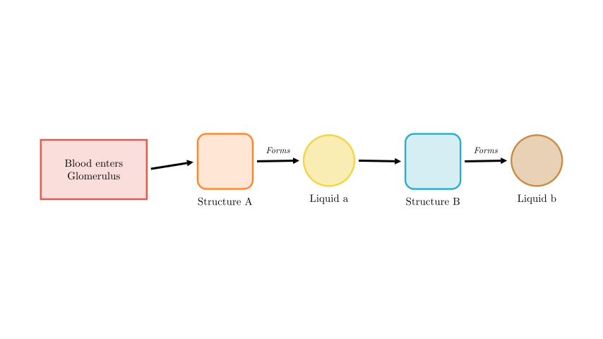
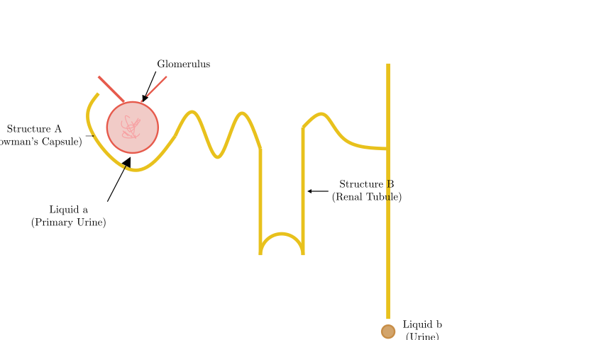
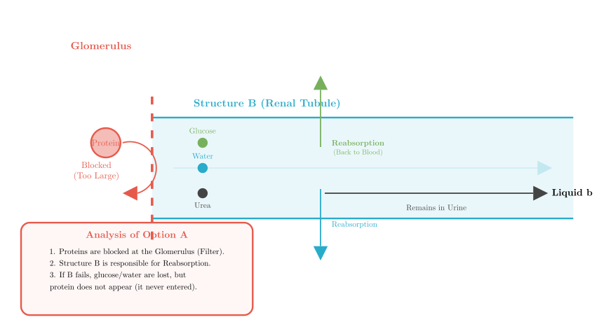
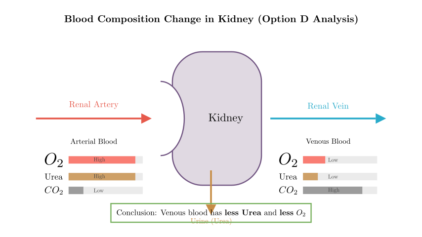

# problem_47_biology_g9

**Problem Statement:**

The figure illustrates the flowchart of urine formation, where **甲 (Jia)** and **乙 (Yi)** represent structures, and **a** and **b** represent liquids. Which of the following statements is **INCORRECT**?

A. If structure **乙 (Yi)** in a normal person is anesthetized (paralyzed), then liquid **b** will contain protein.
B. The liquids represented by **a** and **b** are primary urine (glomerular filtrate) and urine, respectively.
C. The glomerulus, structure **甲 (Jia)**, and structure **乙 (Yi)** together constitute the nephron.
D. After blood flows through the kidney, arterial blood changes to venous blood, and urea decreases.

**Solution Approach:**
To solve this, we must map the abstract flowchart to the anatomical structures of the kidney (specifically the nephron). We will identify the structures labeled '甲' and '乙' and the liquids 'a' and 'b' based on the physiology of urine formation (filtration and reabsorption). Then, we will evaluate each option to find the false statement.

**Step 1: Decoding the Flowchart**

Let's identify the biological structures and fluids based on the sequence of urine formation:

1.  **Blood enters the Glomerulus:** This is the starting point.
2.  **Filtration:** Blood is filtered from the glomerulus into the **Bowman's Capsule** (Renal Capsule). Therefore, **Structure A (甲)** is the Bowman's Capsule.
3.  **Liquid a:** The fluid collected in the Bowman's Capsule is the **Primary Urine** (also known as Glomerular Filtrate).
4.  **Flow:** The primary urine flows from the Bowman's Capsule into the **Renal Tubule**. Therefore, **Structure B (乙)** is the Renal Tubule.
5.  **Reabsorption:** As fluid passes through the renal tubule, useful substances are reabsorbed, leaving behind **Urine**. Therefore, **Liquid b** is Urine.

Now we have our mapping:
*   **甲** = Bowman's Capsule
*   **a** = Primary Urine
*   **乙** = Renal Tubule
*   **b** = Urine

**Step 2: Evaluating Options B and C**

**Option B Analysis:**
The statement claims **a** is primary urine and **b** is urine.
*   Based on our mapping in Step 1, filtration produces primary urine (a) in the Bowman's Capsule, and reabsorption in the tubule results in final urine (b).
*   **Conclusion:** Option B is **Correct**.

**Option C Analysis:**
The statement claims the Glomerulus, Structure A (Bowman's Capsule), and Structure B (Renal Tubule) form the **Nephron**.
*   Definition of a Nephron: It consists of the Renal Corpuscle (Glomerulus + Bowman's Capsule) and the Renal Tubule.
*   **Conclusion:** Option C is **Correct**.

**Step 3: Evaluating Option A (The Critical Step)**

**Option A Analysis:**
The statement claims: "If Structure B (Renal Tubule) is anesthetized/paralyzed, then liquid b (Urine) will contain **protein**."

*   **Function of Structure B (Renal Tubule):** Its main job is **reabsorption**. It takes useful substances like **all glucose**, most water, and inorganic salts from the primary urine and puts them back into the blood.
*   **Protein Filtration:** Large molecular proteins are filtered out *earlier* at the Glomerulus. They generally do not enter the Bowman's Capsule (Structure A) or the Renal Tubule (Structure B) in a healthy person.
*   **Scenario:** If the Renal Tubule is damaged or "anesthetized" (meaning it loses function), it fails to reabsorb substances. This would result in **glucose** appearing in the urine (glucosuria) and excessive water loss (polyuria).
*   **Why Protein is wrong:** Since proteins are blocked at the Glomerulus, they aren't in the tubule to begin with. Therefore, tubular dysfunction does **not** cause protein to appear in the urine. Protein in the urine is a sign of **Glomerular** damage (Structure A or the Glomerulus itself), not Tubular damage.

*   **Conclusion:** Option A is **INCORRECT**.

**Step 4: Evaluating Option D**

**Option D Analysis:**
The statement claims: "After blood flows through the kidney, arterial blood becomes venous blood, and urea decreases."

*   **Gas Exchange:** Like any organ, kidney cells consume oxygen for energy (especially for active transport during reabsorption) and produce carbon dioxide. Thus, oxygenated (arterial) blood becomes deoxygenated (venous) blood.
*   **Filtration/Excretion:** The kidney's primary function is to remove metabolic waste. Urea is filtered out of the blood into the urine. Therefore, the blood leaving the kidney (Renal Vein) has a much **lower concentration of urea** than the blood entering it.
*   **Conclusion:** Option D is **Correct**.

**Final Verification:**
*   A: Incorrect (Tubule damage causes glucose/water issues, not protein issues).
*   B: Correct (Primary urine -> Urine).
*   C: Correct (Components of the nephron).
*   D: Correct (Blood is cleaned and deoxygenated).

The question asks for the statement that is **not correct**.

**Final Answer:** A

