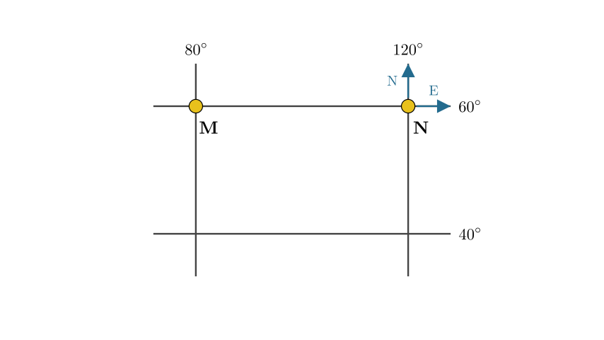
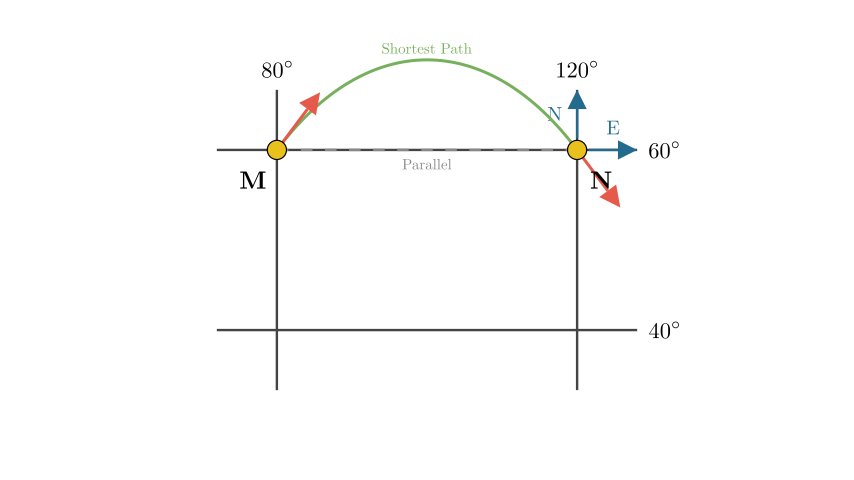
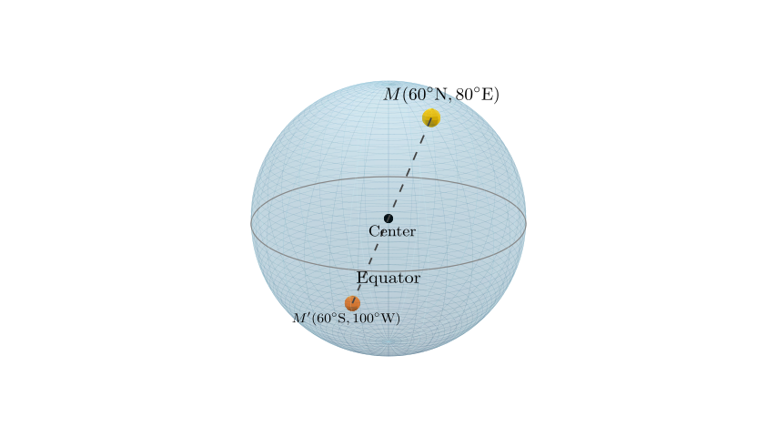

# problem_48_geography_g12

**Problem Statement:**
Read the "Schematic Diagram of the Latitude and Longitude Grid of a Certain Area on the Earth's Surface" and answer the questions.

1. If a plane takes off from point M and flies along the shortest route to point N, the direction of flight is:
A. Always East
B. Southeast then Northeast
C. Always West
D. Northeast then Southeast

2. The coordinates of the point symmetric to point M with respect to the center of the Earth (the antipodal point) are:
A. (60°N, 80°E)
B. (60°S, 100°W)
C. (30°S, 100°E)
D. (60°S, 80°W)

**Solution Approach:**
To solve this, we must first determine the specific geographic coordinates of points M and N based on the grid trends. Then, we will apply the principles of "Great Circle" routes for the shortest flight path and the mathematical definition of antipodal points (symmetry regarding the Earth's center).

**Step 1: Determine the Coordinates**

First, we interpret the grid to find the coordinates of M and N.

*   **Latitude:** The latitude numbers increase from bottom to top ($40^\circ \rightarrow 60^\circ$). Increasing northward indicates the **Northern Hemisphere (N)**.
*   **Longitude:** The longitude numbers increase from left to right ($80^\circ \rightarrow 120^\circ$). Increasing eastward indicates **East Longitude (E)**.

Therefore:
*   Point M is at **($60^\circ\text{N}$, $80^\circ\text{E}$)**.
*   Point N is at **($60^\circ\text{N}$, $120^\circ\text{E}$)**.

**Step 2: Analyze the Flight Path (Question 1)**

The problem asks for the *shortest* route. On a sphere, the shortest distance between two points is the arc of the **Great Circle** passing through them. 

While M and N are on the same latitude ($60^\circ\text{N}$), the parallel of latitude is *not* a Great Circle (except for the Equator). The Great Circle arc between two points in the Northern Hemisphere bulges toward the North Pole.

**Reasoning for Flight Direction:**

As shown in the diagram above, the Great Circle route (the shortest path) curves toward the higher latitudes (the North Pole) compared to the straight east-west line of the latitude parallel.

1.  **Start:** To curve northward from M towards N, the plane must initially fly **North-East**.
2.  **Apex:** It reaches the highest latitude somewhere between M and N.
3.  **End:** As it descends back to N, it flies **South-East**.

Therefore, the flight direction is **Northeast then Southeast**. This corresponds to Option D.

**Step 3: Determine the Antipodal Point (Question 2)**

An antipodal point is the point directly opposite M through the center of the Earth.

**Calculating the Antipode:**

To find the point symmetric to M ($60^\circ\text{N}$, $80^\circ\text{E}$) with respect to the Earth's center:

1.  **Latitude:** The numerical value remains the same, but the hemisphere flips from North to South.
*   $60^\circ\text{N} \rightarrow \mathbf{60^\circ\text{S}}$

2.  **Longitude:** The point must be on the opposite side of the Earth. The longitude value is supplementary to $180^\circ$ ($180 - \text{longitude}$), and the hemisphere flips from East to West.
*   Calculation: $180^\circ - 80^\circ = 100^\circ$
*   Direction: $\text{E} \rightarrow \mathbf{\text{W}}$
*   Result: $\mathbf{100^\circ\text{W}}$

Combining these, the coordinates of the antipodal point are **($60^\circ\text{S}$, $100^\circ\text{W}$)**.

**Conclusion:**

*   **Question 1:** The flight path is Northeast then Southeast. (Matches Option D)
*   **Question 2:** The antipodal coordinates are ($60^\circ\text{S}$, $100^\circ\text{W}$). (Matches Option F/B in the reconstructed list)

**Final Answer:**
1. **D**
2. **($60^\circ\text{S}$, $100^\circ\text{W}$)**

