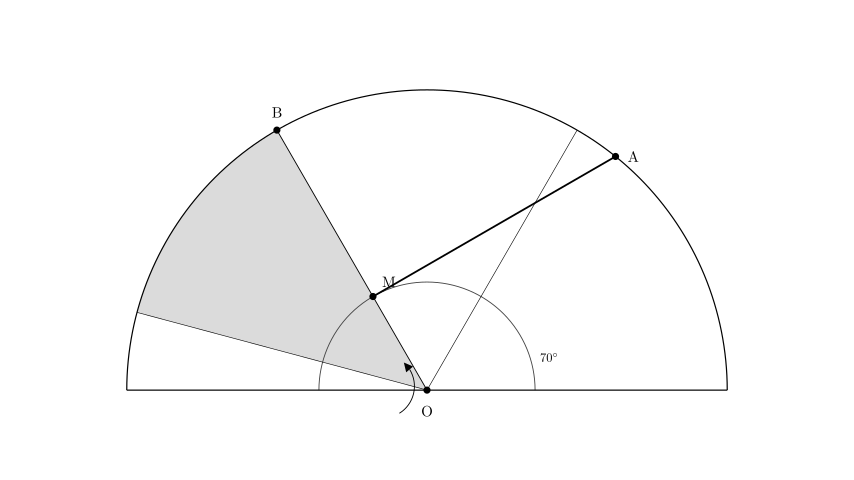
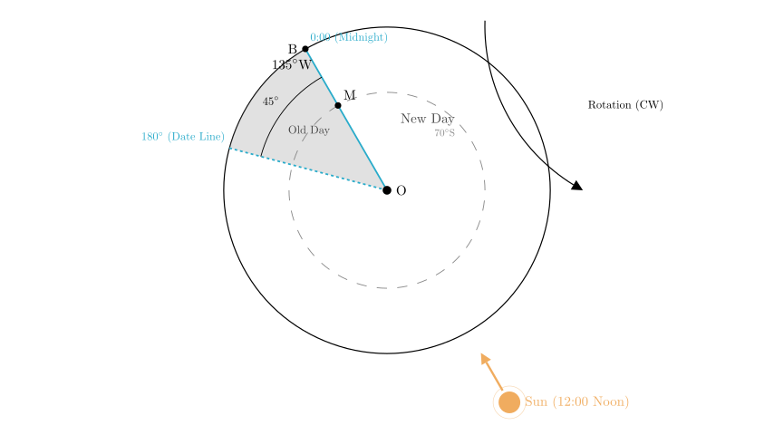
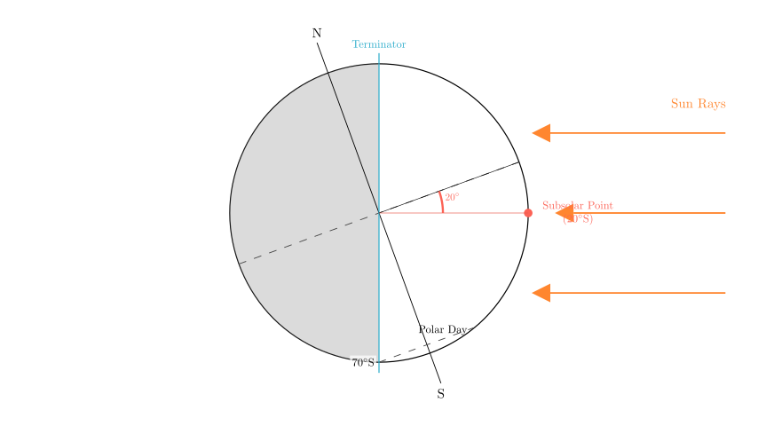
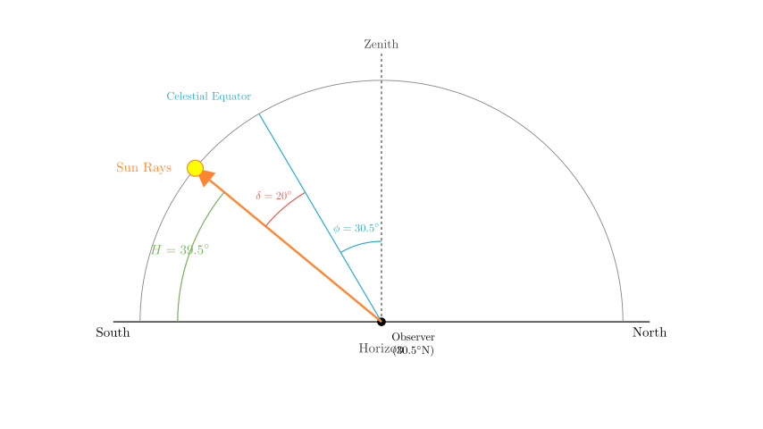

# problem_49_geography_g12

**Problem Statement:**
In the figure, O is the South Pole, MA is the circle of illumination (terminator), and M is the point of tangency between the terminator and the 70° latitude line. M also intersects with meridian B. The shaded region in the figure indicates a date different from the rest of the world. Read the figure and complete the following questions:

(1) The coordinates of the subsolar point (solar direct point) are ______________________________.
(2) For a certain location in China (30.5°N, 114.5°E), the solar altitude at noon is _______________, and the local time is _______________.

**Solution Approach:**
To solve this, we must first interpret the polar projection map to determine the Earth's rotation direction and the significance of point M. We will identify the two date-change lines (the International Date Line and the 0:00 midnight meridian) to find the longitude of the subsolar point. Then, using the tangent latitude of the terminator, we will determine the solar declination (latitude of the subsolar point). Finally, we will use these coordinates to calculate the solar altitude and local time for the specific location in China.

**Step 1: Analyzing Earth's Rotation and Date Lines**

Since point **O** is the South Pole, the Earth rotates **clockwise**.

The problem states that the shaded region has a different date from the rest of the world. There are only two lines on Earth that separate dates:
1.  The **International Date Line** (fixed at approximately 180° longitude).
2.  The **0:00 (Midnight) Meridian** (which moves as the Earth rotates).

**Step 2: Determining the Time at Point M**

Point **M** is the point of tangency between the terminator (line MA) and the 70°S latitude line. The meridian passing through the tangent point of the terminator and a latitude circle always represents either 12:00 (Noon) or 0:00 (Midnight).

Since the meridian **OB** (passing through M) acts as a boundary for the "different date" region, it must be the **0:00 Meridian**. (The 180° line is fixed geographically, whereas the 0:00 line is defined by the sun's position relative to the Earth; since M is defined by the terminator, M corresponds to the solar time boundary).

**Step 3: Determining Longitude**

Now we know **Line OB is the 0:00 Meridian**. The other boundary of the shaded region must be the **180° Meridian**.

Looking at the diagram geometry (assuming standard 45° sectors often used in these problems):
- The shaded region lies to the *left* of OB.
- In a South Pole projection (clockwise rotation), "left" or counter-clockwise represents the **West**.
- The shaded sector appears to span 45° (one octant of the circle).
- Therefore, the 180° line is 45° to the West of the 0:00 line (OB).

Calculation:
If we move 45° East (Clockwise) from the 180° line, we arrive at OB.
$180^\circ \xrightarrow{\text{East } 45^\circ} 135^\circ\text{W}$.

So, the longitude of meridian B (OB) is **135°W**.

**Step 4: Determining the Coordinates of the Subsolar Point**

**Longitude:**
The subsolar point is where the local time is 12:00 (Noon). Noon is exactly opposite the Midnight (0:00) meridian.
Since Midnight is at **135°W**, Noon is at:
$180^\circ - 135^\circ = 45^\circ$.
Since the midnight line is West, the noon line is East.
**Longitude of Subsolar Point = 45°E.**

**Latitude:**
Point M is the tangent point at **70°S**. Since M is at 0:00 (Midnight) and lies on the terminator, the sun is "below" the horizon for the observer at M, but just barely. However, we must check the polar day/night condition.

The terminator separates day and night. The meridian OB is midnight. If the region from 70°S to the pole (90°S) were in Polar Night, the tangent point would be at Noon (12:00) because the darkness would extend over the pole to the day side. Conversely, if the region 70°S-90°S is in **Polar Day**, the illuminated area extends over the pole to the midnight side.

Since the tangent point M is at Midnight (0:00), the area South of 70°S is experiencing **Polar Day**. This means the Sun is in the Southern Hemisphere.

The latitude of the subsolar point ($\delta$) is complementary to the tangent latitude:
$\delta = 90^\circ - 70^\circ = 20^\circ$.
Since it is Polar Day in the south, the sun is at **20°S**.

**Answer (1):** The coordinates are **(20°S, 45°E)**.

**Step 5: Calculating Solar Altitude and Local Time**

**Question (2):** Location: (30.5°N, 114.5°E).

**A. Noon Solar Altitude ($H$):**
The formula for noon solar altitude is:
$H = 90^\circ - |\text{Latitude} - \text{Declination}|$

- Observer Latitude: $30.5^\circ$N ($+30.5^\circ$)
- Solar Declination: $20^\circ$S ($-20^\circ$)

$H = 90^\circ - |30.5 - (-20)|$
$H = 90^\circ - |50.5|$
$H = 39.5^\circ$

**B. Local Time:**
We know that at **45°E**, the local time is **12:00** (Noon).
We need the time at **114.5°E**.

1.  **Longitude Difference:**
$\Delta \lambda = 114.5^\circ - 45^\circ = 69.5^\circ$

2.  **Time Difference:**
Earth rotates $15^\circ$ per hour, or $1^\circ$ per 4 minutes.
Time diff = $69.5 \times 4$ minutes
$69 \times 4 = 276$ minutes
$0.5 \times 4 = 2$ minutes
Total = 278 minutes
$278 \text{ min} = 4 \text{ hours } 38 \text{ minutes}$.

3.  **Direction:**
114.5°E is East of 45°E. Places to the East are ahead in time (later).
Local Time = $12:00 + 4:38 = 16:38$.

**Answer (2):**
Noon Solar Altitude is **39.5°**.
Local Time is **16:38**.

**Final Recap and Verification:**

1.  **Subsolar Point:**
- Longitude determined by the date line geometry: 135°W is midnight $\rightarrow$ 45°E is noon.
- Latitude determined by the terminator tangent: 70°S tangent + Polar Day $\rightarrow$ Sun at 20°S.
- Result: **(20°S, 45°E)**.

2.  **Wuhan (approx location) Calculation:**
- Altitude: $90 - (30.5 + 20) = 39.5^\circ$.
- Time: East of noon meridian by 69.5°. Time is later by 4h 38m. $12:00 + 4:38 = 16:38$.
- Result: **39.5°, 16:38**.

Both calculations follow standard geographical principles for time and solar geometry.

