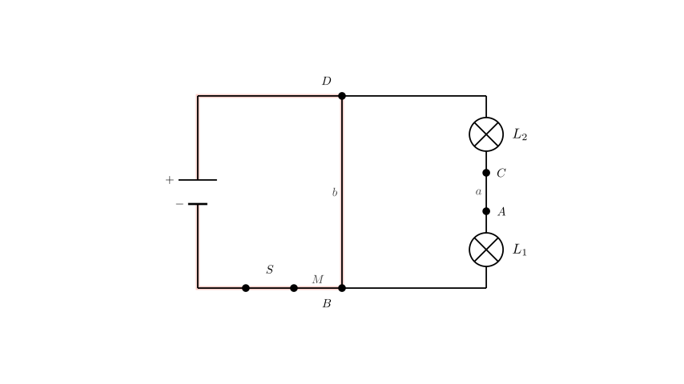
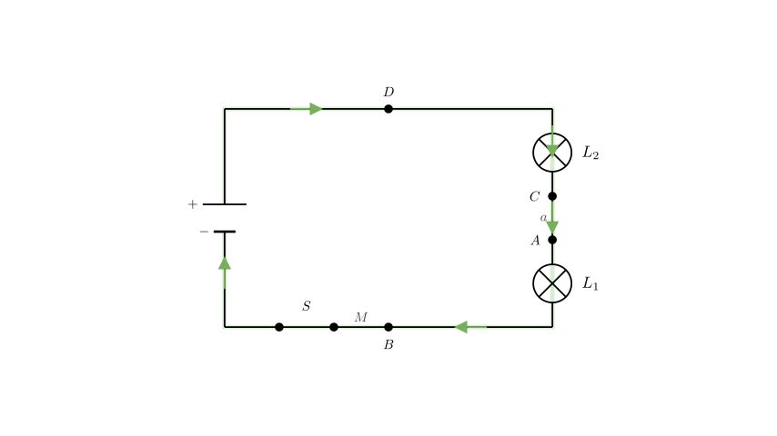
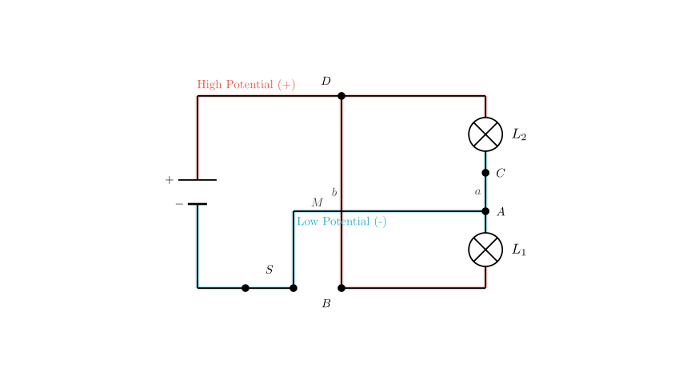

# problem_4_physics_g9

**题目：**
如图所示电路，下列分析错误的是？
A. S闭合后，电路将发生短路。
B. S闭合后，L₁和L₂并联，且都能发光。
C. 要使L₁和L₂串联，可去掉导线*b*。
D. 若将导线*M*从接线柱B改接到接线柱A上，则灯L₁和L₂并联。

**解题思路：**
为了解决这个问题，我们需要把实物接线图转化为电路原理图来分析电流路径。我们将：
1. 从电源正极开始追踪电流流向。
2. 识别节点和连接方式，以判断灯泡是串联、并联还是存在短路。
3. 结合选项描述（A, B, C, D），通过概念性地修改电路来评估每个选项。
4. 找出选项中的错误陈述。

**步骤 1：分析原始电路（选项 A 和 B）**

让我们根据图示追踪电路连接：
- 电池正极（+）连接到灯 $L_2$ 的接线柱 **D**。
- 一根导线（标记为 **b**）直接将接线柱 **D** 连接到灯 $L_1$ 的接线柱 **B**。
- 一根导线（标记为 **M**）将接线柱 **B** 连接到开关 **S**。
- 开关 **S** 连接到电池负极（-）。

**电流流向分析：**
当开关 **S** 闭合时，电流从正极流向 **D**。在 **D** 点，电流有两个选择：经过灯 $L_2$ 或经过导线 **b**。由于导线 **b** 的电阻可以忽略不计，电流会直接流向 **B**。从 **B** 点开始，电流经过导线 **M** 和开关流回负极。

**关于 A 和 B 的结论：**
- 路径 **电池(+) → D → B → S → 电池(-)** 中没有用电器（灯泡），只有导线和开关。这构成了**电源短路**。
- 由于电流通过这条低阻路径绕过了灯泡，灯泡不会发光，且电池或导线可能会损坏。
- 因此，**选项 A 是正确的**（发生了短路）。
- **选项 B 是错误的**（灯泡不会发光；它们被短路了）。由于题目要求找出*错误*的分析，B 是我们的目标答案。

**步骤 2：分析选项 C（串联连接）**

选项 C 建议去掉导线 **b**。让我们看看电流路径会发生什么变化：
1. 电流从正极流出到达 **D**。
2. 没有导线 **b**，电流*必须*经过灯 $L_2$ 才能到达接线柱 **C**。
3. 从 **C** 点，电流通过导线 **a** 流向接线柱 **A**。
4. 从 **A** 点，电流经过灯 $L_1$ 流向接线柱 **B**。
5. 从 **B** 点，电流经过导线 **M** 和开关流向负极。

**关于 C 的结论：**
电流依次经过 $L_2$ 然后经过 $L_1$ ($L_2 \rightarrow L_1$)。电流只有一条路径，这符合**串联电路**的定义。
- 因此，**选项 C 是正确的**。

**步骤 3：分析选项 D（并联连接）**

选项 D 建议将导线 **M** 从接线柱 **B** 移至接线柱 **A**。让我们分析节点（连接点）：
- **高电位节点：** 正极连接到 **D**。导线 **b** 连接 **D** 和 **B**。因此，**D** 点和 **B** 点处于相同的高电位。
- **低电位节点：** 开关（连接负极）现在连接到 **A**。导线 **a** 连接 **A** 和 **C**。因此，**A** 点和 **C** 点处于相同的低电位。

**连接情况：**
- 灯 $L_1$ 连接在 **A**（低）和 **B**（高）之间。
- 灯 $L_2$ 连接在 **C**（低）和 **D**（高）之间。

**关于 D 的结论：**
由于两盏灯都独立连接在相同的高低电位点之间，电流分流同时经过两盏灯。这是一个**并联电路**。
- 因此，**选项 D 是正确的**。

**最终答案：**
分析表明，陈述 A、C 和 D 是对电路行为物理上正确的描述。陈述 B 声称在原始配置下灯泡会并联发光，但我们证明了原始配置是短路，灯泡不会发光。

错误在于选项 **B**。