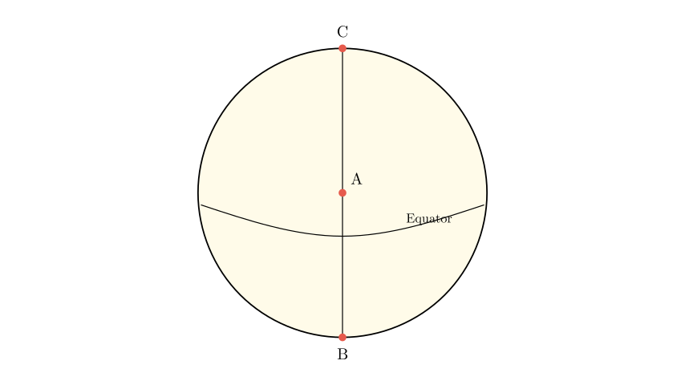
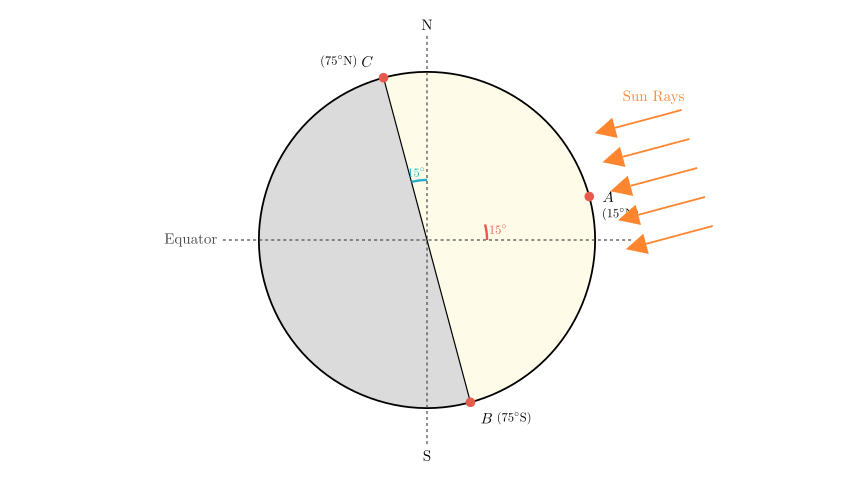
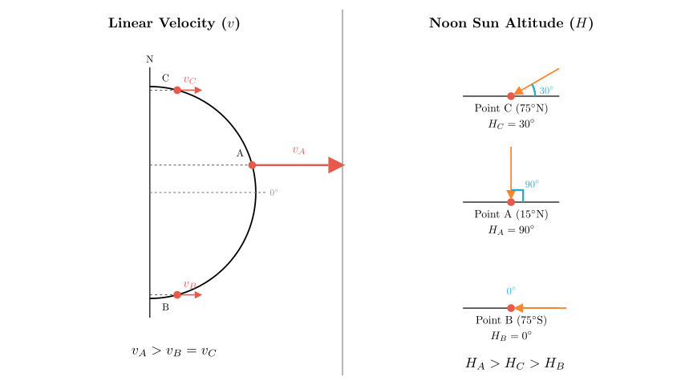

# problem_50_geography_g12

**Problem Statement:**
The area shown in the figure below is the daylight hemisphere (day hemisphere). A is the center of the circle. The latitude of point B is 75°. The west side of point A is the Eastern Hemisphere, and the east side is the Western Hemisphere. Based on this, answer the following questions:

(1) At this time, the geographic coordinates of the subsolar point (solar direct point) are _________, and the geographic coordinates of point C are _________. At this time, Beijing time is _________.
(2) The order of the linear velocities of points A, B, and C in the figure is _________ (use ">", "<", "=" symbols); the order of the noon sun altitude angles of the three points is _________ (use ">", "<", "=" symbols).

**Solution Approach:**
1.  **Analyze the Geometry:** Identify that the circle represents the terminator (boundary between day and night) and point A is the subsolar point because it is the center of the day hemisphere.
2.  **Determine Coordinates:** Use the hemisphere definition to find the longitude of A. Use the latitude of B and the position of the equator to find the latitude of A (solar declination) and C.
3.  **Calculate Time:** Use the longitude difference between the subsolar point and Beijing to calculate the local time.
4.  **Compare Physical Quantities:** Compare the linear velocity based on latitude ($\cos \phi$) and calculate the noon sun altitude using the formula $H = 90^\circ - |\phi - \delta|$.

**Step 1: Analyzing Coordinates of the Subsolar Point (A)**

*   **Longitude:** The problem states that "West of A is the Eastern Hemisphere, and East of A is the Western Hemisphere." The boundary between the Eastern and Western Hemispheres is defined by the meridians $20^\circ$W and $160^\circ$E. The specific boundary where the west side is East (E) and the east side is West (W) is the **$160^\circ$E** meridian. Therefore, the longitude of point A is **$160^\circ$E**.

*   **Latitude:** Point A is the center of the day hemisphere, making it the subsolar point (where the sun is directly overhead). The distance from the subsolar point to the edge of the day hemisphere (the terminator) is always $90^\circ$ along a great circle.
*   Point B is at the bottom edge of the circle and has a latitude of $75^\circ$.
*   In the diagram, the Equator passes *below* point A. This implies A is in the Northern Hemisphere and B is in the Southern Hemisphere.
*   Therefore, B is at **$75^\circ$S**.
*   Since the arc distance $AB$ is $90^\circ$ along the meridian, the latitude of A is $90^\circ - 75^\circ = 15^\circ$.
*   So, A is at **$15^\circ$N**.

**Result for A:** $(15^\circ\text{N}, 160^\circ\text{E})$.

**Step 2: Analyzing Coordinates of Point C**

*   Point C is at the top edge of the day hemisphere, on the same vertical line as A and B.
*   The vertical line represents a great circle (meridian pair).
*   From A ($15^\circ$N), going North $90^\circ$ reaches the edge at C.
*   Traveling $90^\circ$ North from $15^\circ$N: You travel $75^\circ$ to reach the North Pole ($90^\circ$N), and then continue $15^\circ$ "down" the other side of the Earth.
*   This places C at latitude **$75^\circ$N** ($90^\circ - 15^\circ$).
*   Since C is on the meridian opposite to A (across the pole), its longitude is $180^\circ$ away from $160^\circ$E.
*   Longitude of C $= 160^\circ\text{E} + 180^\circ = 340^\circ \rightarrow 20^\circ\text{W}$.

**Result for C:** $(75^\circ\text{N}, 20^\circ\text{W})$.

**Step 3: Calculating Beijing Time**

*   The local time at the subsolar point (Point A, $160^\circ$E) is always **12:00 (noon)**.
*   We need to find the time in Beijing, which is located at **$120^\circ$E**.
*   **Longitude Difference:** $160^\circ\text{E} - 120^\circ\text{E} = 40^\circ$.
*   **Time Difference:** Earth rotates $15^\circ$ per hour (or $1^\circ$ every 4 minutes).
$$40^\circ \times 4 \text{ min/}^\circ = 160 \text{ minutes} = 2 \text{ hours } 40 \text{ minutes}$$
*   **Direction:** Beijing ($120^\circ$E) is west of point A ($160^\circ$E), so Beijing time is *earlier*.
*   **Calculation:** $12:00 - 2 \text{ hours } 40 \text{ minutes} = 9:20$.

**Answer for (1):**
*   Subsolar point: $(15^\circ\text{N}, 160^\circ\text{E})$
*   Point C: $(75^\circ\text{N}, 20^\circ\text{W})$
*   Beijing Time: $9:20$

**Step 4: Comparing Linear Velocity and Noon Sun Altitude**

**(a) Linear Velocity:**
*   Earth's rotation linear velocity decreases from the equator to the poles. It is proportional to the cosine of the latitude: $V = V_{\text{equator}} \times \cos(\text{latitude})$.
*   Latitudes: A ($15^\circ$), B ($75^\circ$), C ($75^\circ$).
*   Since $15^\circ < 75^\circ$, $\cos(15^\circ) > \cos(75^\circ)$.
*   Therefore, the velocity at A is the greatest. B and C have the same absolute latitude, so their speeds are equal.
*   **Result:** $A > B = C$

**(b) Noon Sun Altitude:**
*   The formula for noon sun altitude ($H$) is $H = 90^\circ - |\phi - \delta|$, where $\phi$ is the local latitude and $\delta$ is the solar declination ($15^\circ$N).
*   **Point A ($15^\circ$N):** On the latitude of direct sunlight.
$$H_A = 90^\circ - |15^\circ - 15^\circ| = 90^\circ$$
*   **Point C ($75^\circ$N):**
$$H_C = 90^\circ - |75^\circ - 15^\circ| = 90^\circ - 60^\circ = 30^\circ$$
*   **Point B ($75^\circ$S):**
$$H_B = 90^\circ - |-75^\circ - 15^\circ| = 90^\circ - |-90^\circ| = 0^\circ$$
(Note: Point B is exactly at the terminator, experiencing sunset/sunrise at noon, which corresponds to the limit of polar night).
*   **Result:** $A > C > B$

**Final Answer Recap:**
(1) Subsolar point: **$(15^\circ\text{N}, 160^\circ\text{E})$**; C coordinates: **$(75^\circ\text{N}, 20^\circ\text{W})$**; Beijing time: **9:20**.
(2) Linear Velocity: **$A > B = C$**; Noon Sun Altitude: **$A > C > B$**.

