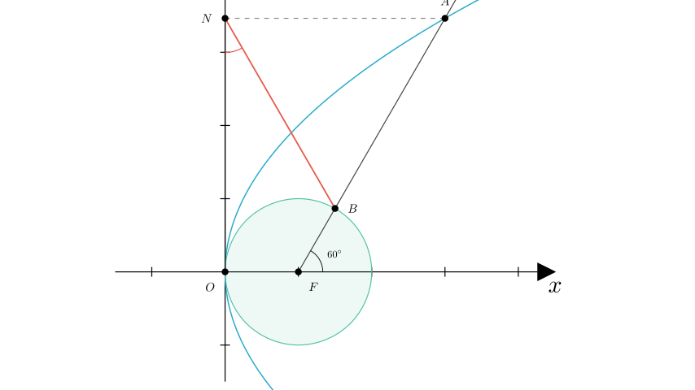
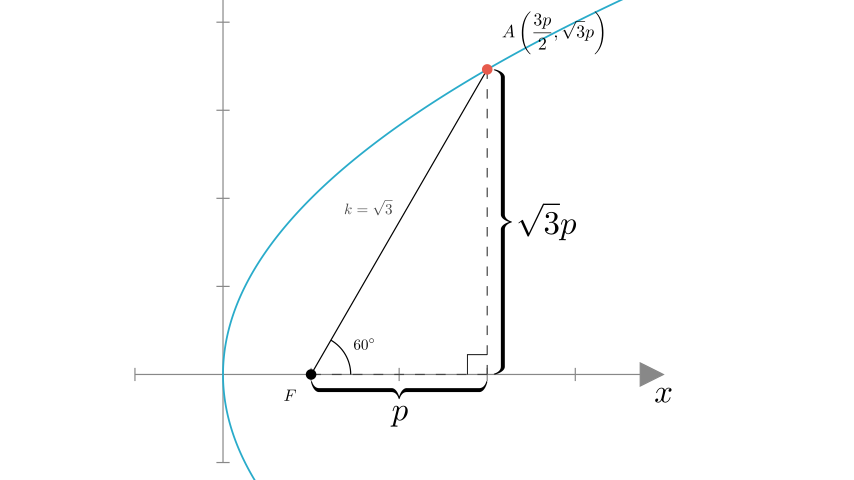
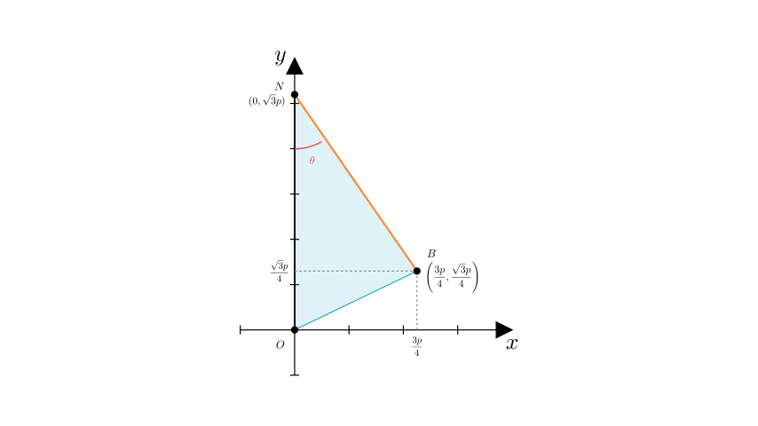
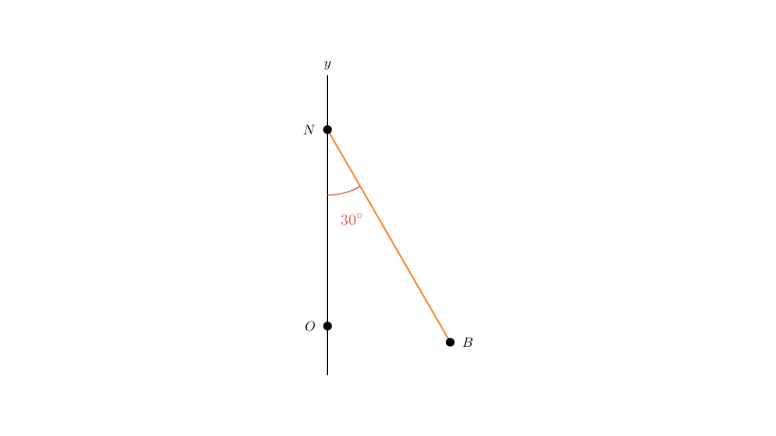

# problem_55_math_g12

**Problem Statement:**
As shown in the figure, the focus of the parabola $C: y^2 = 2px$ ($p > 0$) is $F$. $A$ is a point on $C$. A circle centered at $F$ with radius $\frac{p}{2}$ intersects the line segment $AF$ at point $B$. Given that $\angle AFx = 60^\circ$ and $N$ is the projection of $A$ on the $y$-axis, find the measure of $\angle ONB$.

**Solution Approach:**
1.  Determine the coordinates of the focus $F$ and the equation of the line $AF$.
2.  Find the coordinates of point $A$ by intersecting the line $AF$ with the parabola.
3.  Determine the coordinates of point $N$ (projection of $A$) and point $B$ (on segment $AF$).
4.  Use the coordinates of $O$, $N$, and $B$ to calculate the slope of line $NB$ and deduce the angle $\angle ONB$.

**Step 1: Coordinates and Line Equations**

Let the standard equation of the parabola be $y^2 = 2px$.
The focus $F$ is located at $(\frac{p}{2}, 0)$.

According to the problem, the line $AF$ passes through the focus $F$ and makes an angle of $60^\circ$ with the positive $x$-axis.
The slope of line $AF$ is $\tan(60^\circ) = \sqrt{3}$.

The equation of line $AF$ is:
$$y - 0 = \sqrt{3}\left(x - \frac{p}{2}\right) \implies y = \sqrt{3}x - \frac{\sqrt{3}p}{2}$$

**Step 2: Finding Point A**

To find the coordinates of $A$, we substitute the line equation $y = \sqrt{3}(x - \frac{p}{2})$ into the parabola equation $y^2 = 2px$:

$$ \left[\sqrt{3}\left(x - \frac{p}{2}\right)\right]^2 = 2px $$
$$ 3\left(x^2 - px + \frac{p^2}{4}\right) = 2px $$
$$ 3x^2 - 3px + \frac{3p^2}{4} - 2px = 0 $$
$$ 3x^2 - 5px + \frac{3p^2}{4} = 0 $$

Solving for $x$:
$$ x = \frac{5p \pm \sqrt{25p^2 - 9p^2}}{6} = \frac{5p \pm 4p}{6} $$
The solutions are $x = \frac{3p}{2}$ and $x = \frac{p}{6}$.
From the diagram, point $A$ is further from the vertex than the focus, so we choose $x_A = \frac{3p}{2}$.

Now, find the y-coordinate of $A$:
$$ y_A = \sqrt{3}\left(\frac{3p}{2} - \frac{p}{2}\right) = \sqrt{3}(p) = \sqrt{3}p $$
So, $A = \left(\frac{3p}{2}, \sqrt{3}p\right)$.

**Step 3: Finding Points N and B**

**Point N:**
Since $N$ is the projection of $A$ onto the $y$-axis, its coordinates are $(0, y_A)$.
$$ N = (0, \sqrt{3}p) $$

**Point B:**
$B$ lies on the segment $AF$. The problem states $B$ is the intersection of segment $AF$ with a circle centered at $F$ with radius $r = \frac{p}{2}$.
This means the distance $FB = \frac{p}{2}$.

We can use vector scaling or trigonometry to find $B$.
Line $AF$ is at $60^\circ$. $F$ is at $(\frac{p}{2}, 0)$.
$$ x_B = x_F + FB \cdot \cos(60^\circ) = \frac{p}{2} + \frac{p}{2} \cdot \frac{1}{2} = \frac{3p}{4} $$
$$ y_B = y_F + FB \cdot \sin(60^\circ) = 0 + \frac{p}{2} \cdot \frac{\sqrt{3}}{2} = \frac{\sqrt{3}p}{4} $$
So, $B = \left(\frac{3p}{4}, \frac{\sqrt{3}p}{4}\right)$.

**Step 4: Calculating Angle ONB**

We need to find the angle $\angle ONB$. Let's analyze the slope of the line segment $NB$.

Coordinates: $N(0, \sqrt{3}p)$ and $B\left(\frac{3p}{4}, \frac{\sqrt{3}p}{4}\right)$.

Slope of $NB$ ($k_{NB}$):
$$ k_{NB} = \frac{y_B - y_N}{x_B - x_N} = \frac{\frac{\sqrt{3}p}{4} - \sqrt{3}p}{\frac{3p}{4} - 0} $$
$$ k_{NB} = \frac{-\frac{3\sqrt{3}p}{4}}{\frac{3p}{4}} = -\sqrt{3} $$

A slope of $-\sqrt{3}$ corresponds to an inclination angle of $120^\circ$ with the positive $x$-axis.
However, we are looking for $\angle ONB$.
The line $ON$ lies on the $y$-axis (vertical).
The angle a line with slope $-\sqrt{3}$ makes with the vertical axis can be found by considering the angle with the negative x-axis is $60^\circ$, so the angle with the positive y-axis is $30^\circ$.

Alternatively, using vectors:
Vector $\vec{NO} = (0, -\sqrt{3}p)$ (pointing down along y-axis).
Vector $\vec{NB} = (\frac{3p}{4}, -\frac{3\sqrt{3}p}{4})$.
This calculation confirms the geometry, but the slope method is direct:
Slope $-\sqrt{3}$ means the line is $30^\circ$ away from the vertical axis.

**Conclusion**

The slope of line $NB$ is $-\sqrt{3}$.
The line $ON$ is the $y$-axis (vertical).
The angle between a vertical line and a line with slope $-\sqrt{3}$ is $30^\circ$.

**Final Answer:**
$\angle ONB = 30^\circ$

