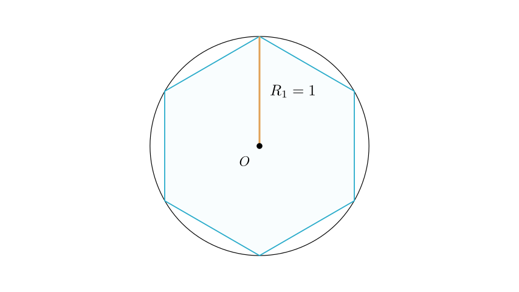
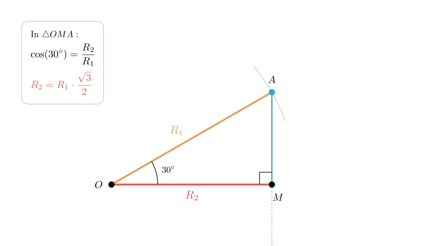
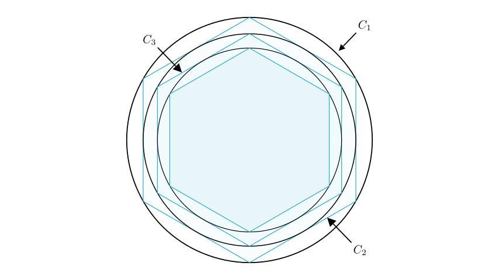

# problem_56_math_g12

**问题陈述：**
如图所示，一个正六边形内接于半径为 1 m 的圆中。然后，画出这个正六边形的内切圆。在这个新圆内，再内接另一个正六边形。这个过程无限继续。所有这些圆的面积之和为 $S = \underline{\hspace{2em}} m^2$。

**解题思路：**
为了解决这个问题，我们需要找出连续圆面积的规律。我们将：
1.  计算第一个圆的面积。
2.  确定一个圆的半径与内接于正六边形的下一个较小圆的半径之间的关系。
3.  确定面积的公比。
4.  使用无穷等比数列求和公式来计算总面积。

**步骤 1：分析第一个圆 ($C_1$)**

题目指出第一个圆的半径是 1 m。
设 $R_1$ 为第一个圆的半径。
$$R_1 = 1$$

第一个圆的面积 ($A_1$) 计算如下：
$$A_1 = \pi R_1^2 = \pi (1)^2 = \pi$$

**步骤 2：分析第二个圆 ($C_2$) 的关系**

第二个圆是位于第一个圆内部的正六边形的**内切圆**。为了求出它的半径 ($R_2$)，我们需要观察正六边形的几何性质。内切圆的半径对应于正六边形的边心距（从中心到边中点的距离）。

连接正六边形的中心到一个顶点以及一条边的中点，我们构成了一个直角三角形。

在正六边形中，一条边所对的圆心角是 $60^\circ$。连接顶点的线平分这个角，或者我们可以直接观察组成正六边形的等边三角形的性质。然而，观察由半径 ($R_1$) 和边心距 ($R_2$) 构成的直角三角形：

- 斜边是外接圆的半径 $R_1$。
- 较长的直角边是内（切）圆的半径 $R_2$。
- $R_1$ 和 $R_2$ 之间的夹角是 $30^\circ$。

利用三角函数：
$$\cos(30^\circ) = \frac{\text{adjacent}}{\text{hypotenuse}} = \frac{R_2}{R_1}$$

解出 $R_2$：
$$R_2 = R_1 \times \cos(30^\circ) = 1 \times \frac{\sqrt{3}}{2} = \frac{\sqrt{3}}{2}$$

现在，我们计算第二个圆的面积 ($A_2$)：
$$A_2 = \pi R_2^2 = \pi \left( \frac{\sqrt{3}}{2} \right)^2 = \pi \left( \frac{3}{4} \right) = \frac{3}{4}\pi$$

**步骤 3：归纳规律**

这个过程无限重复。对于任意圆 $n$ 和下一个圆 $n+1$：
$$R_{n+1} = R_n \times \frac{\sqrt{3}}{2}$$

因此，它们的面积之比是半径之比的平方：
$$\frac{A_{n+1}}{A_n} = \left( \frac{R_{n+1}}{R_n} \right)^2 = \left( \frac{\sqrt{3}}{2} \right)^2 = \frac{3}{4}$$

这意味着圆的面积构成一个**无穷等比数列**：
- 首项 ($a$)：$A_1 = \pi$
- 公比 ($q$)：$\frac{3}{4}$

**步骤 4：计算总和**

无穷等比数列的和 $S$ 由以下公式给出：
$$S = \frac{a}{1 - q}$$

代入我们的数值：
$$S = \frac{\pi}{1 - \frac{3}{4}}$$
$$S = \frac{\pi}{\frac{1}{4}}$$
$$S = 4\pi$$

**最终答案与验证：**

所有圆的面积之和为 $4\pi$。

**回顾：**
1.  我们确定了第一个圆的半径为 1。
2.  我们利用正六边形的几何性质发现，每一步半径缩放的比例因子为 $\frac{\sqrt{3}}{2}$。
3.  这意味着每一步面积缩放的比例因子为 $\frac{3}{4}$。
4.  对等比数列 $\pi + \frac{3}{4}\pi + \frac{9}{16}\pi + \dots$ 求和，结果为 $4\pi$。

**最终答案：** $4\pi$