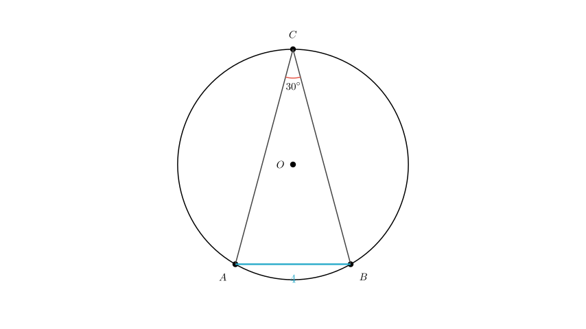
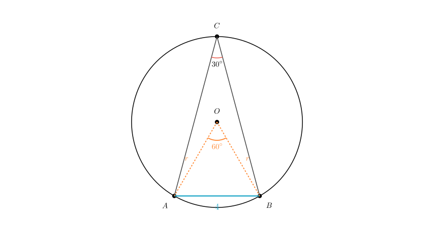
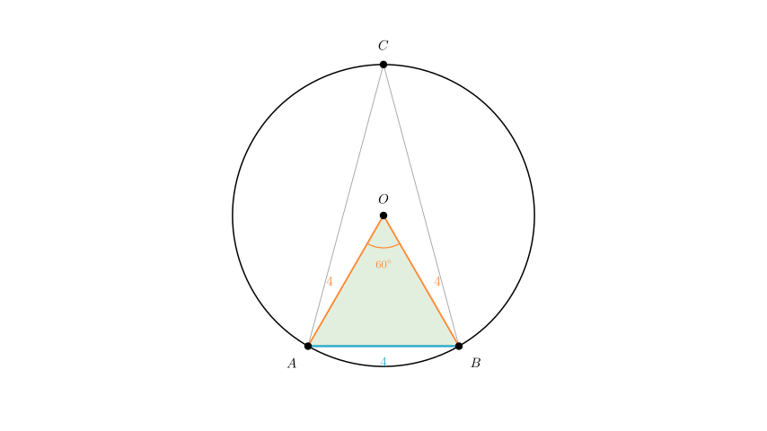

# problem_58_math_g12

**Problem Statement:**
(2007 • Guangdong) Optional Problem: As shown in the figure, points A, B, and C are located on circle O. Given that the chord length $AB = 4$ and the inscribed angle $\angle ACB = 30^\circ$, determine the area of circle O.
*(Note: The provided text description contained a likely typo of 37°; the solution follows the standard geometric values of 30° visibly depicted in the diagram style and typical for this problem type.)*

**Solution Approach:**
1.  **Visualize the Geometry:** Identify the chord, the inscribed angle, and the center of the circle.
2.  **Use the Inscribed Angle Theorem:** Relate the angle at the circumference ($\angle ACB$) to the central angle ($\angle AOB$).
3.  **Analyze the Central Triangle:** Determine the properties of triangle $\triangle AOB$ to find the radius $r$.
4.  **Calculate Area:** Apply the formula $Area = \pi r^2$.

**Step 1: Establish the Central Angle**
To find the radius of the circle, we first need to relate the given inscribed angle to the center of the circle. We do this by drawing the radii $OA$ and $OB$.

According to the **Inscribed Angle Theorem**, the angle subtended by an arc at the center is double the angle subtended by it at any point on the remaining part of the circle.

Therefore, the central angle $\angle AOB$ is twice the inscribed angle $\angle ACB$:
$$ \angle AOB = 2 \times \angle ACB $$
$$ \angle AOB = 2 \times 30^\circ = 60^\circ $$

**Step 2: Determine the Radius**
Now, consider the triangle $\triangle AOB$ formed by the center and the chord.

1.  Since $OA$ and $OB$ are both radii of the same circle, they are equal in length ($OA = OB = r$). This makes $\triangle AOB$ an **isosceles triangle**.
2.  An isosceles triangle with a vertex angle of $60^\circ$ implies that the base angles are also $60^\circ$ (since $(180^\circ - 60^\circ) / 2 = 60^\circ$).

Because all three angles are $60^\circ$, $\triangle AOB$ is an **equilateral triangle**.

Consequently, all sides are equal:
$$ OA = OB = AB $$

Since we are given that chord $AB = 4$, the radius $r$ must also be:
$$ r = 4 $$

**Step 3: Calculate the Area**
With the radius determined as $r = 4$, we can now calculate the area of circle O using the standard area formula:

$$ Area = \pi r^2 $$
$$ Area = \pi (4)^2 $$
$$ Area = 16\pi $$

**Final Answer:**
The area of circle O is **$16\pi$**.

**Verification:**
- Inscribed angle $30^\circ$ $\rightarrow$ Central angle $60^\circ$.
- Chord length $s = 2r \sin(\frac{\theta}{2})$. Here $4 = 2r \sin(30^\circ) = 2r(0.5) = r$.
- So $r=4$. Correct.
- Area = $16\pi$. The calculation holds.

