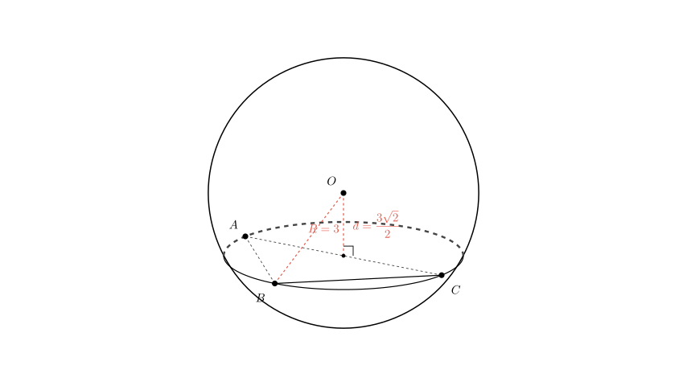
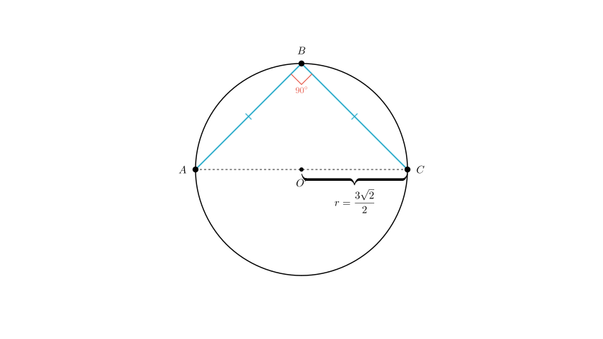
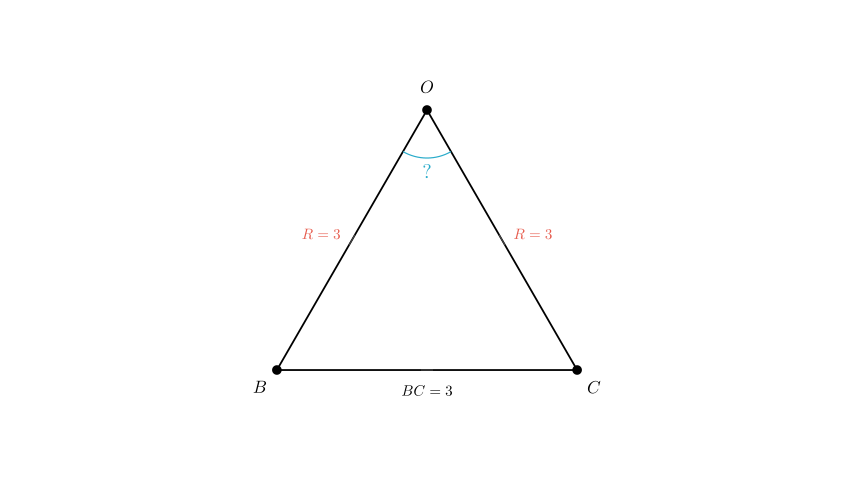

# problem_61_math_g12

**Problem Statement:**
As shown in the figure, points $A$, $B$, and $C$ lie on a sphere with radius $R=3$. Given that $\angle ABC = 90^{\circ}$, $BA = BC$, and the distance from the center of the sphere $O$ to the plane $ABC$ is $\frac{3\sqrt{2}}{2}$, find the spherical distance between points $B$ and $C$.

**Solution Approach:**
To find the spherical distance between points $B$ and $C$, we need to calculate the length of the arc connecting them along the great circle of the sphere. The steps are:
1.  Determine the radius of the small circle (the cross-section) where triangle $ABC$ resides.
2.  Use the geometry of triangle $ABC$ to find the straight-line chord length $|\vec{BC}|$.
3.  Form a triangle with the sphere's center $O$ and points $B$ and $C$ to find the central angle $\angle BOC$.
4.  Calculate the arc length using the radius of the sphere and the central angle.

**Step 1: Calculate the radius of the circumcircle of $\triangle ABC$**

Let the plane containing points $A$, $B$, and $C$ be denoted as $\alpha$. The intersection of the sphere and plane $\alpha$ is a circle (let's call it the "small circle"). Let $r$ be the radius of this small circle and $O'$ be its center.

We form a right-angled triangle using:
- The radius of the sphere, $R = 3$ (hypotenuse).
- The distance from the sphere center to the plane, $d = OO' = \frac{3\sqrt{2}}{2}$.
- The radius of the small circle, $r$ (side).

Using the Pythagorean theorem ($R^2 = r^2 + d^2$):
$$r = \sqrt{R^2 - d^2} = \sqrt{3^2 - \left(\frac{3\sqrt{2}}{2}\right)^2}$$
$$r = \sqrt{9 - \frac{18}{4}} = \sqrt{9 - 4.5} = \sqrt{4.5} = \frac{3\sqrt{2}}{2}$$

So, the radius of the small circle containing $\triangle ABC$ is $r = \frac{3\sqrt{2}}{2}$.

**Step 2: Calculate the chord length $BC$**

Now we analyze $\triangle ABC$ within the small circle.
- We are given that $\angle ABC = 90^{\circ}$. In a circle, a right angle subtended by a chord implies that the chord's endpoints define the diameter. Therefore, the hypotenuse $AC$ is the diameter of the small circle.
- The length of $AC$ is $2r = 2 \times \frac{3\sqrt{2}}{2} = 3\sqrt{2}$.

We are also given that the triangle is isosceles with $BA = BC$. Let the length of the legs be $x$ (i.e., $BC = x$).
Using the Pythagorean theorem in $\triangle ABC$:
$$AB^2 + BC^2 = AC^2$$
$$x^2 + x^2 = (3\sqrt{2})^2$$
$$2x^2 = 18$$
$$x^2 = 9 \implies x = 3$$

Thus, the straight-line distance (chord length) between $B$ and $C$ is $BC = 3$.

**Step 3: Calculate the spherical distance**

The spherical distance is the length of the arc along the great circle (radius $R=3$) connecting $B$ and $C$. To find this, we first find the central angle $\angle BOC$ subtended by the chord $BC$ at the sphere's center $O$.

Consider $\triangle OBC$:
- $OB = R = 3$ (Sphere radius)
- $OC = R = 3$ (Sphere radius)
- $BC = 3$ (Calculated in Step 2)

Since all three sides are equal ($OB = OC = BC = 3$), $\triangle OBC$ is an **equilateral triangle**.
Therefore, the central angle is:
$$\angle BOC = 60^{\circ} = \frac{\pi}{3} \text{ radians}$$

**Step 4: Calculate arc length**
The spherical distance $L$ is given by the arc length formula $L = R \cdot \theta$, where $\theta$ is in radians.
$$L = 3 \cdot \frac{\pi}{3} = \pi$$

**Final Answer:**
The spherical distance between points $B$ and $C$ is $\pi$.

