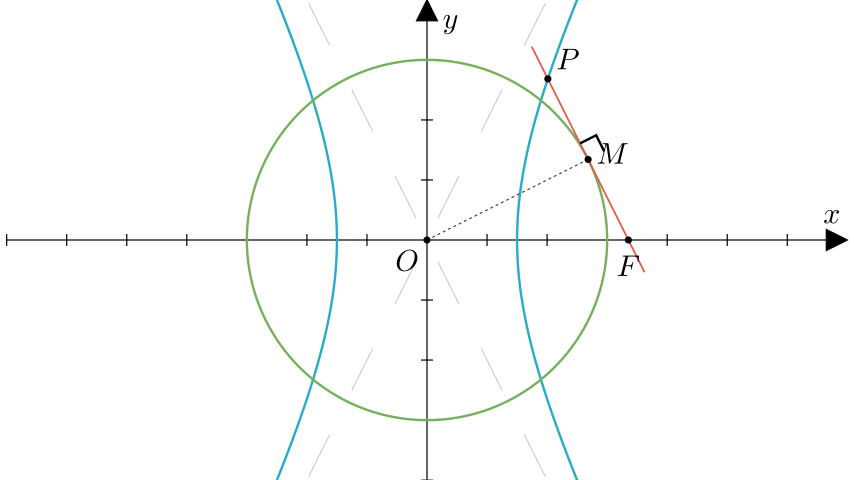
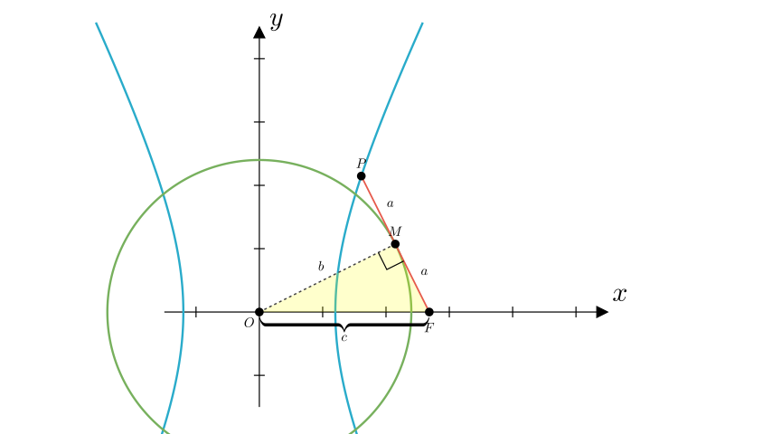

# problem_63_math_g12

**Problem Statement:**
As shown in the figure, $F$ is the right focus of the hyperbola $\frac{x^{2}}{a^{2}} - \frac{y^{2}}{b^{2}} = 1$ (where $b > a > 0$). A line $l$ is drawn through $F$ tangent to the circle $x^{2} + y^{2} = b^{2}$ at point $M$, and it intersects the hyperbola at point $P$. If $M$ is exactly the midpoint of the line segment $PF$, find the equation of the asymptotes of the hyperbola.

**Solution Approach:**
1.  Analyze the geometric properties of the tangent line and the focus.
2.  Use the Pythagorean theorem in the resulting right-angled triangle to establish relationships between the lengths $a$, $b$, and $c$.
3.  Determine the coordinates of point $P$ or use the definition of the hyperbola to find the relationship between $a$ and $b$.
4.  Substitute this relationship into the standard asymptote equation $y = \pm \frac{b}{a}x$ to find the final answer.

**Geometric Analysis:**

First, let's analyze the triangle formed by the origin $O$, the point of tangency $M$, and the focus $F$.

*   The circle has the equation $x^{2} + y^{2} = b^{2}$, so its radius is $r = b$. Thus, the length of segment $OM = b$.
*   $F$ is the right focus of the hyperbola, so its coordinates are $(c, 0)$, meaning the length $OF = c$.
*   Since the line $PF$ is tangent to the circle at $M$, the radius $OM$ is perpendicular to the tangent line $PF$. Therefore, $\triangle OMF$ is a right-angled triangle with $\angle OMF = 90^{\circ}$.

Using the Pythagorean theorem in $\triangle OMF$:
$$MF = \sqrt{OF^{2} - OM^{2}} = \sqrt{c^{2} - b^{2}}$$

Recall the fundamental hyperbola relationship $c^{2} = a^{2} + b^{2}$, which implies $a^{2} = c^{2} - b^{2}$.
Substituting this into the equation for $MF$:
$$MF = \sqrt{a^{2}} = a$$

**Analyzing Segment PF:**
The problem states that $M$ is the midpoint of segment $PF$.
*   Since $MF = a$, and $PM = MF$, then $PM = a$.
*   The total length of the segment $PF = PM + MF = a + a = 2a$.

**Coordinate Calculation:**

Now we need to relate these lengths to the hyperbola equation to find the ratio $b/a$. Let's find the coordinates of point $P$.

Consider the angle $\angle MFO$ (let's call it $\theta$) in the right triangle $\triangle OMF$:
*   $\sin \theta = \frac{\text{Opposite}}{\text{Hypotenuse}} = \frac{OM}{OF} = \frac{b}{c}$
*   $\cos \theta = \frac{\text{Adjacent}}{\text{Hypotenuse}} = \frac{MF}{OF} = \frac{a}{c}$

Point $P$ lies on the line passing through $F(c, 0)$ at an angle of $(180^{\circ} - \theta)$ with the positive x-axis (looking at the geometry, the line goes "up and left" from F). The distance from $F$ to $P$ is $2a$.

Using polar-style definition relative to F:
*   $x_P = c - PF \cdot \cos \theta = c - 2a \cdot \frac{a}{c} = c - \frac{2a^2}{c} = \frac{c^2 - 2a^2}{c}$
*   $y_P = PF \cdot \sin \theta = 2a \cdot \frac{b}{c} = \frac{2ab}{c}$

So, $P = \left( \frac{c^2 - 2a^2}{c}, \frac{2ab}{c} \right)$.

**Solving for the Asymptotes:**

Since point $P$ lies on the hyperbola $\frac{x^{2}}{a^{2}} - \frac{y^{2}}{b^{2}} = 1$, we substitute the coordinates of $P$:

$$ \frac{1}{a^2}\left( \frac{c^2 - 2a^2}{c} \right)^2 - \frac{1}{b^2}\left( \frac{2ab}{c} \right)^2 = 1 $$

Simplify the terms:
$$ \frac{(c^2 - 2a^2)^2}{a^2 c^2} - \frac{4a^2 b^2}{b^2 c^2} = 1 $$
$$ \frac{(c^2 - 2a^2)^2}{a^2 c^2} - \frac{4a^2}{c^2} = 1 $$

Multiply the entire equation by $a^2 c^2$ to clear denominators:
$$ (c^2 - 2a^2)^2 - 4a^4 = a^2 c^2 $$

Expand the squared term:
$$ (c^4 - 4a^2 c^2 + 4a^4) - 4a^4 = a^2 c^2 $$
$$ c^4 - 4a^2 c^2 = a^2 c^2 $$

Divide by $c^2$ (since $c \neq 0$):
$$ c^2 - 4a^2 = a^2 $$
$$ c^2 = 5a^2 $$

Recall that for a hyperbola, $c^2 = a^2 + b^2$. Substitute this back:
$$ a^2 + b^2 = 5a^2 $$
$$ b^2 = 4a^2 $$
Taking the square root (since $a, b > 0$):
$$ b = 2a $$

**Conclusion:**
The equation for the asymptotes of a hyperbola is $y = \pm \frac{b}{a}x$.
Substituting $b = 2a$:
$$ y = \pm \frac{2a}{a}x $$
$$ y = \pm 2x $$

**Final Answer:**
The asymptote equations are $y = \pm 2x$ (or written as $2x \pm y = 0$).

