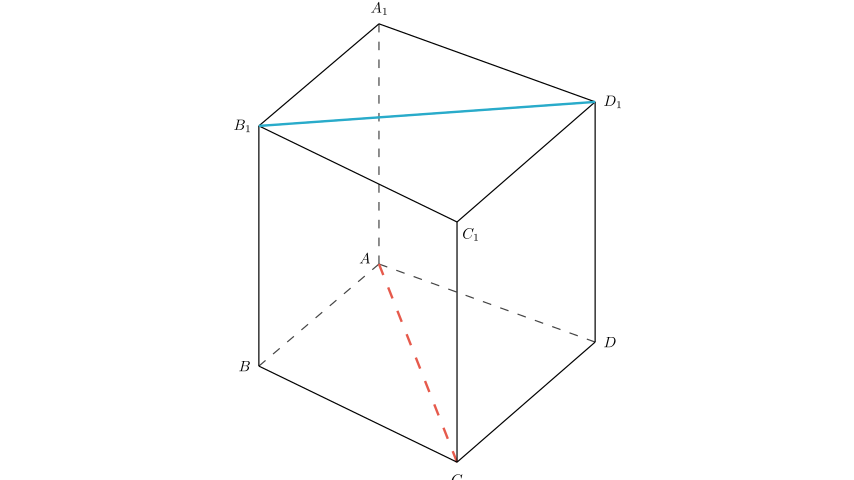
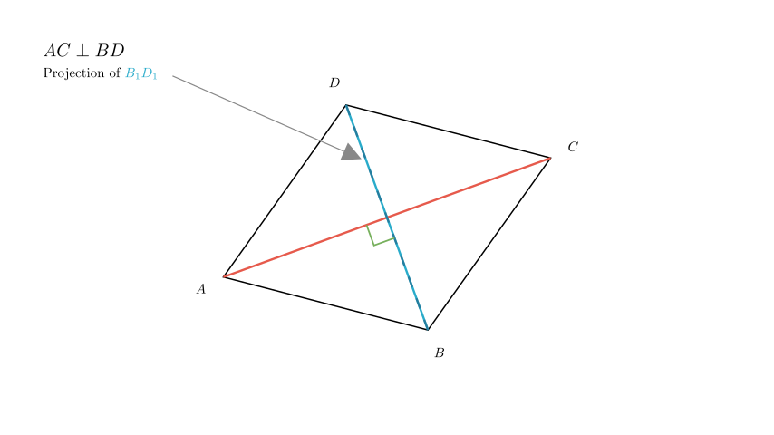

# problem_64_math_g12

**Problem Statement:**

As shown in the figure, in the quadrilateral prism $ABCD-A_{1}B_{1}C_{1}D_{1}$ where the lateral edges are perpendicular to the base, when the base $ABCD$ satisfies the condition $\underline{\hspace{5em}}$, we have $AC \perp B_{1}D_{1}$. (Write down one condition you consider correct.)

**Solution Approach:**
To solve this problem, we need to analyze the geometric relationship between the line segment $AC$ on the bottom base and the line segment $B_{1}D_{1}$ on the top base. We will use the properties of a prism and vector translation to find the equivalent condition on the base $ABCD$.

**Step 1: Analyze the relationship between the top and bottom faces.**

In a prism, the top base $A_{1}B_{1}C_{1}D_{1}$ is parallel and congruent to the bottom base $ABCD$. Furthermore, the lateral edges ($AA_1, BB_1$, etc.) are parallel to each other.

This implies that the line segment connecting $B_1$ and $D_1$ on the top face is parallel to the line segment connecting $B$ and $D$ on the bottom face.

Mathematically, we can express this as:
$$ B_{1}D_{1} \parallel BD $$

Because $B_{1}D_{1}$ is parallel to $BD$, the angle between the skew lines $AC$ and $B_{1}D_{1}$ is the same as the angle between the intersecting lines $AC$ and $BD$ on the base plane.

**Step 2: Determine the condition.**

Since $B_{1}D_{1} \parallel BD$, the condition that $AC \perp B_{1}D_{1}$ is equivalent to the condition that $AC$ is perpendicular to $BD$.

$$ AC \perp B_{1}D_{1} \iff AC \perp BD $$

Therefore, for the lines $AC$ and $B_{1}D_{1}$ to be perpendicular, the diagonals of the base quadrilateral $ABCD$ must be perpendicular to each other.

**Step 3: Formulate the answer.**

The question asks for *one* condition. The most direct and general condition is:

**$AC \perp BD$**

Alternatively, if we want to specify a type of quadrilateral that satisfies this, we could say "ABCD is a rhombus" or "ABCD is a square," as both of these shapes have perpendicular diagonals. However, "$AC \perp BD$" is the fundamental geometric requirement.

**Final Answer:**
The condition is $AC \perp BD$ (or $ABCD$ is a rhombus / square).

**Verification:**
- If $AC \perp BD$: Since $BD \parallel B_1D_1$, then $AC \perp B_1D_1$. The condition holds.
- The lateral edges being perpendicular to the base ensures the prism is a "right prism," keeping the top and bottom faces perfectly aligned vertically, which validates the parallel projection used above.

