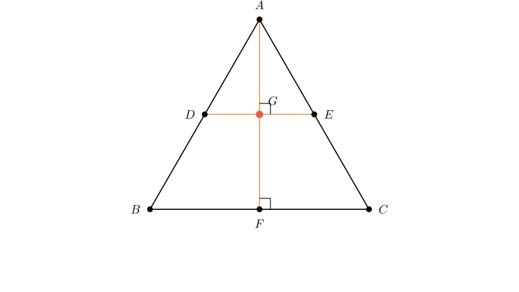
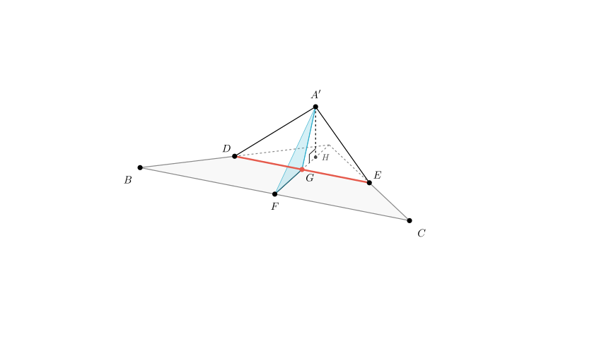
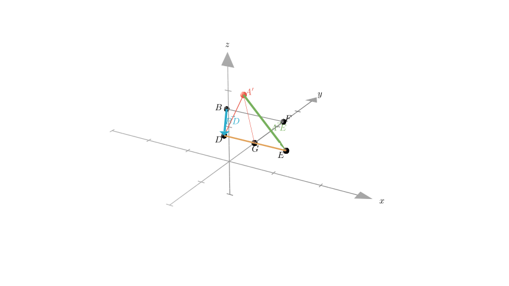

# problem_66_math_g12

**问题陈述：**
如图所示，在边长为 $a$ 的等边三角形 $ABC$ 中，中线 $AF$ 与中位线 $DE$ 相交于 $G$。三角形 $A'ED$ 是将 $\triangle AED$ 绕轴 $DE$ 旋转后形成的图形。给出下列命题，哪些是正确的？（填上所有正确命题的序号）

(1) 动点 $A'$ 在平面 $ABC$ 上的射影在线段 $AF$ 上。
(2) 三棱锥 $A'-FED$ 的体积存在最大值。
(3) 平面 $A'GF$ 始终垂直于平面 $BCED$。
(4) 异面直线 $A'E$ 与 $BD$ 不可能垂直。

**解题思路：**
我们将分析旋转前后图形的几何性质。
1.  **分析几何结构：** 建立线面关系，特别是垂直关系，已知 $\triangle ABC$ 是等边三角形且 $DE$ 是中位线。
2.  **评估命题 (1) 和 (3)：** 利用面面垂直和线面垂直的定理来确定 $A'$ 射影的轨迹以及平面 $A'GF$ 与底面的关系。
3.  **评估命题 (2)：** 分析三棱锥 $A'-FED$ 的体积公式，看其是否有界。
4.  **评估命题 (4)：** 利用向量几何或解析几何检查直线 $A'E$ 和 $BD$ 的方向向量的点积是否可能为零。

**步骤 1：分析几何结构（命题 1 和 3）**

让我们看看底面图形的性质：
*   因为 $\triangle ABC$ 是等边三角形且 $F$ 是 $BC$ 的中点，所以 $AF$ 是高。因此，$AF \perp BC$。
*   $D$ 和 $E$ 分别是 $AB$ 和 $AC$ 的中点，所以 $DE$ 是平行于 $BC$ 的中位线。
*   因为 $AF \perp BC$ 且 $DE \parallel BC$，所以 $AF \perp DE$。
*   交点 $G$ 分割了 $AF$。在旋转过程中，$\triangle AED$ 绕 $DE$ 旋转。点 $A$ 移动到位置 $A'$。
*   由于原三角形中 $AG \perp DE$，所以在运动过程中，线段 $A'G$ 始终垂直于旋转轴 $DE$。
*   同理，底面中的 $FG \perp DE$。

**命题 (3) 的证明：**
*   我们已经确定 $DE \perp A'G$ 且 $DE \perp FG$。
*   因为 $A'G$ 和 $FG$ 相交于 $G$ 并确定了平面 $A'GF$，所以直线 $DE$ 垂直于平面 $A'GF$。
*   因为直线 $DE$ 位于平面 $BCED$（原三角形底面所在的平面）内，且 $DE$ 垂直于平面 $A'GF$，所以这两个平面一定垂直。
*   **结论：** 平面 $A'GF \perp$ 平面 $BCED$ 始终成立。**(3) 正确。**

**命题 (1) 的证明：**
*   因为平面 $A'GF \perp$ 平面 $BCED$，所以平面 $A'GF$ 内任意一点在平面 $BCED$ 上的射影一定位于这两个平面的交线上。
*   这两个平面的交线是包含 $F$ 和 $G$ 的直线（即直线 $AF$）。
*   因为 $A'$ 位于平面 $A'GF$ 内，所以它在底面上的射影一定位于直线 $AF$ 上。
*   **结论：** $A'$ 的射影位于线段 $AF$ 上。**(1) 正确。**

**步骤 2：分析体积（命题 2）**

我们需要确定四面体（三棱锥）$A'-FED$ 的体积是否存在最大值。

*   四面体的体积公式为 $V = \frac{1}{3} \times \text{底面积} \times \text{高}$。
*   我们选择 $\triangle FED$ 作为底面。因为 $F, E, D$ 是平面 $ABC$ 上的定点，所以 $\triangle FED$ 的面积是常数。
*   四面体的高是顶点 $A'$ 到平面 $BCED$（包含 $\triangle FED$ 的平面）的垂直距离。
*   当 $\triangle A'ED$ 绕 $DE$ 旋转时，点 $A'$ 在平面 $A'GF$ 内画出一个圆。
*   当旋转平面（$\triangle A'ED$）垂直于底面 $BCED$ 时，$A'$ 到底面的距离最大。
*   由于高度连续变化并达到一个特定的峰值（等于长度 $A'G$），体积也会达到最大值。
*   **结论：** 体积存在最大值。**(2) 正确。**

**步骤 3：分析异面直线（命题 4）**

我们需要检查直线 $A'E$ 和 $BD$ 是否可能垂直。我们将使用以 $G$ 为原点的坐标系。

1.  **建立坐标系：**
*   设 $G$ 为原点 $(0,0,0)$。
*   直线 $DE$ 为 $x$ 轴。因为 $\triangle ADE$ 是边长为 $a/2$ 的等边三角形，所以 $DE = a/2$。因此 $D = (-a/4, 0, 0)$ 且 $E = (a/4, 0, 0)$。
*   直线 $AF$ 为 $y$ 轴。$AG = GF = \frac{\sqrt{3}}{2} \cdot \frac{a}{2} = \frac{a\sqrt{3}}{4}$。
*   $F$ 的坐标为 $(0, \frac{a\sqrt{3}}{4}, 0)$。
*   $B$ 的坐标可以相对于 $F$ 确定。因为 $F$ 是 $BC$ 的中点，且 $BC \parallel DE$，长度为 $a$：
$B = (-a/2, \frac{a\sqrt{3}}{4}, 0)$。

2.  **定义动点 $A'$：**
*   初始时，$A$ 位于 $(0, -\frac{a\sqrt{3}}{4}, 0)$。
*   当绕 $x$ 轴（$DE$）旋转角度 $\theta$ 时，$A'$ 的坐标变为：
$A' = (0, -\frac{a\sqrt{3}}{4}\cos\theta, \frac{a\sqrt{3}}{4}\sin\theta)$。

3.  **计算向量：**
*   $\vec{BD} = D - B = (-a/4 - (-a/2), 0 - \frac{a\sqrt{3}}{4}, 0) = (\frac{a}{4}, -\frac{a\sqrt{3}}{4}, 0)$。
*   $\vec{A'E} = E - A' = (a/4 - 0, 0 - (-\frac{a\sqrt{3}}{4}\cos\theta), 0 - \frac{a\sqrt{3}}{4}\sin\theta) = (\frac{a}{4}, \frac{a\sqrt{3}}{4}\cos\theta, -\frac{a\sqrt{3}}{4}\sin\theta)$。

4.  **检查垂直性（点积）：**
*   $\vec{BD} \cdot \vec{A'E} = (\frac{a}{4})(\frac{a}{4}) + (-\frac{a\sqrt{3}}{4})(\frac{a\sqrt{3}}{4}\cos\theta) + (0)$
*   $= \frac{a^2}{16} - \frac{3a^2}{16}\cos\theta$
*   $= \frac{a^2}{16} (1 - 3\cos\theta)$。

要使直线垂直，点积必须为零：
$1 - 3\cos\theta = 0 \implies \cos\theta = \frac{1}{3}$。

因为 $\cos\theta = 1/3$ 对应一个实数角度 $\theta$（约 $70.5^\circ$），所以这两条直线是有可能垂直的。

*   **结论：** “不可能垂直”的说法是错误的。**(4) 不正确。**

**最终结论**

基于逐步分析：
(1) $A'$ 的射影在 $AF$ 上：**正确**
(2) 体积存在最大值：**正确**
(3) 平面 $A'GF \perp$ 平面 $BCED$：**正确**
(4) $A'E$ 和 $BD$ 不可能垂直：**不正确**（当 $\cos\theta = 1/3$ 时它们垂直）

**正确命题：** (1), (2), (3)。