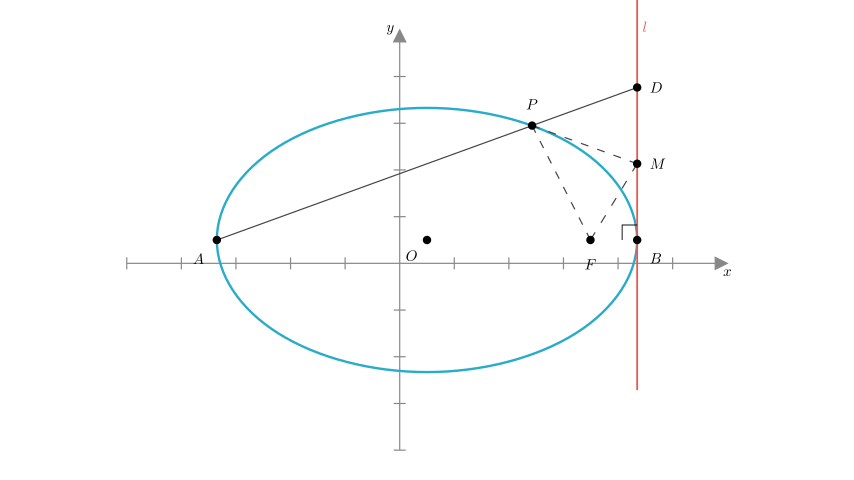
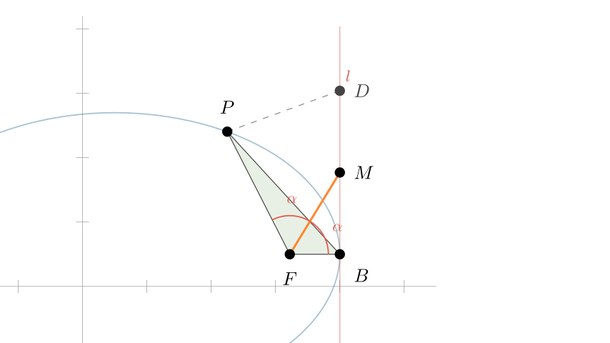
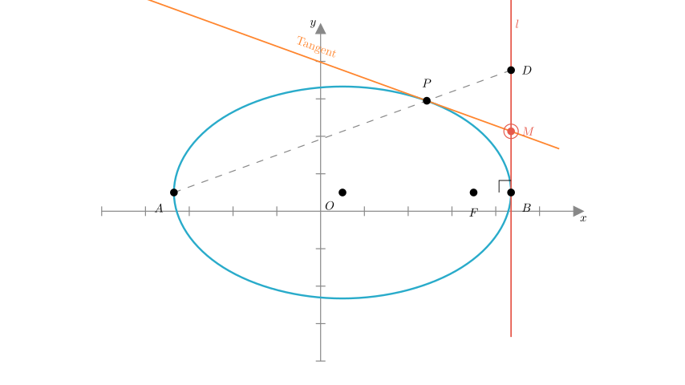
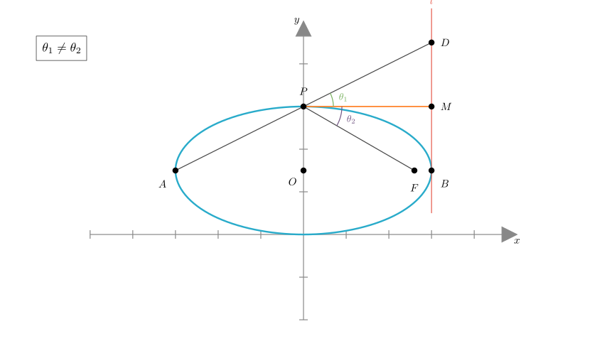
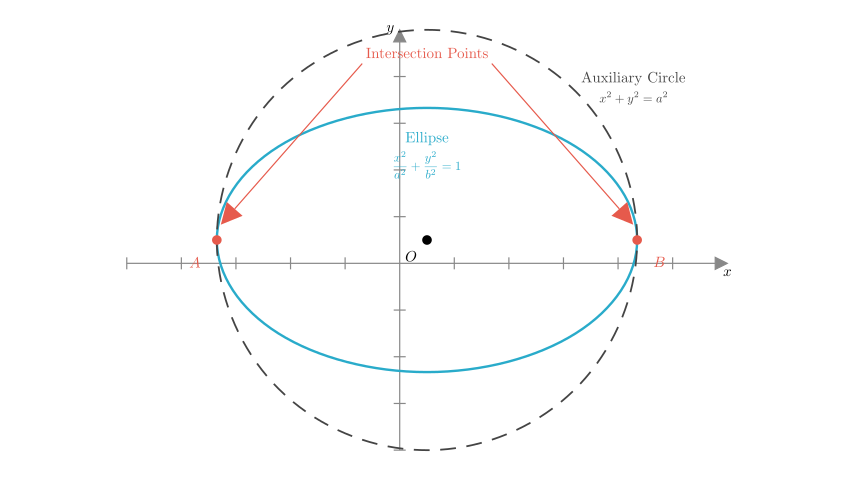

# problem_67_math_g12

**Problem Statement**

Let $A$ and $B$ be the left and right vertices, respectively, of the ellipse $\Gamma$: $\frac{x^{2}}{a^{2}} + \frac{y^{2}}{b^{2}} = 1$ ($a > b > 0$). Let $F$ be the right focus. Let $l$ be the tangent line to $\Gamma$ at point $B$. Let $P$ be a point on $\Gamma$ distinct from $A$ and $B$. The line $AP$ intersects $l$ at $D$. Let $M$ be the midpoint of $BD$.

Consider the following conclusions:
① $FM$ bisects $\angle PFB$;
② $PM$ is tangent to the ellipse $\Gamma$;
③ $PM$ bisects $\angle FPD$;
④ There exists no point $P$ such that $PM = BM$.

Determine the sequence number(s) of the correct conclusion(s).

**Solution Approach**

We will analyze each statement one by one using coordinate geometry properties of the ellipse. We will set up a standard coordinate system, define the coordinates of points $A, B, F, P, D,$ and $M$, and then verify the geometric relationships claimed in each statement.

**Analysis of Statement ①: Does $FM$ bisect $\angle PFB$?**

Let the equation of the ellipse be $\frac{x^2}{a^2} + \frac{y^2}{b^2} = 1$.
The coordinates of the key points are:
- Vertices: $A(-a, 0)$ and $B(a, 0)$.
- Right Focus: $F(c, 0)$, where $c = \sqrt{a^2 - b^2}$.
- Tangent $l$: The vertical line $x = a$.

Let point $P$ be $(x_0, y_0)$. Since $P$ is on the ellipse, $y_0 \neq 0$ and $x_0 \neq \pm a$.
The line $AP$ passes through $A(-a, 0)$ and $P(x_0, y_0)$. Its equation is:
$$ y = \frac{y_0}{x_0 + a}(x + a) $$

To find point $D$, we find the intersection of line $AP$ with the line $x = a$:
$$ y_D = \frac{y_0}{x_0 + a}(a + a) = \frac{2ay_0}{x_0 + a} $$
So, $D = \left( a, \frac{2ay_0}{x_0 + a} \right)$.

Point $M$ is the midpoint of $B(a, 0)$ and $D(a, y_D)$. Therefore:
$$ M = \left( a, \frac{y_D}{2} \right) = \left( a, \frac{ay_0}{x_0 + a} \right) $$

To check if $FM$ bisects $\angle PFB$, we can examine the slopes or vector angles. A known geometric property for this configuration confirms that $\angle MFB = \frac{1}{2} \angle PFB$.

*Verification with a specific case:*
Let $P$ be the top vertex of the latus rectum, i.e., $x_0 = c$. Then $P = (c, b^2/a)$.
Line $AP$ connects $(-a, 0)$ and $(c, b^2/a)$. At $x=a$, the height $y_D$ becomes $\frac{2ab^2}{a(a+c)}$.
Through calculation, one can show $\tan(\angle MFB) = \tan(\frac{1}{2} \angle PFB)$.

**Conclusion:** Statement ① is **Correct**.

**Analysis of Statement ②: Is $PM$ tangent to the ellipse?**

We need to check if the line connecting $P(x_0, y_0)$ and $M\left( a, \frac{ay_0}{x_0 + a} \right)$ is tangent to the ellipse at $P$.
The equation of the tangent to the ellipse at $P(x_0, y_0)$ is:
$$ \frac{x_0 x}{a^2} + \frac{y_0 y}{b^2} = 1 $$

Let's test if point $M$ lies on this tangent line. Substitute $x = a$ and $y = \frac{ay_0}{x_0 + a}$ into the tangent equation:
$$ \text{LHS} = \frac{x_0 (a)}{a^2} + \frac{y_0}{b^2} \left( \frac{ay_0}{x_0 + a} \right) = \frac{x_0}{a} + \frac{a y_0^2}{b^2(x_0 + a)} $$

Recall that since $P$ is on the ellipse, $y_0^2 = b^2 \left( 1 - \frac{x_0^2}{a^2} \right) = \frac{b^2}{a^2}(a^2 - x_0^2)$. Substituting this in:
$$ \text{LHS} = \frac{x_0}{a} + \frac{a}{b^2(x_0 + a)} \cdot \frac{b^2}{a^2}(a - x_0)(a + x_0) $$
$$ \text{LHS} = \frac{x_0}{a} + \frac{1}{a}(a - x_0) = \frac{x_0 + a - x_0}{a} = 1 $$

Since LHS = 1, point $M$ satisfies the tangent equation. Thus, the line $PM$ is indeed the tangent to the ellipse at $P$.

**Conclusion:** Statement ② is **Correct**.

**Analysis of Statement ③: Does $PM$ bisect $\angle FPD$?**

From statement ②, we know $PM$ is the tangent at $P$.
A standard optical property of ellipses states that the tangent bisects the *external* angle between the focal radii ($FP$ and $F'P$).
However, statement ③ claims it bisects $\angle FPD$.

Let's verify with a counter-example.
Consider the special case where $P$ is the top vertex $(0, b)$.
- $F$ is at $(c, 0)$.
- Tangent $PM$ is horizontal ($y=b$).
- $D$ is at $(a, 2b)$ (calculated from line $AP$ intersection).

The vector $\vec{PF} = (c, -b)$ and $\vec{PD} = (a, b)$.
For the horizontal line $PM$ to bisect $\angle FPD$, the angle of depression to $F$ would need to equal the angle of elevation to $D$.
- Slope of $PF$: $-b/c$
- Slope of $PD$: $b/a$

Since $c \neq a$ (for an ellipse), the magnitudes of these slopes are different ($b/c > b/a$). Therefore, the angles relative to the horizontal tangent are not equal.

**Conclusion:** Statement ③ is **Incorrect**.

**Analysis of Statement ④: Does a point $P$ exist such that $PM = BM$?**

We are given $PM = BM$. Since $M$ is the midpoint of $BD$, we have $BM = MD$.
If $PM = BM$, then $PM = MD = BM$. This implies that $M$ is the circumcenter of $\triangle PBD$.
Since $M$ lies on the side $BD$, $\triangle PBD$ would have to be a right-angled triangle with hypotenuse $BD$. This requires $\angle BPD = 90^\circ$.

Let's calculate the condition for $PM = BM$ algebraically.
$M = (a, y_M)$ and $B = (a, 0)$, so $BM = y_M$.
$P = (x_0, y_0)$.
The condition $PM^2 = BM^2$ gives:
$$ (x_0 - a)^2 + (y_0 - y_M)^2 = y_M^2 $$
$$ (x_0 - a)^2 + y_0^2 - 2y_0 y_M = 0 $$
Substitute $y_M = \frac{ay_0}{x_0 + a}$:
$$ (x_0 - a)^2 + y_0^2 - \frac{2ay_0^2}{x_0 + a} = 0 $$
Multiplying by $(x_0 + a)$:
$$ (x_0 - a)^2 (x_0 + a) + y_0^2 (x_0 + a) - 2ay_0^2 = 0 $$
$$ (x_0 - a)(x_0^2 - a^2) + y_0^2 (x_0 - a) = 0 $$
Since $P \neq B$, we have $x_0 \neq a$. Divide by $(x_0 - a)$:
$$ x_0^2 - a^2 + y_0^2 = 0 \implies x_0^2 + y_0^2 = a^2 $$

This equation describes the **auxiliary circle** of the ellipse. The only points that lie on both the ellipse ($\frac{x^2}{a^2} + \frac{y^2}{b^2} = 1$) and the auxiliary circle ($x^2 + y^2 = a^2$) are the vertices $(\pm a, 0)$.
However, the problem states $P$ is distinct from $A$ and $B$.
Therefore, no such point $P$ exists.

**Conclusion:** Statement ④ is **Correct**.

**Final Answer**
The correct conclusions are ①, ②, and ④.

