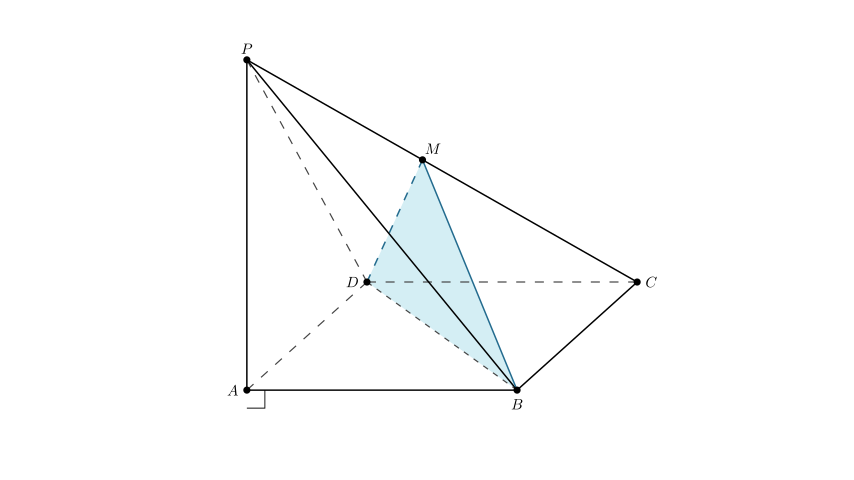
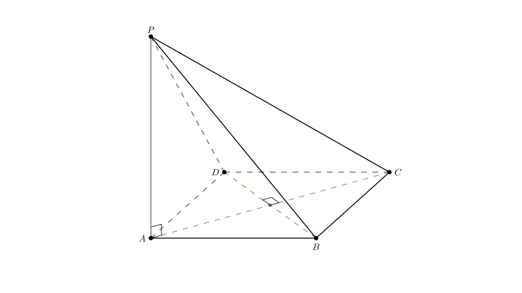
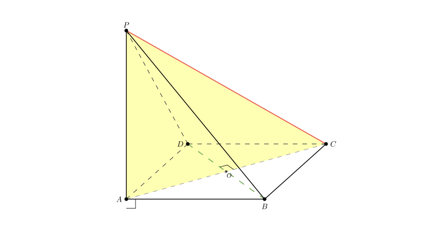
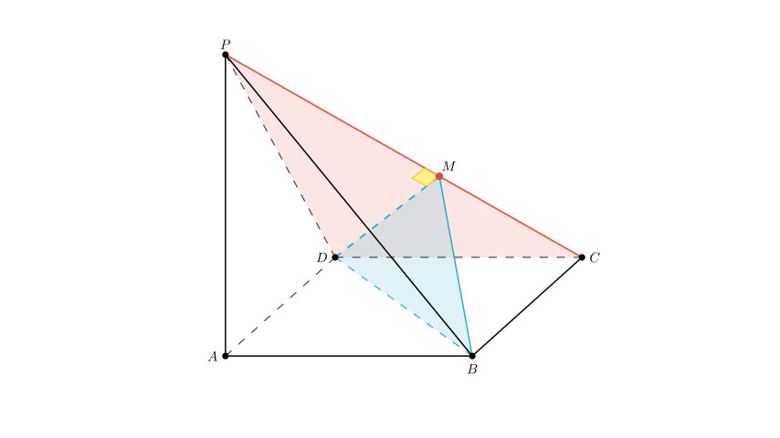

# problem_70_math_g12

**Problem Statement:**
As shown in the figure, in the quadrangular pyramid $P-ABCD$, $PA \perp$ base $ABCD$, and all edges of the base are equal (implying $ABCD$ is a rhombus). $M$ is a moving point on $PC$. When point $M$ satisfies ________, plane $MBD \perp$ plane $PCD$. (Just fill in one condition that you consider correct.)

**Solution Approach:**
To solve this problem, we need to use the theorems regarding perpendicular planes. Specifically, if a line in one plane is perpendicular to the other plane, then the two planes are perpendicular. We will analyze the geometric properties of the pyramid, specifically the relationship between the diagonal $BD$ and the edge $PC$, to derive the necessary condition.

**Step 1: Analyze the Geometry of the Base and Vertical Edge**

First, let's look at the given properties:
1.  The base edges are all equal ($AB=BC=CD=DA$). This means the base $ABCD$ is a **rhombus**.
2.  $PA \perp$ Base $ABCD$.

Because $ABCD$ is a rhombus, its diagonals are perpendicular. Let's denote the intersection of diagonals $AC$ and $BD$ as point $O$ (though we don't strictly need to label it to see the relationship).
$$AC \perp BD$$

Because $PA$ is perpendicular to the entire base plane $ABCD$, it is perpendicular to every line in that base. Therefore:
$$PA \perp BD$$

**Step 2: Establish the Relationship between Line BD and Line PC**

We have established two perpendicularities involving line $BD$:
1.  $BD \perp AC$
2.  $BD \perp PA$

Since $PA$ and $AC$ are two intersecting lines that define the plane $PAC$, line $BD$ must be perpendicular to the entire plane $PAC$.
$$BD \perp \text{Plane } PAC$$

Since the edge $PC$ lies within the plane $PAC$, line $BD$ must be perpendicular to line $PC$.
$$BD \perp PC$$

This is a crucial finding. We now know that regardless of where $M$ is, the line $BD$ (which is part of plane $MBD$) is perpendicular to $PC$ (which is part of plane $PCD$).

**Step 3: Determine the Condition for Plane Perpendicularity**

We want to prove: **Plane $MBD \perp$ Plane $PCD$**.

According to the determination theorem for perpendicular planes: *If a plane contains a line that is perpendicular to another plane, then the two planes are perpendicular.*

We already know that $BD \perp PC$.
- $BD$ is in Plane $MBD$.
- $PC$ is in Plane $PCD$.

To make Plane $MBD \perp$ Plane $PCD$, it would be sufficient to make the line $PC$ perpendicular to the *entire* Plane $MBD$.

For line $PC$ to be perpendicular to Plane $MBD$, it must be perpendicular to two intersecting lines in Plane $MBD$.
We already have $PC \perp BD$. We just need $PC$ to be perpendicular to one other line in Plane $MBD$ passing through the intersection point. The most obvious candidates are $DM$ or $BM$.

If we set the condition **$DM \perp PC$**, then:
1.  $PC \perp BD$ (Proven in Step 2)
2.  $PC \perp DM$ (Proposed Condition)
3.  $BD \cap DM = D$

Therefore, $PC \perp$ Plane $MBD$.
Since $PC \subset$ Plane $PCD$, this implies Plane $PCD \perp$ Plane $MBD$.

**Conclusion and Verification**

The condition $DM \perp PC$ implies that $\angle PMC = 90^\circ$.

Alternatively, due to the symmetry of the rhombus base (symmetric about $AC$), the condition $BM \perp PC$ is equivalent. Another valid geometric description is that $M$ is the orthocenter of $\triangle PCD$ (though that is overly specific), or simply that $M$ is the projection of $D$ onto $PC$.

The most direct and standard answer is the geometric perpendicularity.

**Final Answer:**
$DM \perp PC$ (or $BM \perp PC$)

