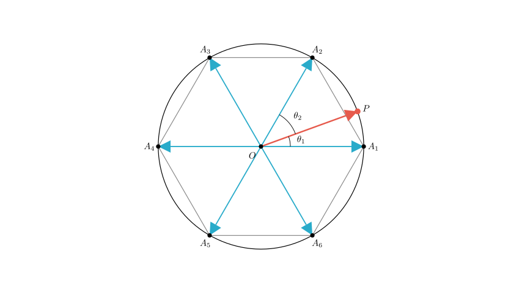
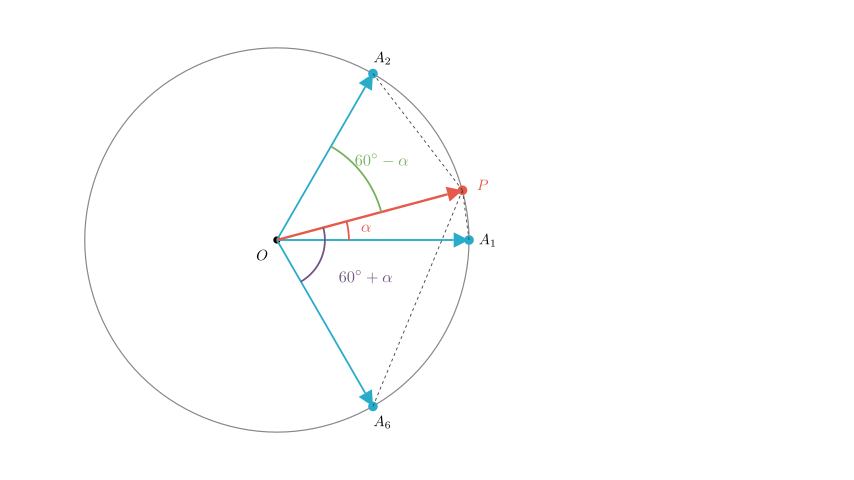
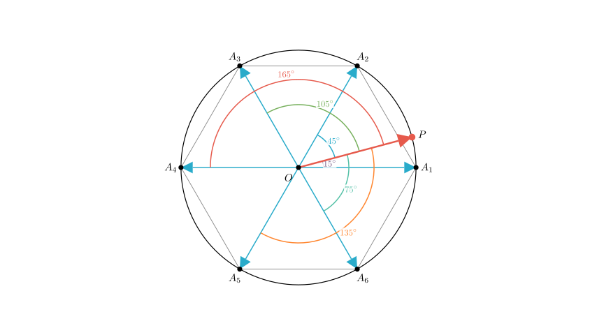

# problem_71_math_g12

**Problem Statement:**
Given a regular hexagon $A_1A_2\cdots A_6$ inscribed in a circle $O$, let $P$ be a point on the circle $O$. Let $\theta_i$ be the angle between the vector $\overrightarrow{OP}$ and the vector $\overrightarrow{OA_i}$ for $i=1, 2, \cdots, 6$. If the values $\theta_1, \theta_2, \cdots, \theta_6$, when rearranged from smallest to largest, form an arithmetic progression, find the 3rd term of this arithmetic progression.

**Solution Approach:**
1.  **Model the Geometry:** We will place the hexagon vertices at fixed angles (multiples of $60^\circ$) on the circle.
2.  **Define Point P:** Due to the symmetry of the regular hexagon, we can analyze the position of $P$ within a specific sector (e.g., between $0^\circ$ and $30^\circ$) without loss of generality.
3.  **Express Angles:** We will calculate the six angles $\{\theta_i\}$ in terms of $P$'s angular position $\alpha$.
4.  **Sort and Solve:** We will order these expressions by size, set up the condition for an arithmetic progression (equal differences), and solve for $\alpha$.
5.  **Calculate the Term:** Finally, we will substitute $\alpha$ back into the expressions to find the value of the 3rd term.

**Step 1: Coordinate and Angle Setup**

Let the vertices of the regular hexagon be at the following angular positions relative to the center $O$:
*   $A_1$: $0^\circ$
*   $A_2$: $60^\circ$
*   $A_3$: $120^\circ$
*   $A_4$: $180^\circ$
*   $A_5$: $240^\circ$
*   $A_6$: $300^\circ$ (which corresponds to $-60^\circ$)

Let the angle of point $P$ be $\alpha$. Due to the 6-fold rotational symmetry and reflection symmetry of the hexagon, the set of angles $\{\theta_i\}$ is invariant under these symmetries. Therefore, we can assume without loss of generality that $P$ lies in the first half of the first sector:
$$0^\circ \le \alpha \le 30^\circ$$

**Step 2: Expressing the Vector Angles**

The angle $\theta_i$ between two vectors is the shortest angular distance between them on the circle, falling within the range $[0^\circ, 180^\circ]$.

Based on our setup ($P$ at $\alpha$, where $0 \le \alpha \le 30$):
1.  **Angle with $A_1$ ($0^\circ$):** $\theta_1 = \alpha$
2.  **Angle with $A_2$ ($60^\circ$):** $\theta_2 = 60^\circ - \alpha$
3.  **Angle with $A_3$ ($120^\circ$):** $\theta_3 = 120^\circ - \alpha$
4.  **Angle with $A_4$ ($180^\circ$):** $\theta_4 = 180^\circ - \alpha$
5.  **Angle with $A_5$ ($240^\circ$):** The angular difference is $240^\circ - \alpha$. The vector angle is $360^\circ - (240^\circ - \alpha) = 120^\circ + \alpha$.
6.  **Angle with $A_6$ ($300^\circ$):** The angular difference is $300^\circ - \alpha$. The vector angle is $360^\circ - (300^\circ - \alpha) = 60^\circ + \alpha$.

Thus, the set of six angles is:
$$ \{ \alpha, 60^\circ - \alpha, 60^\circ + \alpha, 120^\circ - \alpha, 120^\circ + \alpha, 180^\circ - \alpha \} $$

**Step 3: Sorting the Angles**

We need to arrange these values from smallest to largest to form the arithmetic progression. Given $0^\circ \le \alpha \le 30^\circ$:

1.  **Smallest:** $\alpha$ (since $\alpha \le 30$ and $60-\alpha \ge 30$)
2.  **Second:** $60^\circ - \alpha$
3.  **Third:** $60^\circ + \alpha$ (Clearly larger than $60-\alpha$)
4.  **Fourth:** $120^\circ - \alpha$ (Note: $(120-\alpha) - (60+\alpha) = 60 - 2\alpha \ge 0$)
5.  **Fifth:** $120^\circ + \alpha$
6.  **Largest:** $180^\circ - \alpha$

So, the sorted sequence is:
$$ a_1 = \alpha $$
$$ a_2 = 60^\circ - \alpha $$
$$ a_3 = 60^\circ + \alpha $$
$$ a_4 = 120^\circ - \alpha $$
$$ a_5 = 120^\circ + \alpha $$
$$ a_6 = 180^\circ - \alpha $$

**Step 4: Solving for $\alpha$**

For this sequence to be an arithmetic progression, the difference between consecutive terms must be constant. Let's compare the first two differences:

Difference $d_1 = a_2 - a_1 = (60^\circ - \alpha) - \alpha = 60^\circ - 2\alpha$
Difference $d_2 = a_3 - a_2 = (60^\circ + \alpha) - (60^\circ - \alpha) = 2\alpha$

Set $d_1 = d_2$:
$$ 60^\circ - 2\alpha = 2\alpha $$
$$ 4\alpha = 60^\circ $$
$$ \alpha = 15^\circ $$

We should verify if this $\alpha$ works for the rest of the sequence:
*   $a_4 - a_3 = (120^\circ - 15^\circ) - (60^\circ + 15^\circ) = 105^\circ - 75^\circ = 30^\circ$
*   $a_5 - a_4 = (120^\circ + 15^\circ) - (120^\circ - 15^\circ) = 135^\circ - 105^\circ = 30^\circ$
*   $a_6 - a_5 = (180^\circ - 15^\circ) - (120^\circ + 15^\circ) = 165^\circ - 135^\circ = 30^\circ$

The common difference is $30^\circ$, so $\alpha = 15^\circ$ is the correct solution.

**Step 5: Finding the 3rd Term**

The question asks for the 3rd term of this arithmetic progression. Based on our sorted list:

$$ \text{3rd Term } (a_3) = 60^\circ + \alpha $$

Substituting $\alpha = 15^\circ$:
$$ a_3 = 60^\circ + 15^\circ = 75^\circ $$

**Final Answer:**
The arithmetic progression is $15^\circ, 45^\circ, 75^\circ, 105^\circ, 135^\circ, 165^\circ$.
The 3rd term is **$75^\circ$**.

