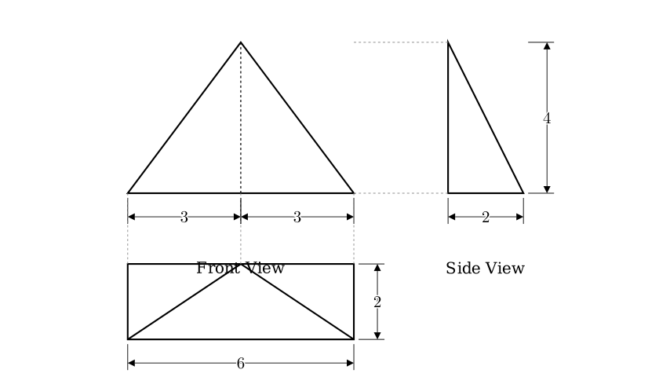
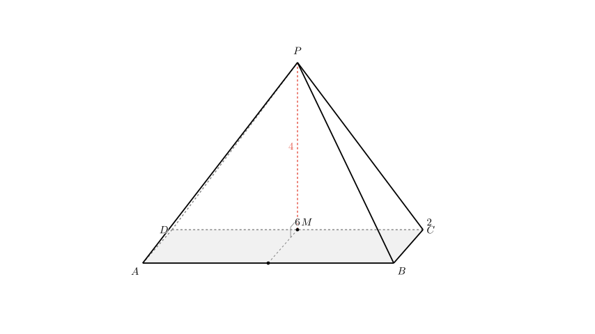
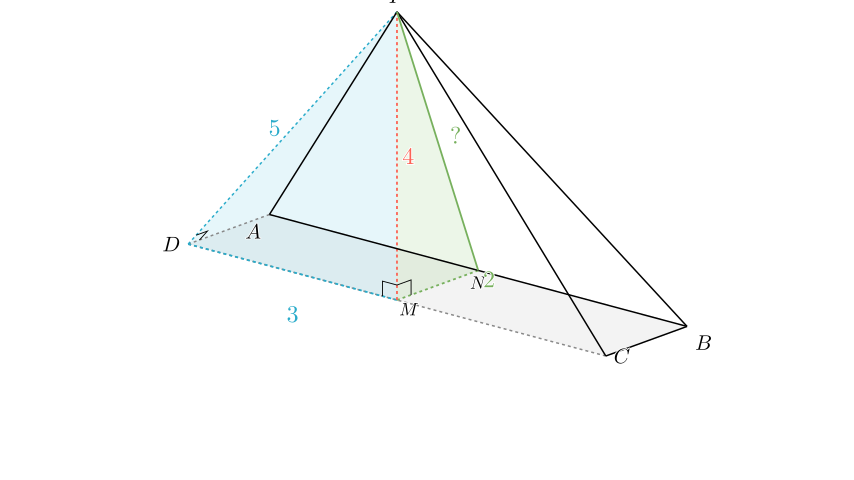

# problem_72_math_g12

**Problem Statement:**
(2012 Jiaozuo Simulation) As shown in the figure, this is the three-view diagram of a quadrangular pyramid. The surface area of this geometric solid is ______.

**Solution Approach:**
1.  **Analyze the Three-View Diagram:** We will interpret the Front, Side, and Top views to determine the 3D structure and dimensions of the pyramid.
2.  **Reconstruct the Geometry:** We will identify the shape of the base, the position of the apex, and the height of the pyramid.
3.  **Calculate Surface Areas:** We will calculate the area of the base and each of the four triangular lateral faces individually.
4.  **Summation:** We will add these areas together to find the total surface area.

**Step 1: Decoding the Geometry**

From the three views, we can determine the specific properties of the quadrangular pyramid:

*   **From the Top View:** The base is a rectangle with length $6$ and width $2$. The internal lines show that the apex of the pyramid projects onto the midpoint of one of the long edges (the "back" edge in this perspective).
*   **From the Front View:** The pyramid has a total width of $6$ ($3+3$). It appears as an isosceles triangle, confirming the apex is centered horizontally relative to the long side.
*   **From the Side View:** The view is a right-angled triangle with height $4$ and base $2$. The right angle indicates that the face containing the apex and the back edge is perpendicular to the base.

**Geometric Reconstruction:**
Let the base be rectangle $ABCD$ with $AB = CD = 6$ and $BC = DA = 2$.
Let the apex be $P$.
Let $M$ be the midpoint of the edge $CD$.
The apex $P$ is located directly above point $M$.
The height of the pyramid is $PM = 4$.

**Step 2: Analyzing the Faces**

The surface area consists of 5 parts: the rectangular base and 4 triangular faces.

**1. The Base ($ABCD$):**
This is a rectangle of size $6 \times 2$.
$$ \text{Area}_{\text{base}} = 6 \times 2 = 12 $$

**2. The Back Face ($PCD$):**
Since $P$ is directly above $M$ (the midpoint of $CD$), the line $PM$ is perpendicular to $CD$.
Triangle $PCD$ is perpendicular to the base.
Base $CD = 6$. Height $PM = 4$.
$$ \text{Area}_{PCD} = \frac{1}{2} \times \text{base} \times \text{height} = \frac{1}{2} \times 6 \times 4 = 12 $$

**3. The Side Faces ($PAD$ and $PBC$):**
Let's analyze triangle $PAD$.
Since $PM \perp \text{Plane } ABCD$, $PM$ is perpendicular to $AD$.
Also, $ABCD$ is a rectangle, so $CD \perp AD$.
Because $M$ lies on $CD$, the line $MD$ is perpendicular to $AD$.
By the geometric properties (or the Three Perpendiculars Theorem), since $PM \perp AD$ (via projection) and $MD \perp AD$, the slant edge $PD$ is perpendicular to $AD$. Thus, $\triangle PAD$ is a right-angled triangle at $D$.

We need the length of $PD$. In the right triangle $\triangle PMD$:
$PM = 4$
$MD = 3$ (half of length 6)
$$ PD = \sqrt{PM^2 + MD^2} = \sqrt{4^2 + 3^2} = \sqrt{16 + 9} = 5 $$

Now, calculate the area of right triangle $PAD$:
$$ \text{Area}_{PAD} = \frac{1}{2} \times AD \times PD = \frac{1}{2} \times 2 \times 5 = 5 $$
By symmetry, $\triangle PBC$ is identical to $\triangle PAD$, so $\text{Area}_{PBC} = 5$.

**4. The Front Face ($PAB$):**
This is an isosceles triangle with base $AB = 6$. We need its height (slant height from $P$ to $AB$).
Let $N$ be the midpoint of $AB$.
Connect $M$ to $N$. The length $MN$ equals the width of the rectangle, so $MN = 2$.
Since $PM \perp \text{Base}$, $\triangle PMN$ is a right-angled triangle.
The hypotenuse $PN$ is the height of the face $PAB$.

Calculate $PN$:
$$ PN = \sqrt{PM^2 + MN^2} = \sqrt{4^2 + 2^2} = \sqrt{16 + 4} = \sqrt{20} = 2\sqrt{5} $$

Now, calculate the area of triangle $PAB$:
$$ \text{Area}_{PAB} = \frac{1}{2} \times AB \times PN = \frac{1}{2} \times 6 \times 2\sqrt{5} = 6\sqrt{5} $$

**Step 3: Total Surface Area**

Summing all the calculated areas:
$$ S = S_{\text{base}} + S_{PCD} + S_{PAD} + S_{PBC} + S_{PAB} $$
$$ S = 12 + 12 + 5 + 5 + 6\sqrt{5} $$
$$ S = 34 + 6\sqrt{5} $$

**Final Answer:**
The surface area of the geometric solid is $34 + 6\sqrt{5}$.

