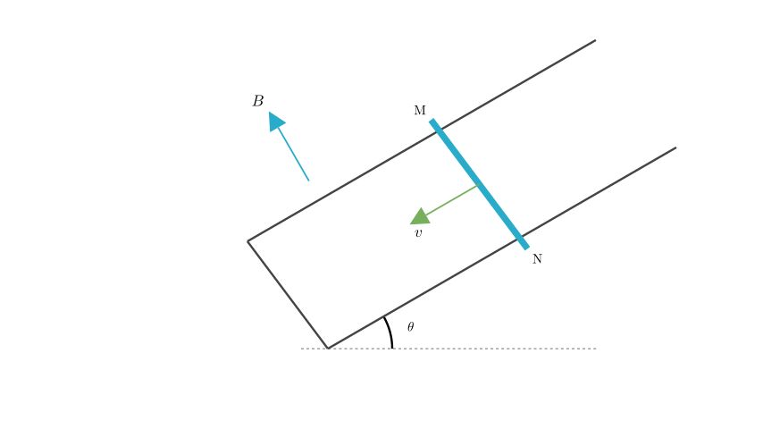
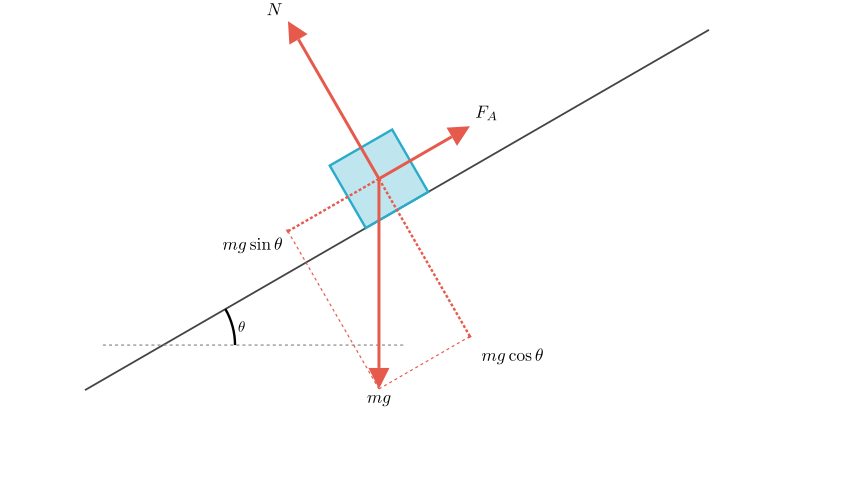
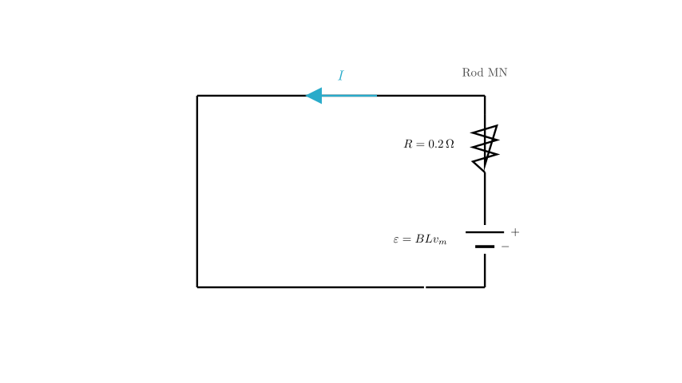
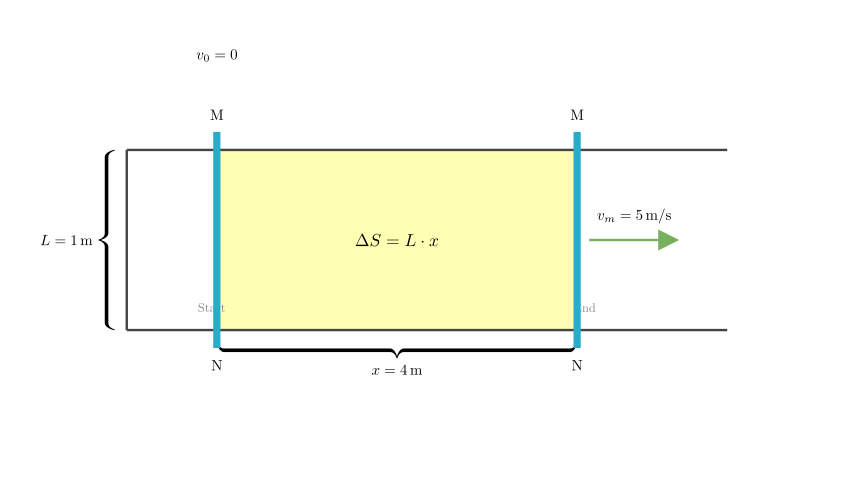

# problem_73_physics_g12

**Problem Statement:**

As shown in the figure, a U-shaped conductor frame has a width $L=1\,\text{m}$. The plane of the frame makes an angle $\theta=30^\circ$ with the horizontal plane, and its resistance is negligible. A uniform magnetic field is perpendicular to the plane of the U-shaped frame, with a magnetic induction intensity $B=0.2\,\text{Wb/m}^2$ (Tesla).

A conducting rod MN with mass $m=0.2\,\text{kg}$ and resistance $R=0.2\,\Omega$ is placed across the U-shaped frame (which is sufficiently long) and can slide without friction.

Find:
1. The maximum velocity $v_m$ of the conductor rod MN during its descent.
2. The electric power $P$ released on the conductor rod MN at the maximum velocity $v_m$.
3. If the electrical energy consumed by the conductor rod from the start of the slide until it reaches maximum velocity is $Q_{\text{elec}}=1.5\,\text{J}$, what is the electric charge $q$ passing through the cross-section of the rod during this process?

**Solution Approach:**

To solve this problem, we will apply concepts from mechanics and electromagnetism:
1.  **Dynamics:** We will analyze the forces acting on the rod (Gravity, Normal force, and Ampere force) to find the terminal velocity (maximum velocity) where acceleration is zero.
2.  **Circuit Theory:** We will calculate the induced EMF and current to determine the power dissipated.
3.  **Energy & Charge:** We will use the Law of Conservation of Energy to find the distance traveled, and then relate that distance to the change in magnetic flux to calculate the total charge transfer.

**Part 1: Calculating Maximum Velocity ($v_m$)**

When the rod MN slides down the frictionless incline, it cuts magnetic field lines, generating an induced Electromotive Force (EMF). This creates a current, which in turn interacts with the magnetic field to produce an Ampere force ($F_A$) acting on the rod.

According to Lenz's Law and the Right-Hand Rule, the direction of the Ampere force opposes the motion; therefore, it points up the incline.

**Step 1: Force Analysis**
The rod is subject to three forces:
1.  Gravity ($mg$), acting vertically downwards.
2.  Normal Force ($N$), perpendicular to the rails.
3.  Ampere Force ($F_A$), parallel to the rails, acting upwards.

The component of gravity pulling the rod down the slope is $F_g = mg \sin\theta$.

**Step 2: Equilibrium Condition**
The rod accelerates until the upward Ampere force balances the downward component of gravity. At maximum velocity ($v_m$), the net force is zero ($a=0$).

$$mg \sin\theta = F_A$$

**Step 3: Expression for Ampere Force**
The induced EMF is $E = BLv$.
The induced current is $I = \frac{E}{R} = \frac{BLv}{R}$.
The Ampere force is $F_A = BIL = B\left(\frac{BLv}{R}\right)L = \frac{B^2 L^2 v}{R}$.

Substituting this into the equilibrium equation for $v_m$:
$$mg \sin\theta = \frac{B^2 L^2 v_m}{R}$$

Solving for $v_m$:
$$v_m = \frac{mg R \sin\theta}{B^2 L^2}$$

**Step 4: Calculation**
Given: $m=0.2\,\text{kg}$, $g=10\,\text{m/s}^2$, $R=0.2\,\Omega$, $\theta=30^\circ$, $B=0.2\,\text{T}$, $L=1\,\text{m}$.

$$v_m = \frac{0.2 \times 10 \times 0.2 \times \sin 30^\circ}{(0.2)^2 \times 1^2}$$
$$v_m = \frac{0.4 \times 0.5}{0.04} = \frac{0.2}{0.04} = 5\,\text{m/s}$$

**Answer (1):** The maximum velocity is **5 m/s**.

**Part 2: Calculating Electric Power ($P$)**

At the maximum velocity $v_m$, the system is in a steady state. We need to find the power dissipated by the resistance $R$ of the rod.

**Method A: Using Electrical Formulas**
The induced EMF at max speed is:
$$E = BLv_m$$
$$E = 0.2 \times 1 \times 5 = 1.0\,\text{V}$$

The power dissipated is:
$$P = \frac{E^2}{R}$$
$$P = \frac{(1.0)^2}{0.2} = 5\,\text{W}$$

**Method B: Using Energy Conversion**
At terminal velocity, the kinetic energy is constant. Therefore, the work done by gravity is entirely converted into electrical energy (heat).
Power of gravity component = Power dissipated electrically.
$$P = F_{\text{gravity\_parallel}} \times v_m = (mg \sin\theta) \times v_m$$
$$P = (0.2 \times 10 \times 0.5) \times 5 = 1.0 \times 5 = 5\,\text{W}$$

Both methods yield the same result.

**Answer (2):** The electric power released is **5 W**.

**Part 3: Calculating Charge ($q$)**

We need to find the total charge $q$ that passed through the rod while it accelerated from rest ($v=0$) to maximum velocity ($v_m=5\,\text{m/s}$).

**Step 1: Relate Charge to Distance**
The definition of current is $I = \frac{\Delta q}{\Delta t}$.
From Faraday's Law, average current $\bar{I} = \frac{\bar{E}}{R} = \frac{\Delta \Phi}{R \Delta t}$.
Therefore, the charge is:
$$q = \bar{I} \Delta t = \frac{\Delta \Phi}{R}$$
Since the magnetic field is uniform, the change in flux is $\Delta \Phi = B \cdot \Delta S = B \cdot (L \cdot x)$, where $x$ is the distance the rod slid down the rails.
$$q = \frac{BLx}{R}$$

To find $q$, we first need to find the distance $x$.

**Step 2: Energy Conservation to find Distance ($x$)**
From the start to the point where max velocity is reached:
$$ \text{Loss in Potential Energy} = \text{Gain in Kinetic Energy} + \text{Electrical Energy Consumed} $$
$$ mg h = \frac{1}{2}mv_m^2 + Q_{\text{elec}} $$

Here, the vertical height $h = x \sin\theta$.
$$ mg (x \sin\theta) = \frac{1}{2}mv_m^2 + Q_{\text{elec}} $$

**Step 3: Calculation**
Substitute the known values ($m=0.2, g=10, \theta=30^\circ, v_m=5, Q_{\text{elec}}=1.5$):
$$ 0.2 \times 10 \times x \times 0.5 = \frac{1}{2} \times 0.2 \times (5)^2 + 1.5 $$
$$ 1.0 \cdot x = 0.1 \times 25 + 1.5 $$
$$ x = 2.5 + 1.5 $$
$$ x = 4\,\text{m} $$

**Step 4: Calculate Charge**
Now substitute $x=4\,\text{m}$ back into the charge equation:
$$ q = \frac{BLx}{R} = \frac{0.2 \times 1 \times 4}{0.2} $$
$$ q = 4\,\text{C} $$

**Answer (3):** The charge passing through the rod is **4 C**.

**Final Summary:**

1.  **Maximum Velocity:** By balancing the component of gravity down the slope with the opposing magnetic Ampere force, we found $v_m = 5\,\text{m/s}$.
2.  **Electric Power:** Using the formula $P = E^2/R$ (or mechanical power $P=Fv$), we determined the power at max velocity is $P = 5\,\text{W}$.
3.  **Electric Charge:** By using the conservation of energy, we calculated the sliding distance ($x=4\,\text{m}$). We then used the relationship $q = \frac{\Delta \Phi}{R}$ to find the total charge transfer $q = 4\,\text{C}$.

