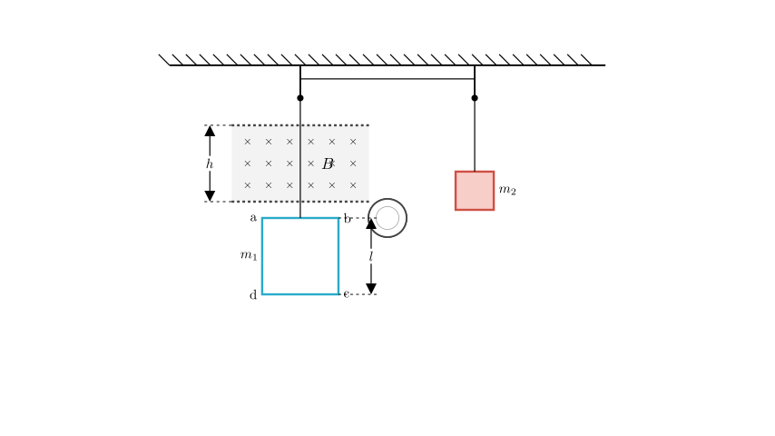
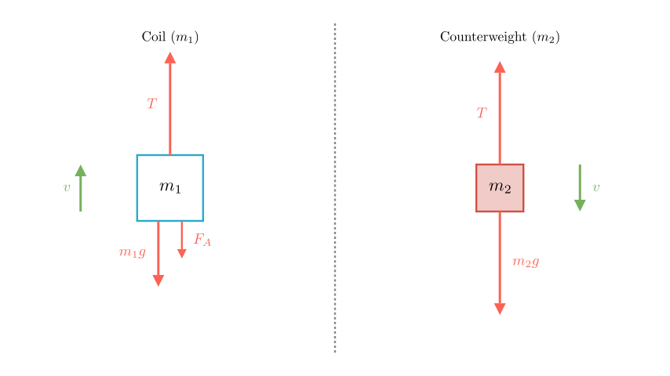
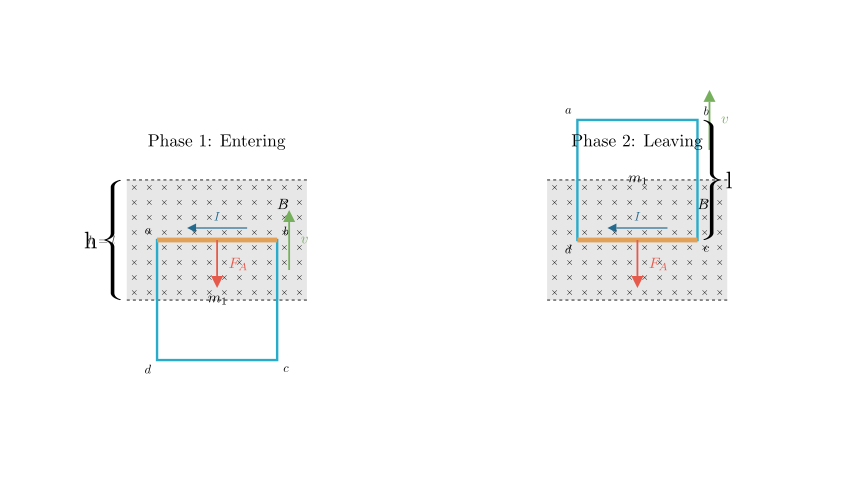

# problem_74_physics_g12

**Problem Statement:**
As shown in the figure, a coil $abcd$ has side length $l=0.20\text{ m}$, mass $m_1=0.10\text{ kg}$, resistance $R=0.10\text{ }\Omega$, and a counterweight of mass $m_2=0.14\text{ kg}$. The uniform magnetic field above the coil has a magnetic induction intensity $B=0.5\text{ T}$, with the direction perpendicular to the coil plane pointing inwards. The width (height) of the magnetic field region is $h=l=0.20\text{ m}$. The counterweight descends from a certain position, causing the side $ab$ to enter the magnetic field and start moving at a uniform speed. 

Calculate:
(1) The speed of the uniform motion of the coil.
(2) The heat generated during the process from side $ab$ entering the magnetic field until the coil passes completely out of the magnetic field.
*(Assume gravitational acceleration $g=10\text{ m/s}^2$)*

**Solution Approach:**
To solve this problem, we will first analyze the forces acting on the coil and the counterweight during the uniform motion phase. By applying Newton's laws and the formulas for Ampere's force and induced EMF, we can determine the velocity. For the second part, we will use the principle of conservation of energy (or the work-energy theorem) to calculate the heat generated, considering the work done against the magnetic force as the coil traverses the field.

**Part 1: Calculating the Uniform Speed ($v$)**

**Step 1: Force Analysis**
Since the coil moves upward at a **uniform speed** (constant velocity), the system is in equilibrium. The net force on both masses is zero.

Let's analyze the forces acting on each object:
*   **Counterweight ($m_2$):** Subject to gravity ($m_2g$) acting downwards and tension ($T$) acting upwards. Since it moves at constant velocity:
$$T = m_2g$$

*   **Coil ($m_1$):** Subject to gravity ($m_1g$) acting downwards, tension ($T$) acting upwards, and the magnetic Ampere force ($F_A$) acting downwards.

Why is the Ampere force downwards?
As the top edge $ab$ moves upward into the magnetic field, the magnetic flux pointing into the page increases. By Lenz's Law, the induced current will create a magnetic field pointing *out* of the page to oppose this change, resulting in a counter-clockwise current ($a \rightarrow b \rightarrow c \rightarrow d$).
Using the Left-Hand Rule on side $ab$ (current flows $a \rightarrow b$, B-field is inwards), the resulting magnetic force points **downwards**, opposing the motion.

**Step 2: Mathematical Derivation**

From the equilibrium condition of the coil ($m_1$):
$$T = m_1g + F_A$$

Substituting $T = m_2g$:
$$m_2g = m_1g + F_A$$
$$F_A = (m_2 - m_1)g$$

Now, we express the Ampere force $F_A$ in terms of velocity $v$.
1.  Induced Electromotive Force (EMF): $E = Blv$
2.  Induced Current: $I = \frac{E}{R} = \frac{Blv}{R}$
3.  Ampere Force: $F_A = BIl = B \left( \frac{Blv}{R} \right) l = \frac{B^2 l^2 v}{R}$

**Step 3: Calculation**
Equating the two expressions for $F_A$:
$$(m_2 - m_1)g = \frac{B^2 l^2 v}{R}$$

Solving for $v$:
$$v = \frac{(m_2 - m_1)g R}{B^2 l^2}$$

Substitute the given values ($m_1=0.10$, $m_2=0.14$, $g=10$, $R=0.10$, $B=0.5$, $l=0.20$):
$$v = \frac{(0.14 - 0.10) \times 10 \times 0.10}{(0.5)^2 \times (0.20)^2}$$
$$v = \frac{0.04 \times 1}{0.25 \times 0.04}$$
$$v = \frac{0.04}{0.01}$$
$$v = 4\text{ m/s}$$

The uniform speed of the coil is **4 m/s**.

**Part 2: Calculating Generated Heat ($Q$)**

**Step 1: Identify the Process**
The problem asks for the heat generated from the moment $ab$ enters the field until the coil completely leaves the field. Since the height of the magnetic field $h$ is equal to the side length of the coil $l$ ($h=l=0.20\text{ m}$), the motion consists of two continuous phases where induced current flows:

1.  **Entering Phase:** The coil moves distance $l$. Side $ab$ cuts magnetic field lines. Current is induced. Ampere force acts downwards.
2.  **Leaving Phase:** Immediately after $ab$ reaches the top of the field, the bottom side $cd$ enters the field. As the coil continues to move up another distance $l$, side $cd$ cuts field lines. Current is induced (now clockwise), but the Ampere force still acts downwards.

**Step 2: Work-Energy Calculation**
The heat generated $Q$ is equal to the work done by the system against the resistive Ampere force. Since the velocity is uniform throughout the entire process (both entering and leaving phases generate the same resistive force magnitude), we can calculate the work simply as:
$$Q = W_{\text{Ampere}} = F_A \times d_{\text{total}}$$

The total distance $d_{\text{total}}$ where current flows is the length to enter plus the length to leave:
$$d_{\text{total}} = l + l = 2l = 2 \times 0.20\text{ m} = 0.40\text{ m}$$

Using the value of $F_A$ we found earlier ($F_A = (m_2 - m_1)g = 0.4\text{ N}$):
$$Q = 0.4\text{ N} \times 0.40\text{ m}$$
$$Q = 0.16\text{ J}$$

**Alternative Method (Energy Conservation):**
The decrease in the system's gravitational potential energy is converted into heat (since kinetic energy is constant).
$$Q = \Delta PE_{\text{loss}} = m_2 g (2l) - m_1 g (2l)$$
$$Q = (m_2 - m_1) g (2l)$$
$$Q = (0.04\text{ kg}) \times 10\text{ m/s}^2 \times 0.40\text{ m}$$
$$Q = 0.16\text{ J}$$

**Final Answer:**
(1) The uniform speed of the coil is **4 m/s**.
(2) The heat generated during the process is **0.16 J**.

**Recap:**
We determined the speed by balancing the gravitational forces with the magnetic Ampere force. We then calculated the heat generated by finding the total work done against this magnetic force over the total distance the coil moved while interacting with the magnetic field (entering + leaving).

