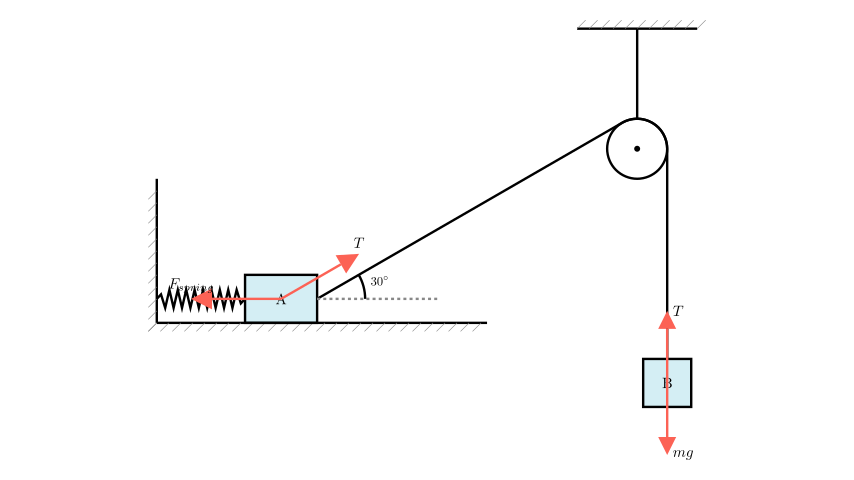
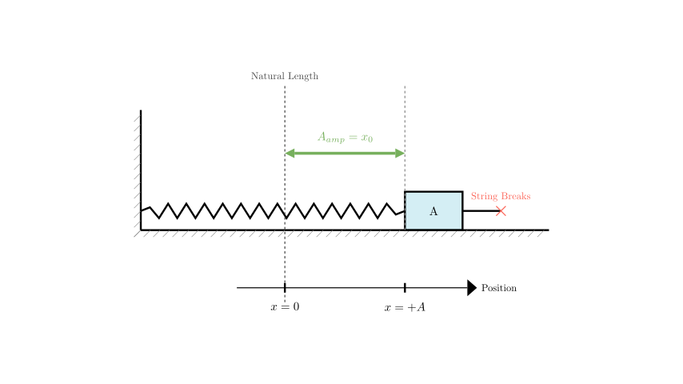
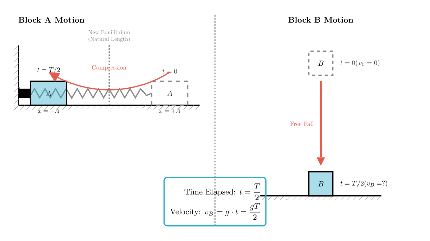

# problem_81_physics_g12

**Problem Statement:**
As shown in the figure, objects A and B both have a mass of $m$. Object A is connected to a fixed wall by a spring and to object B by a fine string passing over a pulley. When the system is in a static state, the angle between the string pulling A and the horizontal direction is $30^\circ$. Friction is negligible. The spring constant is $k$. 

If the suspension string suddenly breaks, A performs simple harmonic motion (SHM) on the horizontal plane with a period of $T$. When B hits the ground, A happens to compress the spring to its shortest length. 

Find:
(1) The amplitude of A's vibration.
(2) The velocity of B when it hits the ground.

**Solution Approach:**
To solve this, we will analyze the forces in the initial static equilibrium to determine the initial extension of the spring. This extension represents the displacement from the *new* equilibrium position (natural length) after the string breaks, which defines the amplitude. Then, we will correlate the time it takes for A to reach maximum compression with the time B spends falling to calculate B's final velocity.

**Part 1: Determining the Amplitude of A**

First, we analyze the system before the string breaks to find the initial deformation of the spring.

**Analysis of Block B:**
Since B is stationary, the tension in the string ($T$) must balance the weight of B.
$$T = m_B g = mg$$

**Analysis of Block A:**
Block A is also stationary. The horizontal forces acting on A are the spring force ($F_{spring}$) pulling to the left and the horizontal component of the tension ($T_x$) pulling to the right.

The horizontal component of tension is:
$$T_x = T \cos(30^\circ) = mg \cdot \frac{\sqrt{3}}{2}$$

Balancing the horizontal forces:
$$F_{spring} = T_x \implies k \cdot x_0 = \frac{\sqrt{3}}{2}mg$$

where $x_0$ is the initial extension of the spring.
Solving for $x_0$:
$$x_0 = \frac{\sqrt{3}mg}{2k}$$

**Defining the Amplitude:**

When the string breaks, the tension force vanishes ($T=0$). The only horizontal force acting on A is the spring force.

In a horizontal spring-mass system, the equilibrium position for Simple Harmonic Motion is the point where the net force is zero. Without the string, the net force is zero when the spring is at its **natural length**.

Therefore:
1. The new equilibrium position is the spring's natural length ($x=0$).
2. The motion starts from the initial stretched position ($x = x_0$) with zero initial velocity.

This initial displacement from the new equilibrium is exactly the amplitude ($A_{amp}$) of the oscillation.

$$A_{amp} = x_0 = \frac{\sqrt{3}mg}{2k}$$

**Answer (1):** The amplitude of A's vibration is $\frac{\sqrt{3}mg}{2k}$.

**Part 2: Determining the Velocity of B**

Now we analyze the timing. The problem states that "when B hits the ground, A happens to compress the spring to the shortest length."

**Motion of A:**
1.  At $t=0$, A is at the positive extreme (maximum extension).
2.  A moves through the equilibrium point.
3.  A reaches the negative extreme (shortest length/maximum compression).

In Simple Harmonic Motion, the time required to go from the positive extreme to the negative extreme is exactly half a period ($T/2$).

Therefore, the time elapsed is:
$$t = \frac{T}{2}$$

**Motion of B:**
Block B undergoes free fall starting from rest ($v_0 = 0$). We need to find its velocity $v_B$ at time $t = T/2$.

Using the kinematic equation for velocity in free fall:
$$v = gt$$

Substituting the time $t$:
$$v_B = g \cdot \left( \frac{T}{2} \right)$$

$$v_B = \frac{gT}{2}$$

**Answer (2):** The velocity of B when it lands is $\frac{gT}{2}$.

**Final Recap:**

1.  **Amplitude:** We found the initial tension $T=mg$, calculated its horizontal component $T_x = mg \cos 30^\circ$, and equated it to the spring force $kx_0$. Since the block is released from rest relative to the spring's natural length, this initial extension $x_0$ is the amplitude.
Result: $A_{amp} = \frac{\sqrt{3}mg}{2k}$.

2.  **Velocity:** We identified that moving from maximum extension to maximum compression takes half a vibrational period ($t = T/2$). Applying free-fall kinematics to block B for this duration gives the final velocity.
Result: $v_B = \frac{gT}{2}$.

