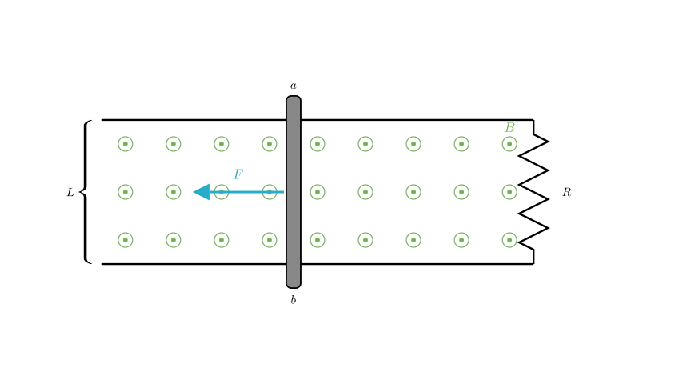
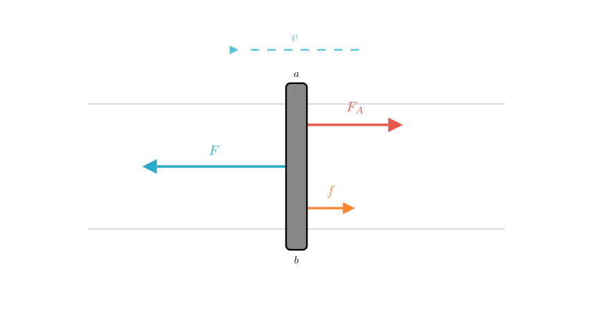
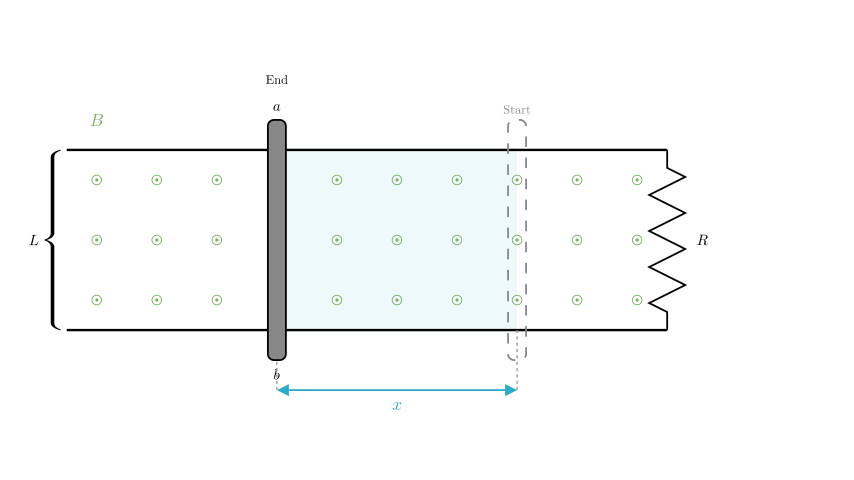

# problem_84_physics_g12

**Problem Statement:**
As shown in the figure, a sufficiently long U-shaped metal frame of width $L=1\text{m}$ is placed horizontally. The right end is connected to a resistor $R=0.8\Omega$. The frame is located in a uniform magnetic field with magnetic induction $B=1\text{T}$ directed vertically upwards. A metal rod $ab$ with mass $m=0.2\text{kg}$ and resistance $r=0.2\Omega$ is placed on the guide rails. The coefficient of kinetic friction between the rod $ab$ and the rails is $\mu=0.5$. A constant force $F=3\text{N}$ is applied to the rod, causing it to move from rest along the rails (the rod remains perpendicular to and in good contact with the rails). After a period of time, the rod reaches a stable velocity. During this process, the electric charge passing through the rod is $q=2.8\text{C}$. (The resistance of the frame is negligible, $g=10\text{m/s}^2$).

**Questions:**
1. What is the stable velocity reached by the rod $ab$?
2. From the start until the velocity stabilizes, how much heat is generated in the resistor $R$?

**Solution Approach:**
To solve this, we will first analyze the forces acting on the rod when it reaches a constant stable velocity. At this point, the net force is zero. We will balance the applied force against friction and the magnetic (Ampere) force to find the velocity. For the second part, we will relate the given charge $q$ to the displacement of the rod, and then use the Work-Energy Theorem to calculate the total heat generated, distributing it between the internal resistance and the external resistor $R$.

**Part 1: Finding the Stable Velocity**

When the rod moves to the left, it cuts the magnetic field lines, inducing an electromotive force (EMF) and a current. Because the rod carries a current in a magnetic field, it experiences a magnetic force (Ampere force).

The forces acting on the rod along the direction of motion are:
1.  The applied constant force $F$ (forward, to the left).
2.  The sliding friction force $f$ (backward, to the right).
3.  The Ampere force $F_A$ (backward, to the right, opposing the motion).

The rod accelerates until the forces balance. When the velocity becomes stable, the acceleration is zero, and the net force is zero.

**Calculation of Stable Velocity:**

First, we calculate the friction force $f$:
$$f = \mu N = \mu mg = 0.5 \times 0.2\,\text{kg} \times 10\,\text{m/s}^2 = 1\,\text{N}$$

At stable velocity $v$, the equilibrium equation is:
$$F = f + F_A$$
$$3\,\text{N} = 1\,\text{N} + F_A \implies F_A = 2\,\text{N}$$

The formula for the Ampere force is $F_A = B I L$.
Using Ohm's law, the current $I$ is given by the induced EMF divided by total resistance:
$$I = \frac{E}{R+r} = \frac{BLv}{R+r}$$

Substituting this back into the force equation:
$$F_A = B \left( \frac{BLv}{R+r} \right) L = \frac{B^2 L^2 v}{R+r}$$

Now we solve for $v$:
$$2 = \frac{1^2 \times 1^2 \times v}{0.8 + 0.2}$$
$$2 = \frac{v}{1}$$
$$v = 2\,\text{m/s}$$

**Answer (1):** The stable velocity of the rod is **2 m/s**.

**Part 2: Calculating Heat Generated in Resistor R**

To find the heat generated, we should use the principle of Conservation of Energy (Work-Energy Theorem). The work done by the applied force $F$ is converted into kinetic energy, work done against friction, and electrical energy (which dissipates as heat).

$$W_F = \Delta E_k + W_f + Q_{\text{total}}$$

However, to calculate the work done ($W = F \cdot x$), we first need to determine the displacement $x$ of the rod. We can find $x$ using the given charge $q$.

The charge $q$ that flows through the circuit is related to the change in magnetic flux $\Delta \Phi$:
$$q = \bar{I} \Delta t = \frac{\bar{E}}{R+r} \Delta t = \frac{\Delta \Phi / \Delta t}{R+r} \Delta t = \frac{\Delta \Phi}{R+r}$$

Since $\Delta \Phi = B \cdot \Delta A = B \cdot (L \cdot x)$:
$$q = \frac{BLx}{R+r}$$

**Step 1: Calculate Displacement ($x$)**

Rearranging the charge formula to solve for $x$:
$$x = \frac{q(R+r)}{BL}$$

Substitute the values:
$$x = \frac{2.8 \times (0.8 + 0.2)}{1 \times 1} = \frac{2.8 \times 1}{1} = 2.8\,\text{m}$$

**Step 2: Apply Work-Energy Theorem**

Now we calculate the individual work terms:
*   Work done by applied force: $W_F = F \cdot x = 3 \times 2.8 = 8.4\,\text{J}$
*   Work done against friction: $W_f = f \cdot x = 1 \times 2.8 = 2.8\,\text{J}$
*   Change in kinetic energy: $\Delta E_k = \frac{1}{2}mv^2 - 0 = \frac{1}{2} \times 0.2 \times (2)^2 = 0.4\,\text{J}$

Using the energy balance equation:
$$W_F = \Delta E_k + W_f + Q_{\text{total}}$$
$$8.4 = 0.4 + 2.8 + Q_{\text{total}}$$
$$8.4 = 3.2 + Q_{\text{total}}$$
$$Q_{\text{total}} = 5.2\,\text{J}$$

**Step 3: Calculate Heat in Resistor R**

$Q_{\text{total}}$ is the total heat generated in the entire circuit (both the rod's internal resistance $r$ and the external resistor $R$). Since the resistors are in series, the heat generated is proportional to the resistance values.

$$Q_R = \frac{R}{R+r} Q_{\text{total}}$$
$$Q_R = \frac{0.8}{0.8 + 0.2} \times 5.2$$
$$Q_R = 0.8 \times 5.2 = 4.16\,\text{J}$$

**Final Answer:**
1. The stable velocity is **2 m/s**.
2. The heat generated in resistor $R$ is **4.16 J**.

