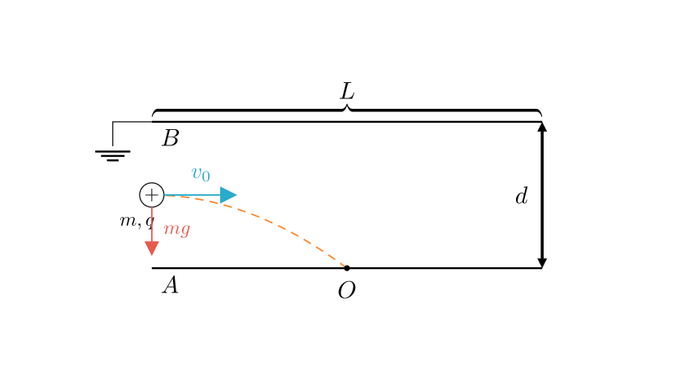
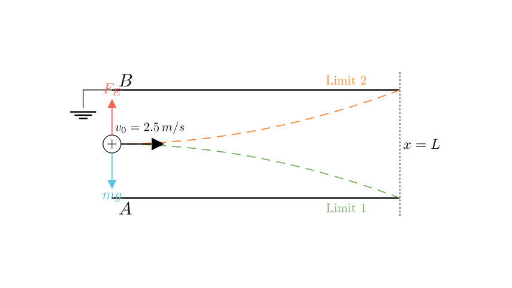
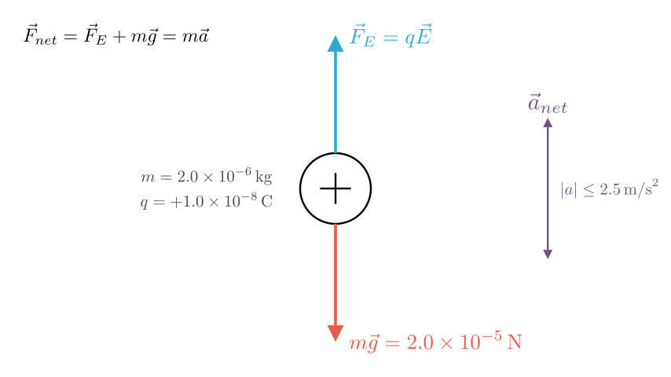

# problem_86_physics_g12

**Problem Statement:**
As shown in the figure, a parallel plate capacitor is placed horizontally. Originally, plates $A$ and $B$ are uncharged, and plate $B$ is grounded. The length of the plates is $L=0.1\,m$, and the distance between them is $d=0.4\,cm$. A particle with mass $m=2.0 \times 10^{-6}\,kg$ and charge $q=+1.0 \times 10^{-8}\,C$ enters from the center between the plates with a certain initial velocity parallel to the plates. Due to gravity, the particle lands exactly at the midpoint $O$ of plate $A$. Take $g=10\,m/s^2$.

Calculate:
1. The magnitude of the initial velocity of the charged particle.
2. If the capacitor is charged such that the particle can exit from the right side of the parallel plates, what is the range of the electric potential of plate $A$?

**Solution Approach:**
We will solve this in two parts. First, we will use the kinematic equations for projectile motion under gravity to determine the initial velocity. Second, we will analyze the combined effects of gravity and the electric force to find the acceleration limits that allow the particle to exit the plates without hitting them, subsequently calculating the required electric potential.

**Part 1: Calculating Initial Velocity ($v_0$)**

In the uncharged state, the particle is subject only to gravity. It performs horizontal projectile motion.

**Given:**
*   Horizontal displacement to impact: $x = \frac{L}{2} = \frac{0.1}{2} = 0.05\,m$
*   Vertical displacement to impact: $y = \frac{d}{2} = \frac{0.4 \times 10^{-2}}{2} = 0.002\,m$
*   Acceleration: $g = 10\,m/s^2$ (downwards)

**Vertical Motion:**
Using the kinematic equation for vertical displacement starting from rest vertically:
$$y = \frac{1}{2}gt^2$$
$$0.002 = \frac{1}{2}(10)t^2$$
$$t^2 = \frac{0.004}{10} = 4 \times 10^{-4}\,s^2$$
$$t = 0.02\,s$$

**Horizontal Motion:**
The horizontal velocity is constant.
$$x = v_0 t$$
$$v_0 = \frac{x}{t} = \frac{0.05}{0.02}$$
$$v_0 = 2.5\,m/s$$

**Answer (1):** The initial velocity is $2.5\,m/s$.

**Part 2: Potential Range for Plate A**

Now the capacitor is charged. For the particle to exit from the right side, it must travel the full length $L$ without hitting either plate.

**Time of flight:**
The time required to traverse the full length $L$ horizontally is:
$$T = \frac{L}{v_0} = \frac{0.1}{2.5} = 0.04\,s$$

**Displacement Constraints:**
The particle enters at the vertical center. To exit successfully, its vertical displacement $Y$ at time $T$ must satisfy:
$$-\frac{d}{2} \le Y \le \frac{d}{2}$$
$$-0.002\,m \le Y \le 0.002\,m$$
(Taking downward as positive direction).

**Acceleration Constraints:**
Using $Y = \frac{1}{2}aT^2$, we find the required net acceleration $a$:
$$|Y| = \frac{1}{2}|a|T^2 \le 0.002$$
$$|a| \le \frac{2 \times 0.002}{(0.04)^2} = \frac{0.004}{0.0016} = 2.5\,m/s^2$$

So, the net acceleration $a$ (downward) must be between $-2.5\,m/s^2$ and $+2.5\,m/s^2$.

**Force Analysis:**
The forces acting on the particle are gravity ($mg$ downwards) and the electric force ($F_E$).
Since gravity ($g=10\,m/s^2$) creates a downward acceleration much larger than the allowed limit ($2.5\,m/s^2$), the electric force must point **upwards** to counteract gravity.

Because the particle charge $q$ is positive, an upward electric force implies the Electric Field $E$ points upwards. Therefore, the bottom plate $A$ must be at a higher potential than the grounded top plate $B$.
$$F_{net} = mg - F_E = ma$$
$$g - \frac{qE}{m} = a$$

Substituting the relationship between Potential difference ($U_{AB} = \phi_A - \phi_B = \phi_A$) and Field ($E = \phi_A / d$):
$$a = g - \frac{q\phi_A}{md}$$

**Calculating Potential Range:**
We apply the acceleration limits $-2.5 \le a \le 2.5$.

**Case 1: Maximum Downward Acceleration ($a = 2.5\,m/s^2$)**
Particle grazes the bottom plate.
$$2.5 = 10 - \frac{q\phi_A}{md}$$
$$\frac{q\phi_A}{md} = 7.5$$
$$\phi_A = \frac{7.5 \times m \times d}{q} = \frac{7.5 \times 2.0 \times 10^{-6} \times 0.004}{1.0 \times 10^{-8}}$$
$$\phi_A = \frac{7.5 \times 8 \times 10^{-9}}{10^{-8}} = 7.5 \times 0.8 = 6\,V$$

**Case 2: Maximum Upward Acceleration ($a = -2.5\,m/s^2$)**
Particle grazes the top plate.
$$-2.5 = 10 - \frac{q\phi_A}{md}$$
$$\frac{q\phi_A}{md} = 12.5$$
$$\phi_A = \frac{12.5 \times m \times d}{q} = 12.5 \times 0.8 = 10\,V$$

**Conclusion:**
The electric potential of plate $A$ must be between $6\,V$ and $10\,V$.

**Final Answer:**
(1) The initial velocity is $2.5\,m/s$.
(2) The potential range for plate $A$ is $6\,V \le \phi_A \le 10\,V$.

