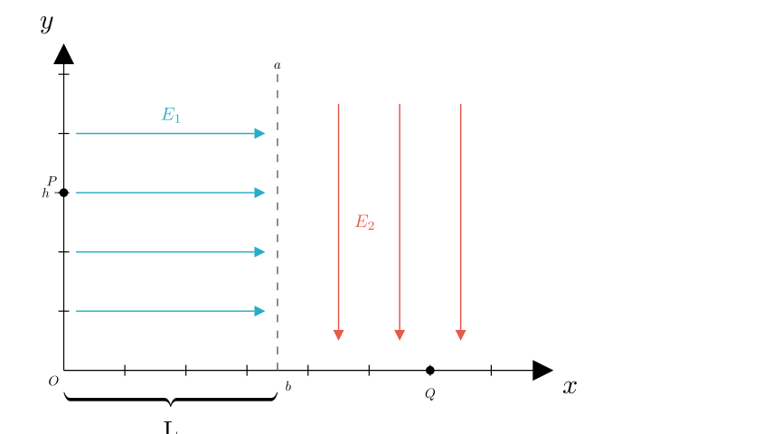
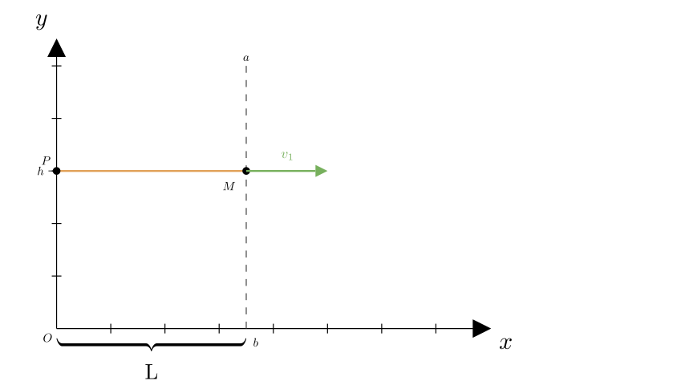
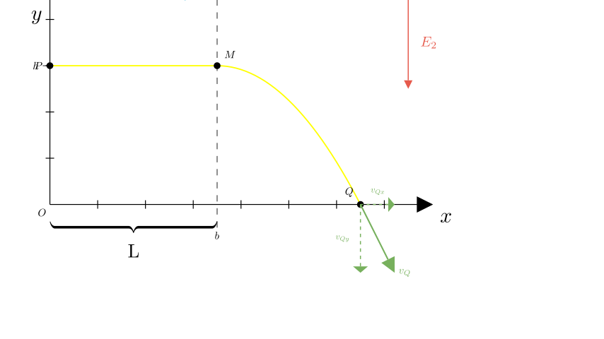

# problem_89_physics_g12

### Problem Statement
As shown in the figure, in the Cartesian coordinate system $xOy$, the dashed line $ab$ divides the first quadrant into two regions. The region to the left ($0 < x < L$) contains a uniform electric field with intensity $E_1$ directed along the positive x-axis. The region to the right ($x > L$) contains a uniform electric field with intensity $E_2$ directed along the negative y-axis.

A positive particle with mass $m$ and charge $q$ (gravity is ignored) is placed at rest at point $P(0, h)$ on the y-axis. Under the action of the electric forces, the particle moves and finally leaves the electric field region from point $Q$ on the x-axis. The distance from the dashed line $ab$ to the y-axis is known to be $L$.

**Calculate:**
1. The velocity of the particle when it passes through the $E_1$ electric field region (crossing line $ab$).
2. The magnitude of the velocity of the particle when it passes through point $Q$.
3. The coordinates of point $Q$.

### Solution Approach
This problem can be solved by splitting the motion into two stages:
1.  **Stage 1 (Left Region):** Uniform acceleration in a straight line along the x-axis due to $E_1$. There is no force in the y-direction, so the y-coordinate remains constant.
2.  **Stage 2 (Right Region):** The particle enters this region with a horizontal velocity. It experiences a constant downward force due to $E_2$. This results in motion similar to a horizontal projectile (parabolic trajectory).

We will use Newton's laws of motion and kinematic equations (or the Work-Energy Theorem) to solve for the velocities and coordinates.

### Part 1: Velocity Crossing the $E_1$ Region

Let's analyze the motion in the left region (from $x=0$ to $x=L$).

**Forces Analysis:**
*   The electric field $E_1$ is horizontal (positive x-direction).
*   The electric force is $F_1 = qE_1$.
*   Since gravity is ignored and there is no electric field in the y-direction here, the net force in the y-direction is zero.

**Motion Analysis:**
*   **y-direction:** The particle starts at rest. Since there is no vertical force, the vertical velocity remains 0. The particle moves horizontally at height $y = h$.
*   **x-direction:** The particle undergoes uniform acceleration starting from rest ($v_0 = 0$).

Using Newton's Second Law:
$$a_1 = \frac{F_1}{m} = \frac{qE_1}{m}$$

We need the velocity $v_1$ after the particle travels a horizontal distance $L$. Using the kinematic equation $v^2 - v_0^2 = 2ax$:
$$v_1^2 - 0 = 2 a_1 L$$
$$v_1^2 = 2 \left( \frac{qE_1}{m} \right) L$$

Taking the square root:
$$v_1 = \sqrt{\frac{2qE_1L}{m}}$$

**Conclusion for Part 1:**
The velocity of the particle as it crosses the dashed line $ab$ is $\sqrt{\frac{2qE_1L}{m}}$, directed horizontally to the right.

### Part 2: Velocity at Point Q

Now the particle enters the right region ($x > L$) at point $M(L, h)$ with an initial horizontal velocity $v_x = v_1$.

**Forces Analysis:**
*   The electric field $E_2$ is vertical (negative y-direction).
*   The electric force is $F_2 = qE_2$ downwards.
*   There is no force in the x-direction ($E_1$ does not exist here).

**Motion Analysis (Projectile-like Motion):**
*   **x-direction:** No force means constant velocity. $v_{Qx} = v_1$.
*   **y-direction:** Uniform acceleration downwards.
$$a_2 = \frac{F_2}{m} = \frac{qE_2}{m}$$

The particle travels from height $y=h$ to $y=0$ (Point Q). We can find the vertical velocity component $v_{Qy}$ using kinematics ($v_y^2 - v_{y0}^2 = 2a_y \Delta y$):
$$v_{Qy}^2 - 0 = 2 a_2 h$$
$$v_{Qy}^2 = 2 \left( \frac{qE_2}{m} \right) h = \frac{2qE_2h}{m}$$

**Total Velocity at Q:**
The total speed $v_Q$ is the vector sum of the components:
$$v_Q = \sqrt{v_{Qx}^2 + v_{Qy}^2}$$

Substitute $v_{Qx}^2 = v_1^2 = \frac{2qE_1L}{m}$ and $v_{Qy}^2 = \frac{2qE_2h}{m}$:
$$v_Q = \sqrt{\frac{2qE_1L}{m} + \frac{2qE_2h}{m}}$$
$$v_Q = \sqrt{\frac{2q}{m}(E_1L + E_2h)}$$

*Alternative Method (Work-Energy Theorem):*
Total work done by electric fields = Change in Kinetic Energy.
$$W_{total} = W_{E1} + W_{E2} = qE_1L + qE_2h$$
$$\frac{1}{2}mv_Q^2 - 0 = qE_1L + qE_2h$$
$$v_Q = \sqrt{\frac{2(qE_1L + qE_2h)}{m}}$$
(This confirms our previous result).

### Part 3: Coordinates of Point Q

Point Q lies on the x-axis, so its y-coordinate is $0$. We need to find its x-coordinate, $x_Q$.
$$x_Q = L + \Delta x$$
where $\Delta x$ is the horizontal distance traveled in the second region.

**Time of Flight ($t$):**
Consider the vertical motion in the second region. The particle drops a height $h$ with acceleration $a_2 = \frac{qE_2}{m}$ starting with zero vertical velocity.
$$h = \frac{1}{2} a_2 t^2$$
$$t = \sqrt{\frac{2h}{a_2}} = \sqrt{\frac{2hm}{qE_2}}$$

**Horizontal Displacement ($\Delta x$):**
The horizontal velocity is constant ($v_1$) in this region.
$$\Delta x = v_1 \cdot t$$

Substitute the expressions for $v_1$ and $t$:
$$\Delta x = \left( \sqrt{\frac{2qE_1L}{m}} \right) \cdot \left( \sqrt{\frac{2hm}{qE_2}} \right)$$

Combine the terms inside the square root:
$$\Delta x = \sqrt{\frac{2qE_1L}{m} \cdot \frac{2hm}{qE_2}}$$
$$\Delta x = \sqrt{\frac{4 q E_1 L h m}{m q E_2}}$$

Cancel $m$ and $q$, and pull out the 4:
$$\Delta x = 2\sqrt{\frac{E_1 L h}{E_2}}$$

**Final Coordinate:**
The x-coordinate is the sum of the first region's width and this new displacement:
$$x_Q = L + 2\sqrt{\frac{E_1 L h}{E_2}}$$

Therefore, the coordinates of Q are:
$$Q \left( L + 2\sqrt{\frac{E_1 L h}{E_2}}, \quad 0 \right)$$

### Summary of Answers

**(1)** Velocity passing through $E_1$ region:
$$v_1 = \sqrt{\frac{2qE_1L}{m}}$$

**(2)** Velocity magnitude at point Q:
$$v_Q = \sqrt{\frac{2q}{m}(E_1L + E_2h)}$$

**(3)** Coordinates of point Q:
$$\left( L + 2\sqrt{\frac{E_1 L h}{E_2}}, \quad 0 \right)$$

