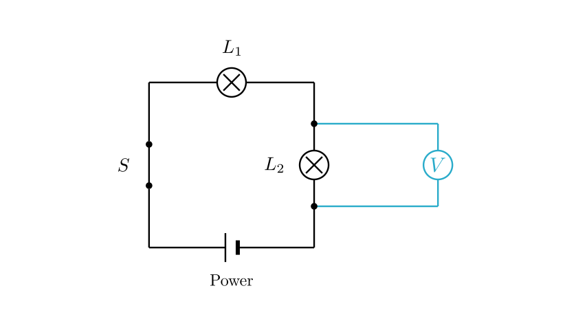
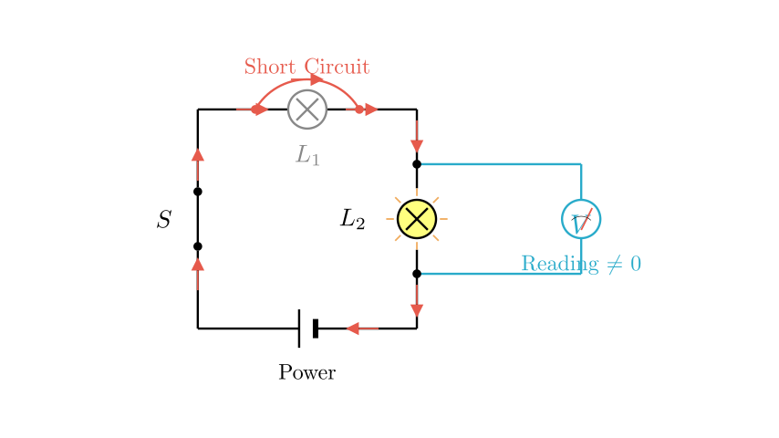
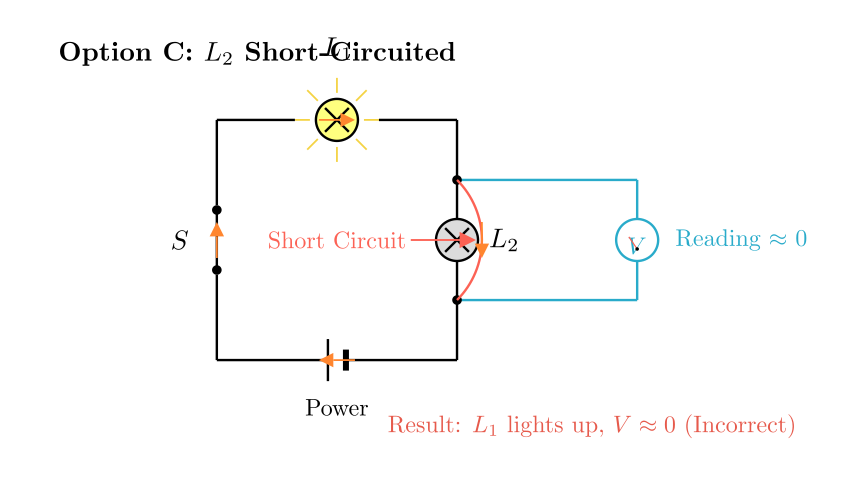

# problem_8_physics_g9

**Problem Statement:**

Student Xiao Ming conducts an experimental investigation using the circuit shown in the diagram. Lamps $L_1$ and $L_2$ have the same specifications. When the switch is closed, one lamp lights up while the other does not, and the voltmeter shows a reading. The possible cause of the fault is:

A. $L_1$ is short-circuited
B. $L_1$ is open-circuited
C. $L_2$ is short-circuited
D. $L_2$ is open-circuited

**Solution Approach:**

1.  **Analyze the Circuit Structure:** Determine if the lamps are in series or parallel and identify which component the voltmeter is measuring.
2.  **Analyze the Symptoms:** Use the conditions "one lamp on, one off" and "voltmeter has a reading" to deduce the nature of the fault (Short Circuit vs. Open Circuit).
3.  **Evaluate Options:** Test each fault scenario to see if it matches the observed symptoms.

**Step 1: Circuit Analysis**

First, let's translate the physical connections into a schematic diagram (as shown above).

*   **Current Path:** Starting from the positive terminal of the power source, the current flows through the **Switch**, then through **Lamp $L_1$**, then through **Lamp $L_2$**, and finally returns to the negative terminal. Since the current flows through the lamps sequentially, $L_1$ and $L_2$ are connected in **series**.
*   **Voltmeter Connection:** The voltmeter terminals are connected to the two ends of **Lamp $L_2$**. Therefore, the voltmeter measures the voltage across $L_2$.

**Step 2: Analyzing the Fault Symptoms**

*   **Symptom 1: "One lamp lights up, one does not."**
In a series circuit, if there is an **open circuit** (a break in the wire or filament) anywhere in the main loop, current cannot flow, and **neither** lamp would light up. Since one lamp is on, the circuit must be continuous (conducting current). This eliminates the possibility of an open circuit in the main loop. The fault must be a **short circuit** in one of the lamps.

*   **Symptom 2: "Voltmeter has a reading."**
This means there is a potential difference across the component the voltmeter is measuring ($L_2$).

Let's test the specific options based on this logic.

**Step 3: Evaluating the Options**

**Option A: $L_1$ is short-circuited** (Visualized above)
*   **Analysis:** If $L_1$ is short-circuited, it acts like a plain wire. Current bypasses the filament of $L_1$, so $L_1$ does **not** light up.
*   **Circuit State:** The circuit effectively becomes a simple circuit with just $L_2$. The resistance of the circuit decreases, and current flows through $L_2$.
*   **Result:** $L_2$ **lights up**.
*   **Voltmeter:** Since the voltmeter is connected across $L_2$ (which is lit and has current flowing through it), it measures the voltage across $L_2$ (which is approximately the source voltage). The voltmeter **has a reading**.
*   **Conclusion:** This matches all conditions: One off ($L_1$), One on ($L_2$), Voltmeter has reading. **(This is the correct answer)**

**Option B: $L_1$ is open-circuited**
*   **Analysis:** If $L_1$ is broken, the series circuit is interrupted.
*   **Result:** No current flows. Both $L_1$ and $L_2$ are **OFF**.
*   **Conclusion:** Contradicts "one lamp lights up".

**Option C: $L_2$ is short-circuited** (Visualized above)
*   **Analysis:** If $L_2$ is short-circuited, current bypasses it. $L_2$ does **not** light up.
*   **Circuit State:** The circuit effectively acts as if only $L_1$ is present.
*   **Result:** $L_1$ **lights up**. (This fits the "one on, one off" condition).
*   **Voltmeter:** The voltmeter is connected in parallel with $L_2$. Since $L_2$ is shorted (resistance $\approx 0$), the potential difference across it is $V = I \times 0 = 0\text{V}$.
*   **Conclusion:** The voltmeter would show **no reading** (0V). This contradicts the problem statement "voltage meter has a reading". Thus, this option is incorrect.

**Option D: $L_2$ is open-circuited**
*   **Analysis:** If $L_2$ is broken, the main circuit path is broken.
*   **Result:** Although the voltmeter bridges the break, voltmeters have extremely high internal resistance. The current in the circuit would be tiny ($I \approx 0$). Neither lamp would light up visibly.
*   **Conclusion:** Contradicts "one lamp lights up".

**Final Conclusion:**
The only scenario that satisfies "One lamp on, one lamp off" and "Voltmeter has a reading" (where the voltmeter is across the lit lamp) is when the **other** lamp is short-circuited. Since the voltmeter is across $L_2$, and it has a reading, $L_2$ must be the working (lit) lamp. Therefore, $L_1$ must be the faulty (short-circuited) lamp.

**Answer:** A

