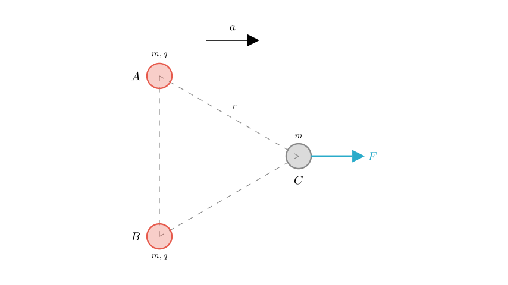
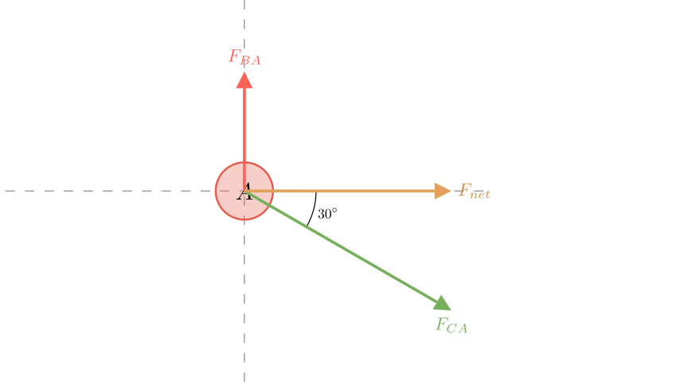
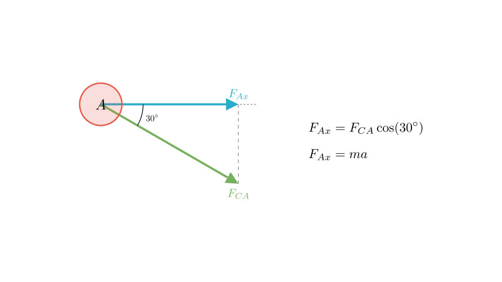
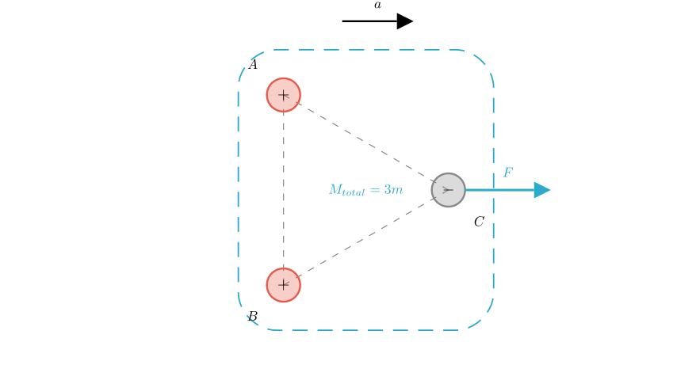

# problem_91_physics_g12

**Problem Statement:**
As shown in the figure, three charged small spheres A, B, and C are fixed on a smooth, insulated horizontal surface. Their masses are all $m$, and the distance between any two spheres is $r$. Spheres A and B carry positive charges, both with magnitude $q$. A horizontal force $F$ is applied to sphere C, and simultaneously, the three spheres are released. To ensure that the distance $r$ between the three spheres remains unchanged during the motion, calculate:
(1) The polarity and magnitude of the charge on sphere C.
(2) The magnitude of the horizontal force $F$.

**Solution Approach:**
Since the distances between the spheres remain constant, the system maintains its equilateral triangle shape and moves as a rigid body. This implies that all three spheres share the same acceleration vector $a$. We will analyze the forces acting on one of the spheres (Sphere A) to determine the unknown charge of C using component analysis. Then, we will apply Newton's Second Law to the entire system to find the external force $F$.

**Step 1: Determine the Polarity of Sphere C**

Let's analyze the forces acting on sphere A. 

1.  **Interaction with B:** Since A and B are both positively charged, B exerts a repulsive electrostatic force ($F_{BA}$) on A. Given the geometry (A is directly above B in the vertical base of the triangle), this force pushes A vertically upward.
2.  **Constraint:** For the triangle to maintain its shape while accelerating horizontally to the right, sphere A must not move vertically relative to B. This means the net vertical force on A must be zero.
3.  **Conclusion:** To cancel the upward repulsive force from B, the force from C ($F_{CA}$) must have a downward component. Therefore, C must attract A. Since A is positive, **Sphere C must be negatively charged.**

**Step 2: Calculate the Magnitude of Charge C ($q_C$)**

We apply Coulomb's Law, where $k$ is the electrostatic constant. The magnitude of the force between any two charges $q_1, q_2$ separated by distance $r$ is $F = k \frac{|q_1 q_2|}{r^2}$.

**Vertical Force Balance on A:**
The upward repulsive force from B must equal the downward vertical component of the attractive force from C.

*   Force from B: $F_{BA} = k \frac{q^2}{r^2}$ (Points Up)
*   Force from C: $F_{CA} = k \frac{q \cdot q_C}{r^2}$ (Points 30° below horizontal)

Balancing the vertical components ($\sum F_y = 0$):
$$F_{BA} = F_{CA} \sin(30^\circ)$$

Substituting the Coulomb expressions:
$$k \frac{q^2}{r^2} = \left( k \frac{q \cdot q_C}{r^2} \right) \cdot \frac{1}{2}$$

Solving for $q_C$:
$$q = \frac{q_C}{2} \implies q_C = 2q$$

**Answer (1):** Sphere C carries a negative charge with magnitude **$2q$**.

**Step 3: Determine the Acceleration ($a$)**

Now we look at the horizontal forces on Sphere A to find the system's acceleration. The only horizontal force acting on A is the horizontal component of the attraction from C.

$$F_{Ax} = F_{CA} \cos(30^\circ)$$

Substitute $F_{CA} = k \frac{q(2q)}{r^2} = \frac{2kq^2}{r^2}$:
$$F_{Ax} = \left( \frac{2kq^2}{r^2} \right) \cdot \frac{\sqrt{3}}{2} = \frac{\sqrt{3}kq^2}{r^2}$$

According to Newton's Second Law for Sphere A ($F_{net} = ma$):
$$ma = \frac{\sqrt{3}kq^2}{r^2} \implies a = \frac{\sqrt{3}kq^2}{mr^2}$$

**Step 4: Calculate the External Force $F$**

We can now treat the three spheres (A, B, and C) as a single system with total mass $M_{total} = m + m + m = 3m$. 

The internal electrostatic forces between A, B, and C cancel out for the system as a whole. The only external horizontal force is the applied force $F$.

Using Newton's Second Law for the whole system:
$$F = M_{total} \cdot a$$

Substitute the acceleration we found in Step 3:
$$F = 3m \cdot \left( \frac{\sqrt{3}kq^2}{mr^2} \right)$$

$$F = \frac{3\sqrt{3}kq^2}{r^2}$$

**Final Answer:**
(1) Sphere C is **negatively charged** with a charge quantity of **$2q$**.
(2) The magnitude of the horizontal force is **$F = \frac{3\sqrt{3}kq^2}{r^2}$**.

