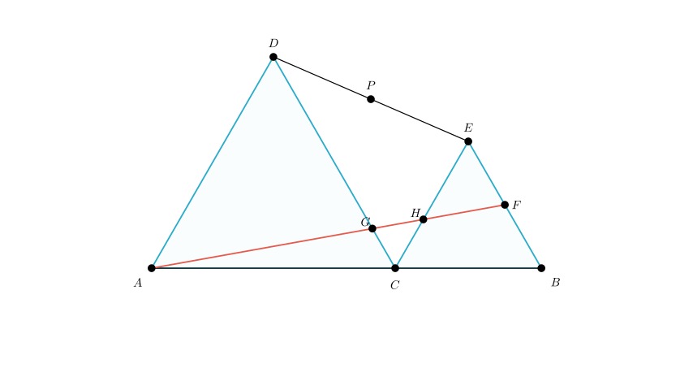
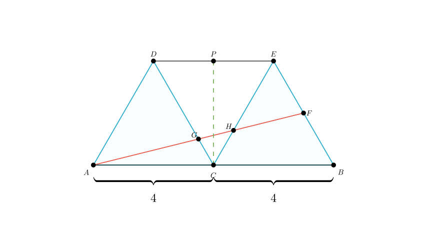
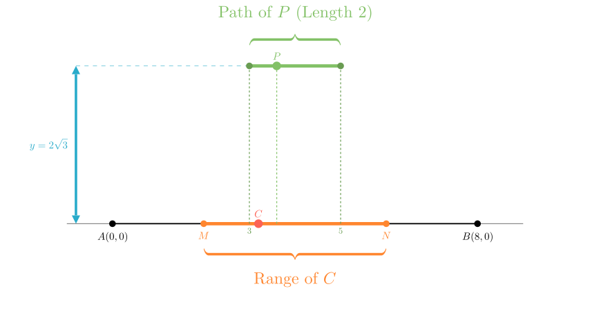

# problem_93_math_g9

**Problem Statement:**
As shown in Figure 1, given line segment $AB=8$. Point $C$ is a moving point on $AB$ (excluding $A$ and $B$). Two equilateral triangles $\triangle ACD$ and $\triangle BCE$ are constructed on the same side of $AB$. Connect $DE$. Points $P$ and $F$ are the midpoints of $DE$ and $BE$ respectively. Connect $AF$, intersecting $DC$ at $G$ and $CE$ at $H$.

(1) Write down all similar triangles in the figure (excluding the equilateral triangles $\triangle ACD$ and $\triangle BCE$).
(2) When point $C$ is the midpoint of $AB$ (as shown in Figure 2), find the length of $CP$ and the ratio $AG:GH:HF$.
(3) Points $M$ and $N$ are two points on line segment $AB$ such that $AM=BN=2$. When point $C$ moves from point $M$ to point $N$, find the length of the path traveled by point $P$.

**Solution Approach:**
We will solve this geometry problem step-by-step.
1.  **Similarity Analysis:** We will identify parallel lines created by the $60^\circ$ angles of the equilateral triangles to find similar triangles.
2.  **Specific Case ($C$ is midpoint):** We will use the symmetry of the figure and the ratios established in step 1 to calculate the length of $CP$ and the segment ratios along $AF$.
3.  **Locus of Point $P$:** We will use a coordinate geometry approach to express the coordinates of $P$ in terms of the position of $C$, allowing us to determine the path length as $C$ moves between $M$ and $N$.

**Part 1: Identifying Similar Triangles**

To find similar triangles, we look for equal angles, particularly those derived from parallel lines.

*   Since $\triangle ACD$ and $\triangle BCE$ are equilateral, $\angle ACD = \angle ABC = 60^\circ$.
*   This implies that line segment $CD$ is parallel to line segment $BE$ (corresponding angles are equal).
*   Consider $\triangle ACG$ and $\triangle ABF$:
*   $\angle CAG$ is common to both (same as angle $\angle CAB$).
*   Since $CD \parallel BE$, $\angle ACG = \angle ABF = 60^\circ$.
*   Therefore, **$\triangle ACG \sim \triangle ABF$**.

*   Next, observe that $\angle DAC = \angle ECB = 60^\circ$. This implies $AD \parallel CE$.
*   Consider the intersection of lines $AF$ and $CD$ (at $G$) relative to the parallel lines $AD$ and $CE$.
*   Wait, let's look at the intersection of transversals $AF$ and $CD$ between parallel lines $AD$ and $CE$.
*   Actually, a clearer pair arises from the intersection $G$:
*   We know $AD \parallel CE$.
*   Consider $\triangle GCH$ and $\triangle GDA$.
*   $\angle CGH = \angle DGA$ (vertically opposite angles).
*   $\angle GCH = \angle GDA$ (alternate interior angles, or simply observing the $60^\circ$ geometry).
*   Therefore, **$\triangle GCH \sim \triangle GDA$**.

So, the similar triangles are $\triangle ACG \sim \triangle ABF$ and $\triangle GCH \sim \triangle GDA$.

**Part 2: Calculation when C is the Midpoint**

Given $AB = 8$ and $C$ is the midpoint, we have $AC = CB = 4$.
This makes $\triangle ACD$ and $\triangle BCE$ congruent equilateral triangles with side length 4.

**Finding the length of CP:**
1.  Because $\triangle ACD \cong \triangle BCE$, we have $CD = CE = 4$.
2.  Angle $\angle DCE = 180^\circ - \angle ACD - \angle BCE = 180^\circ - 60^\circ - 60^\circ = 60^\circ$.
3.  Since $CD = CE$ and $\angle DCE = 60^\circ$, $\triangle DCE$ is also an equilateral triangle with side length 4.
4.  $P$ is the midpoint of $DE$. In equilateral $\triangle DCE$, the median $CP$ is also the altitude.
5.  Using the altitude formula for an equilateral triangle with side $a=4$:
$$CP = \frac{\sqrt{3}}{2} \times \text{side} = \frac{\sqrt{3}}{2} \times 4 = 2\sqrt{3}$$

**Finding the ratio AG : GH : HF:**
1.  **Analyze $\triangle ACG \sim \triangle ABF$:**
*   Similarity ratio: $\frac{AC}{AB} = \frac{4}{8} = \frac{1}{2}$.
*   Therefore, $\frac{AG}{AF} = \frac{1}{2}$, which implies $AG = GF$.
*   Also, $\frac{CG}{BF} = \frac{1}{2}$. Since $F$ is the midpoint of $BE$ (side 4), $BF = 2$.
*   So, $CG = \frac{1}{2} \times 2 = 1$.

2.  **Analyze $\triangle GCH \sim \triangle GDA$:**
*   We know $CD = 4$. Since $CG = 1$, then $GD = 3$.
*   The similarity ratio is $\frac{GC}{GD} = \frac{1}{3}$.
*   Therefore, $\frac{GH}{GA} = \frac{1}{3}$, which implies $GA = 3GH$.

3.  **Combine the ratios:**
*   Let $GH = x$. Then $AG = 3x$.
*   Since $AG = GF$, then $GF = 3x$.
*   We calculate $HF = GF - GH = 3x - x = 2x$.
*   The ratio $AG : GH : HF = 3x : x : 2x$.

**Result:** $AG : GH : HF = 3 : 1 : 2$.

**Part 3: The Path of Point P**

We need to find the path length of $P$ as $C$ moves from $M$ to $N$.
Let's set up a coordinate system with $A$ at the origin $(0,0)$.
Line segment $AB$ lies on the x-axis, so $B$ is at $(8,0)$.

**Coordinates of Key Points:**
Let the position of $C$ be $(x, 0)$.
1.  **Point D:** $D$ is the vertex of equilateral $\triangle ACD$.
*   Side length $AC = x$.
*   $D = ( \frac{x}{2}, \frac{\sqrt{3}}{2}x )$.
2.  **Point E:** $E$ is the vertex of equilateral $\triangle BCE$.
*   Side length $CB = 8-x$.
*   The x-coordinate of $E$ is $x + \frac{8-x}{2} = \frac{x+8}{2}$.
*   The y-coordinate of $E$ is $\frac{\sqrt{3}}{2}(8-x)$.
*   $E = ( \frac{x+8}{2}, \frac{\sqrt{3}(8-x)}{2} )$.

**Coordinates of P (Midpoint of DE):**
$$x_P = \frac{x_D + x_E}{2} = \frac{1}{2} \left( \frac{x}{2} + \frac{x+8}{2} \right) = \frac{1}{2} \left( \frac{2x+8}{2} \right) = \frac{x}{2} + 2$$
$$y_P = \frac{y_D + y_E}{2} = \frac{1}{2} \left( \frac{\sqrt{3}x}{2} + \frac{\sqrt{3}(8-x)}{2} \right) = \frac{1}{2} \left( \frac{\sqrt{3}x + 8\sqrt{3} - \sqrt{3}x}{2} \right) = \frac{1}{2} (4\sqrt{3}) = 2\sqrt{3}$$

**Analysis of the Path:**
*   The y-coordinate of $P$ is constant ($2\sqrt{3}$). This means the path of $P$ is a horizontal line segment.
*   The x-coordinate of $P$ depends linearly on $x$: $x_P = \frac{x}{2} + 2$.

**Calculating the Length:**
*   $C$ moves from $M$ to $N$.
*   Given $AM = 2$, the starting x-value for $C$ is $x_{start} = 2$.
*   Given $BN = 2$, the ending x-value for $C$ is $x_{end} = 8 - 2 = 6$.
*   **Start position of P:** $x_P = \frac{2}{2} + 2 = 3$.
*   **End position of P:** $x_P = \frac{6}{2} + 2 = 5$.
*   **Path Length:** $5 - 3 = 2$.

**Final Answers:**
(1) $\triangle ACG \sim \triangle ABF$ and $\triangle GCH \sim \triangle GDA$.
(2) $CP = 2\sqrt{3}$; Ratio $AG:GH:HF = 3:1:2$.
(3) The path length of point $P$ is 2.

