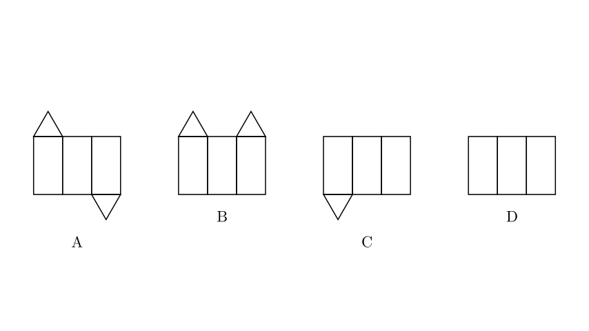
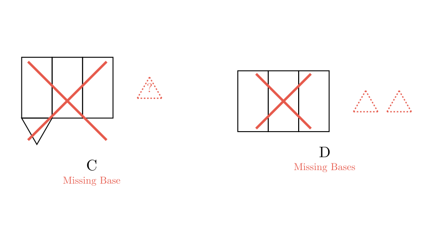
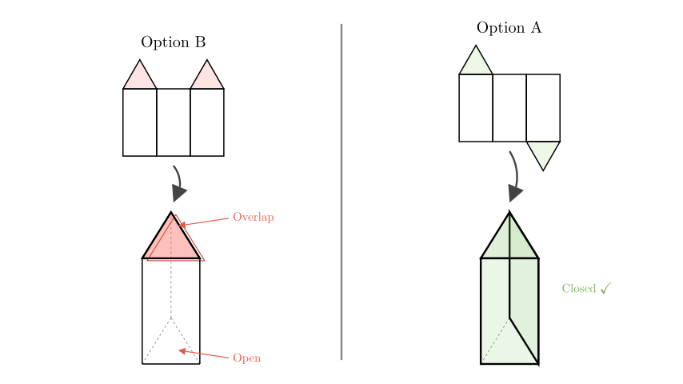

# problem_94_math_g9

**Problem Statement:**
Which of the following four figures is the surface development (net) of a triangular prism?

A) [Figure A]
B) [Figure B]
C) [Figure C]
D) [Figure D]

**Solution Approach:**
To solve this problem, we need to understand the geometric properties of a triangular prism. A triangular prism consists of:
1.  **Three rectangular lateral faces** (which form the sides of the prism).
2.  **Two triangular bases** (one at the top and one at the bottom).

We will analyze each option to see if it contains the correct number of faces and if they are arranged in a way that allows them to fold into a closed 3D shape.

**Step 1: Counting the Faces**

First, let's eliminate options based on the number of faces required. A triangular prism must have exactly **5 faces** in total:
*   3 Rectangles
*   2 Triangles

Let's check the options:
*   **Option C:** Has 3 rectangles but only **1 triangle**. This is missing a base.
*   **Option D:** Has 3 rectangles and **0 triangles**. This is missing both bases.

Therefore, Options C and D are incorrect. We are left with Options A and B, which both have the correct number of faces (3 rectangles and 2 triangles).

**Step 2: Analyzing the Arrangement (Folding Logic)**

Now we compare Option A and Option B. The key difference is the position of the triangular bases relative to the rectangular strip.

*   **The Rule:** For a prism to close properly, the two bases must be on **opposite sides** of the lateral surface (the strip of rectangles). One needs to fold over the "top" and the other needs to fold over the "bottom."

*   **Analyzing Option B:** Both triangles are on the **same side** (the top). If we fold the rectangles into a triangular tube, both triangles will try to cover the top opening. This results in overlapping bases at the top and a completely open bottom.

*   **Analyzing Option A:** One triangle is on the top, and the other is on the bottom. When the rectangles are folded into a tube, the top triangle folds down to cover the top opening, and the bottom triangle folds up to cover the bottom opening.

**Conclusion**

Option A is the only figure that has the correct number of faces (3 rectangles, 2 triangles) arranged on opposite sides of the lateral strip, allowing it to fold into a complete triangular prism.

**Final Answer:** A

