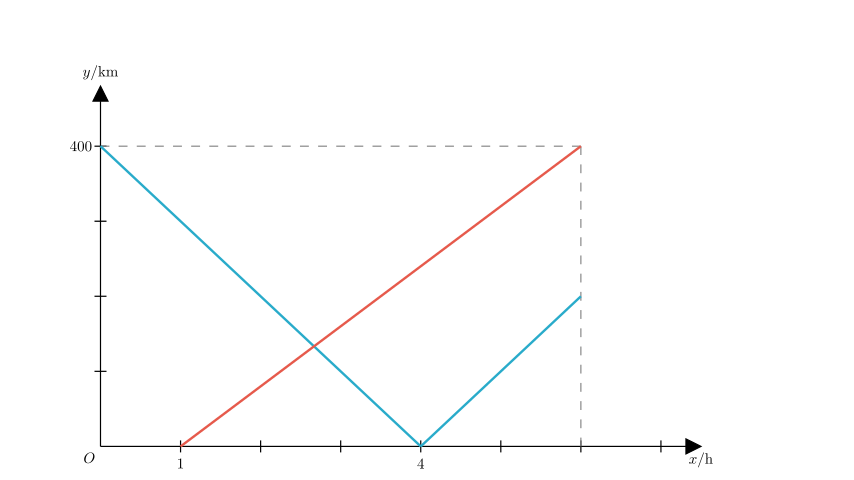
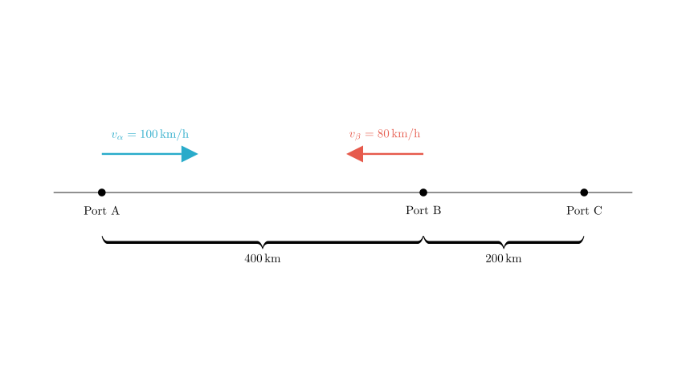
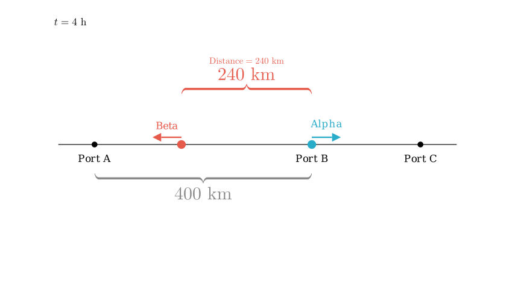

# problem_95_math_g9

**Problem Statement:**
There are three ports A, B, and C located sequentially along a straight coastline. 
- Boat Alpha departs from Port A and travels at a constant speed along the coastline towards Port C.
- 1 hour later, Boat Beta departs from Port B and travels at a constant speed along the coastline towards Port A.
- Both boats arrive at their respective destinations at the same time.
- The speed of Boat Alpha is 1.25 times the speed of Boat Beta.

The graph shows the function relationship between the distance $y$ (km) of the two boats from Port B and the travel time $x$ (h) of Boat Alpha.

Determine the number of correct statements among the following:
1. The distance between ports A and B is 400 km.
2. The speed of Boat Alpha is 100 km/h.
3. The distance between ports B and C is 200 km.
4. At 4 hours after Boat Alpha departs, the distance between the two boats is 220 km.

**Options:**
A. 4
B. 3
C. 2
D. 1

**Solution Approach:**
We will analyze the provided distance-time graph to deduce the physical movements of both boats. By matching the graph segments to the specific journeys (A to C via B, and B to A), we can calculate the speeds, total time, and distances between ports to verify each statement.

**Step 1: Analyzing Boat Alpha's Motion (Statement ① and ②)**

Let's interpret the graph based on the problem description. The y-axis represents the **distance from Port B**.

*   **Boat Alpha** starts at Port A and moves towards Port C. Since the ports are in the order A-B-C, Alpha must travel from A to B, reach B (where distance from B is 0), and then continue to C.
*   Looking at the graph, the blue curve starts at $(0, 400)$ and decreases to $(4, 0)$.
*   At $x=0$ (start time), the distance $y=400$. This means the starting point A is 400 km away from B.
*   **Statement ① is Correct:** The distance between A and B is 400 km.
*   The graph reaches $y=0$ at $x=4$. This means Boat Alpha arrives at Port B after 4 hours.

Now we can calculate Boat Alpha's speed ($v_{\alpha}$):
$$v_{\alpha} = \frac{\text{Distance } AB}{\text{Time}} = \frac{400 \text{ km}}{4 \text{ h}} = 100 \text{ km/h}$$

*   **Statement ② is Correct:** The speed of Boat Alpha is 100 km/h.

**Step 2: Analyzing Boat Beta's Motion**

*   **Boat Beta** starts from Port B and heads to Port A. It starts 1 hour after Alpha.
*   In the graph, the red line starts at $x=1$ with $y=0$ (distance from B is 0). This matches the description.
*   We are given the speed relationship: Boat Alpha's speed is 1.25 times Boat Beta's speed.
$$v_{\alpha} = 1.25 \times v_{\beta}$$
$$100 = 1.25 \times v_{\beta} \implies v_{\beta} = \frac{100}{1.25} = 80 \text{ km/h}$$

**Step 3: Calculating Total Time and Distance BC (Statement ③)**

The problem states both boats arrive at their destinations simultaneously.
*   **Destination for Beta:** Port A (Distance 400 km from B).
*   Time taken for Beta to travel 400 km:
$$t_{\beta} = \frac{400 \text{ km}}{80 \text{ km/h}} = 5 \text{ hours}$$
*   Since Beta starts at $x=1$, the arrival time on the clock (x-axis) is:
$$x_{\text{arrival}} = 1 + 5 = 6 \text{ hours}$$

So, the total travel time for the scenario is 6 hours.

*   **Destination for Alpha:** Port C.
*   Alpha travels from $x=0$ to $x=6$.
*   We already know Alpha takes 4 hours to get from A to B. So, it travels from B to C between $x=4$ and $x=6$.
*   Time from B to C $= 6 - 4 = 2$ hours.
*   Distance $BC = v_{\alpha} \times \text{time} = 100 \text{ km/h} \times 2 \text{ h} = 200 \text{ km}$.

*   **Statement ③ is Correct:** The distance between B and C is 200 km.

**Step 4: Checking the Distance Between Boats at x = 4 (Statement ④)**

We need to find the positions of both boats at $x=4$ hours.

*   **Boat Alpha:** At $x=4$, Alpha has traveled 400 km from A. Since $AB=400$ km, Alpha is exactly at **Port B**.

*   **Boat Beta:** Beta started at $x=1$. By $x=4$, Beta has been traveling for:
$$\Delta t = 4 - 1 = 3 \text{ hours}$$
*   Beta travels from B towards A at 80 km/h.
*   Distance of Beta from B $= 80 \text{ km/h} \times 3 \text{ h} = 240 \text{ km}$.

*   **Distance between boats:**
*   Alpha is at B (0 km from B).
*   Beta is 240 km away from B (towards A).
*   Distance $= 240 - 0 = 240$ km.

*   **Statement ④ is Incorrect:** The statement claims the distance is 220 km, but we calculated 240 km.

**Conclusion:**
*   Statement ①: Correct
*   Statement ②: Correct
*   Statement ③: Correct
*   Statement ④: Incorrect

There are 3 correct statements.

**Final Answer:**
The correct choice is **B (3个)**.

