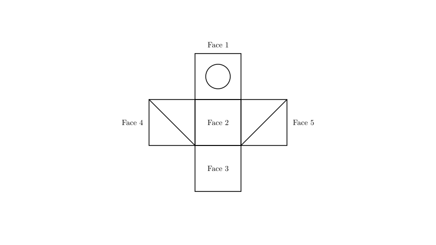
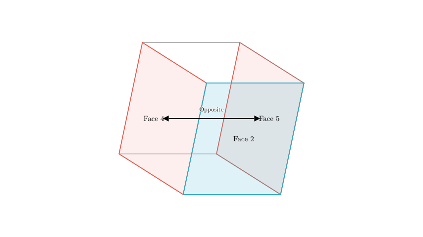
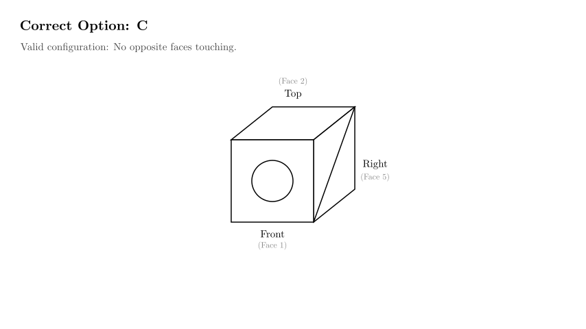

# problem_96_math_g9

**Problem Statement:**
Mingming folded a piece of paper (as shown in the diagram) into a cubic box, put a bottle of ink inside, and mixed it with other empty boxes. Based on observation alone, select which box contains the ink. (Which of the options A, B, C, or D corresponds to the unfolded net?)

**Solution Approach:**
To solve this spatial reasoning problem, we will analyze the "net" (the unfolded 2D pattern) and determine the relative positions of the faces when folded into a 3D cube.

1.  **Analyze the Net:** Identify the features of each face on the flat paper.
2.  **Identify Opposite Faces:** Use the layout of the net to determine which faces will be on opposite sides of the cube. Opposite faces can never be seen adjacent to each other in a standard 3D view.
3.  **Eliminate Options:** Discard the choices that show impossible arrangements (e.g., opposite faces touching).
4.  **Verify the Correct Option:** Confirm that the remaining option matches the connectivity and orientation of the net.

**Step 1: Analyzing the Net and Adjacency**

Let's examine the structure of the net shown in the diagram above:
*   **Face 2** (the central blank square) acts as the central "anchor".
*   **Face 4** (shaded) and **Face 5** (shaded) are attached to opposite sides of Face 2.
*   **Face 1** (circle) is attached to the top of Face 2.
*   **Face 3** (blank) is attached to the bottom of Face 2.

**Step 2: The "Opposite Faces" Rule**

In any cube net, if three squares are arranged in a straight line (row or column), the two squares at the ends of the line will become **opposite faces** in the folded cube. 

Looking at the horizontal row formed by **Face 4**, **Face 2**, and **Face 5**:
*   Face 4 is on the left of Face 2.
*   Face 5 is on the right of Face 2.
*   Therefore, when folded, **Face 4 and Face 5 will be opposite each other** (e.g., if Face 4 is the Left face, Face 5 is the Right face).

**Crucial Deduction:**
Opposite faces can never share an edge, and you can never see both of them at the same time in a standard perspective view of a cube (which shows at most 3 faces).

**Step 3: Eliminating Impossible Options**

Now we apply the rule we just established: **The two shaded faces cannot be seen together.**

Let's check the options provided in the problem:

*   **Option A:** Shows two shaded faces adjacent to each other. **Incorrect.**
*   **Option B:** Shows two shaded faces adjacent to each other. **Incorrect.**
*   **Option D:** Shows two shaded faces adjacent to each other. **Incorrect.**

All three of these options violate the spatial rule derived from the net. The two shaded faces must be on opposite sides of the cube.

**Step 4: Verifying Option C**

Let's verify if Option C is physically possible.

1.  Imagine **Face 2** (the central blank square) is the **Top** of the box.
2.  **Face 1** (Circle) is attached to Face 2. We fold it down to become the **Front**.
3.  **Face 5** (Right Shaded Wing) is attached to the right side of Face 2. We fold it down to become the **Right** face.

This arrangement results in:
*   Top: Blank
*   Front: Circle
*   Right: Shaded

This matches Option C exactly. Note that Option C shows a shaded face on the right. In our specific fold (Face 2 as Top), the Right Wing (Face 5) becomes the Right face. Since only one shaded face is visible, this configuration is valid.

**Conclusion:**
Options A, B, and D are impossible because they show opposite faces (the two shaded ones) touching each other. Option C is the only one that respects the geometry of the net.

**Final Answer:** C

