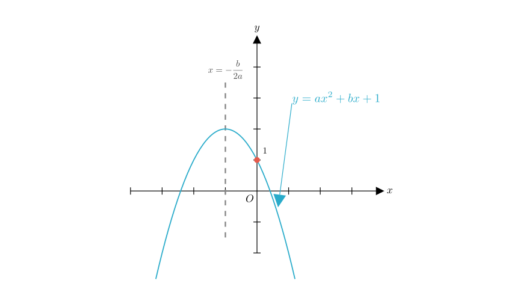
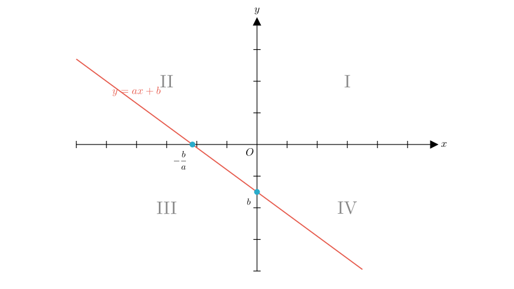

# problem_97_math_g9

**Problem Statement:**
Given that the approximate graph of the quadratic function $y=ax^{2}+bx+1$ is as shown in the figure, which quadrant does the graph of the linear function $y=ax+b$ **not** pass through?

A. First quadrant
B. Second quadrant
C. Third quadrant
D. Fourth quadrant

**Solution Approach:**
To solve this problem, we will first analyze the provided graph of the quadratic function to determine the signs (positive or negative) of the coefficients $a$ and $b$. Once we know the signs of $a$ and $b$, we will sketch the graph of the linear function $y=ax+b$ to see which quadrants it traverses.

**Step 1: Determine the signs of $a$ and $b$.**

By observing the graph of the quadratic function $y=ax^{2}+bx+1$:

1.  **Sign of $a$**: The parabola opens **downwards**, which indicates that the coefficient of the squared term is negative.
$$a < 0$$

2.  **Sign of $b$**: The axis of symmetry for a quadratic function is given by the line $x = -\frac{b}{2a}$.
- From the graph, the vertex is to the left of the y-axis, meaning the axis of symmetry is negative ($x < 0$).
- We have the inequality: $-\frac{b}{2a} < 0$.
- Since we already determined that $a < 0$, the denominator $2a$ is negative.
- For the entire fraction $-\frac{b}{\text{negative}}$ to be negative, the term $-b$ must be positive (since a positive divided by a negative is negative). Or more simply:
$$-\frac{b}{2a} < 0 \implies \frac{b}{2a} > 0$$
Since $2a < 0$, $b$ must also be negative for the ratio to be positive.
- Therefore:
$$b < 0$$

So, we have established that **$a$ is negative** and **$b$ is negative**.

**Step 2: Analyze the path of the linear function $y=ax+b$.**

Now we analyze the linear equation using the signs we found ($a < 0$ and $b < 0$):

1.  **Slope ($a$)**: The slope is $a$, which is negative. This means the line goes **downhill** from left to right.
2.  **Y-intercept ($b$)**: The y-intercept is $b$, which is negative. This means the line crosses the y-axis **below** the origin (on the negative y-axis).

Let's trace the line:
- It crosses the y-axis at $(0, b)$ where $b < 0$. This point is on the boundary between the Third and Fourth quadrants.
- To find the x-intercept, we set $y=0$:
$$0 = ax + b \implies ax = -b \implies x = -\frac{b}{a}$$
- Since $b$ is negative, $-b$ is positive.
- Since $a$ is negative, a positive number divided by a negative number results in a negative value.
- Therefore, the x-intercept is **negative**. The line crosses the x-axis to the left of the origin.

**Conclusion on Quadrants:**
- The line passes through the **Second Quadrant** (where $x$ is very negative and $y$ is positive).
- It crosses into the **Third Quadrant** (between the negative x-intercept and negative y-intercept).
- It continues into the **Fourth Quadrant** (where $x$ is positive and $y$ becomes more negative).

The only quadrant the line does not enter is the **First Quadrant** (where $x>0$ and $y>0$).

**Final Answer:**

The graph of the linear function $y=ax+b$ passes through the Second, Third, and Fourth quadrants. It does **not** pass through the **First quadrant**.

Therefore, the correct option is **A**.

