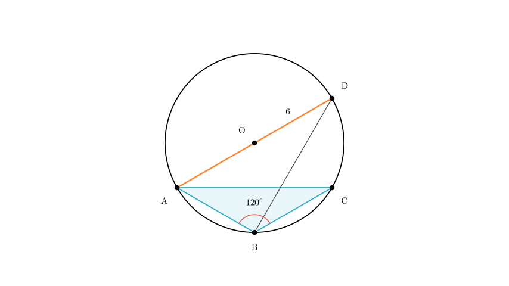
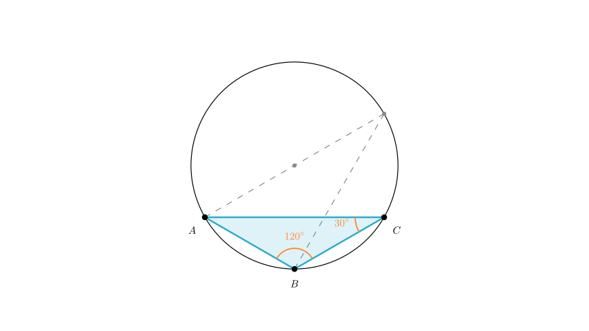
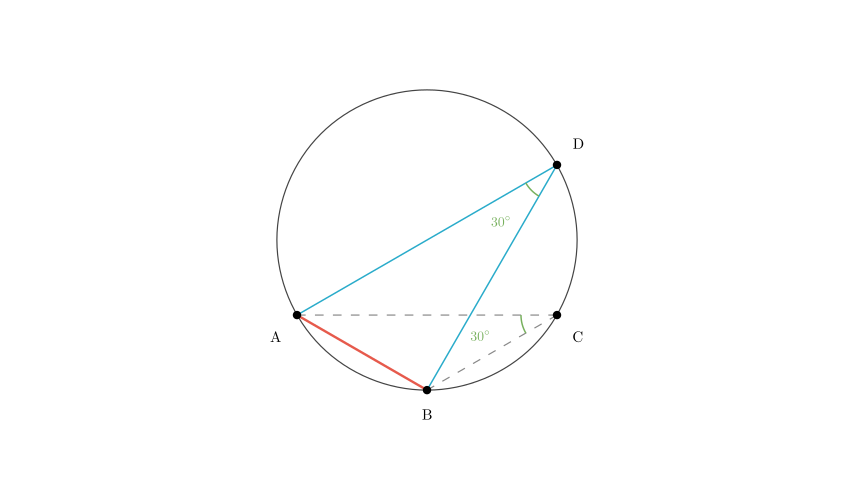
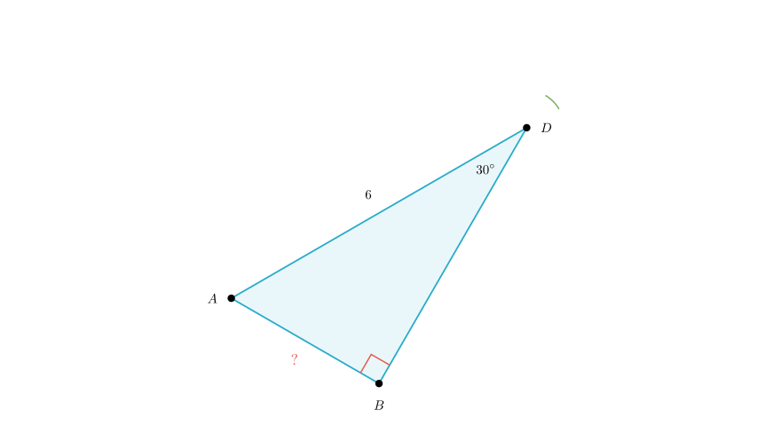

# problem_98_math_g9

**Problem Statement:**
As shown in the figure, $\triangle ABC$ is inscribed in circle $O$. Given that $AB = BC$, $\angle ABC = 120^\circ$, and $AD$ is the diameter of circle $O$ with length $AD = 6$, what is the length of $AB$?

**Options:**
A. 3
B. $2\sqrt{3}$
C. $3\sqrt{3}$
D. 2

**Solution Approach:**
To find the length of chord $AB$, we will use the properties of inscribed angles and right triangles formed by the diameter. Specifically:
1.  Analyze the isosceles triangle $\triangle ABC$ to find the measure of $\angle ACB$.
2.  Use the property that inscribed angles subtending the same arc are equal to find $\angle ADB$.
3.  Use the property that the diameter subtends a right angle to form a right triangle $\triangle ABD$.
4.  Calculate $AB$ using trigonometry in the right triangle.

**Step 1: Analyze Triangle ABC**

First, let's look at $\triangle ABC$. We are given that $AB = BC$, which means $\triangle ABC$ is an isosceles triangle.
We are also given that the vertex angle $\angle ABC = 120^\circ$.

Since the sum of angles in a triangle is $180^\circ$, the two base angles ($\angle BAC$ and $\angle BCA$) must be equal and sum to $180^\circ - 120^\circ = 60^\circ$.

Therefore:
$$ \angle BCA = \frac{180^\circ - 120^\circ}{2} = 30^\circ $$

**Step 2: Use Inscribed Angle Properties**

Now, consider the arc $AB$. Both $\angle ADB$ and $\angle ACB$ are inscribed angles that subtend (open up to) the same arc $AB$.

According to the Inscribed Angle Theorem, angles subtending the same arc are equal.
Since we calculated that $\angle ACB = 30^\circ$, it follows that:
$$ \angle ADB = 30^\circ $$

**Step 3: Identify the Right Triangle**

We are given that $AD$ is the diameter of circle $O$. A fundamental property of circles is that an angle inscribed in a semicircle is a right angle ($90^\circ$).

Therefore, $\angle ABD$, which subtends the diameter $AD$, must be $90^\circ$.

This makes $\triangle ABD$ a right-angled triangle with the hypotenuse being the diameter $AD$.

**Step 4: Calculate Length AB**

Now we solve for $AB$ in the right-angled $\triangle ABD$:
*   Hypotenuse $AD = 6$
*   Angle $\angle ADB = 30^\circ$
*   We want to find the side opposite to the $30^\circ$ angle, which is $AB$.

Using the sine function:
$$ \sin(\angle ADB) = \frac{\text{Opposite}}{\text{Hypotenuse}} $$
$$ \sin(30^\circ) = \frac{AB}{AD} $$

We know that $\sin(30^\circ) = \frac{1}{2}$. Substituting the values:
$$ \frac{1}{2} = \frac{AB}{6} $$

Solving for $AB$:
$$ AB = 6 \times \frac{1}{2} $$
$$ AB = 3 $$

**Conclusion:**
The length of $AB$ is 3. This corresponds to Option A.

**Final Answer:** A

