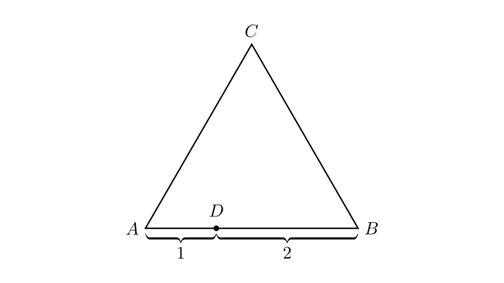
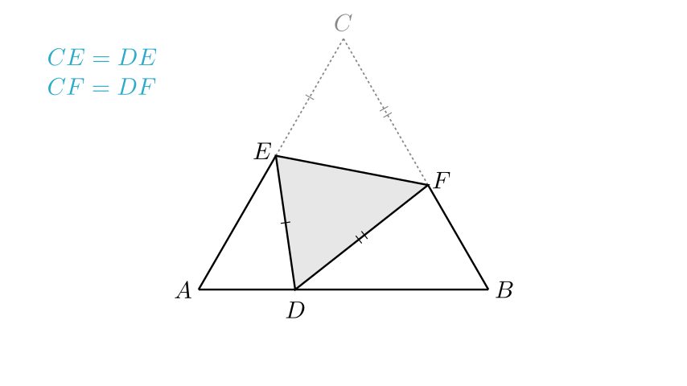
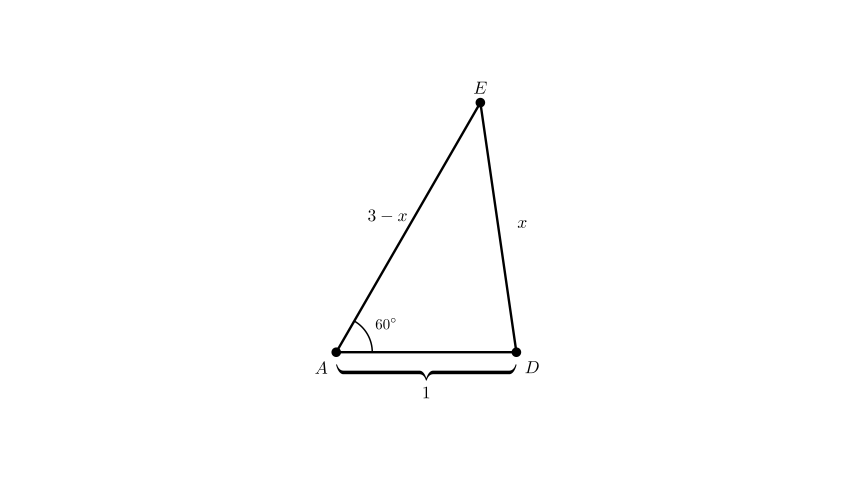
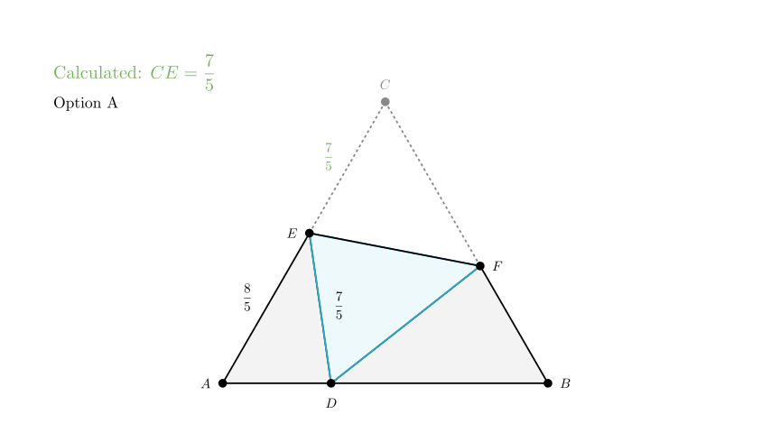

# problem_99_math_g9

**Problem Statement:**
As shown in the figure, $D$ is a point on side $AB$ of equilateral $\triangle ABC$, such that $AD=1$ and $BD=2$. The triangle $ABC$ is folded such that point $C$ coincides with point $D$. The fold line (crease) is $EF$, where point $E$ is on $AC$ and point $F$ is on $BC$. If $BF=1.25$, what is the length of $CE$?

**Options:**
A. $\frac{7}{5}$
B. $\frac{2}{3}$
C. $\frac{5}{6}$
D. $\frac{1}{2}$

**Solution Approach:**
1.  Determine the side length of the equilateral triangle.
2.  Use the properties of folding (reflection) to identify equal segments ($CE = DE$ and $CF = DF$).
3.  Define the unknown length $CE$ as a variable $x$.
4.  Apply the Law of Cosines in $\triangle ADE$ to solve for $x$.

**Step 1: Determine Side Lengths**

Since $\triangle ABC$ is an equilateral triangle, all sides are equal in length.
From the problem, point $D$ lies on $AB$ with $AD=1$ and $BD=2$.

Therefore, the total side length of the triangle is:
$$AB = AD + BD = 1 + 2 = 3$$

So, $AC = BC = AB = 3$.

**Step 2: Analyze the Right Side (Segment BC)**

We are given that $BF = 1.25$.
Since point $F$ is on $BC$, we can find the length of $CF$:
$$CF = BC - BF$$
$$CF = 3 - 1.25 = 1.75$$

**Step 3: Folding Properties**

When the triangle is folded along $EF$ so that $C$ touches $D$:
- The segment $CF$ maps to $DF$. Therefore, $DF = CF = 1.75$.
- The segment $CE$ maps to $DE$. Therefore, $CE = DE$.
- $\angle C$ maps to $\angle EDF$. Since $\angle C = 60^\circ$, then $\angle EDF = 60^\circ$.

**Step 4: Set up the equation for CE**

Let the length we need to find, $CE$, be $x$.
$$CE = x$$

Because of the folding property established in Step 3:
$$DE = x$$

Now, look at side $AC$. Point $E$ lies on $AC$.
Since the total length $AC = 3$, the remaining segment $AE$ is:
$$AE = AC - CE = 3 - x$$

Now we focus on $\triangle ADE$. We have expressions for all three sides and we know angle $A$.
- Side $AD = 1$ (given)
- Side $AE = 3 - x$
- Side $DE = x$
- $\angle A = 60^\circ$ (property of equilateral triangle)

**Step 5: Apply Law of Cosines**

In $\triangle ADE$, apply the Law of Cosines:
$$DE^2 = AD^2 + AE^2 - 2(AD)(AE)\cos(A)$$

Substitute the known values ($AD=1$, $AE=3-x$, $DE=x$, $\cos(60^\circ) = 0.5$):
$$x^2 = 1^2 + (3 - x)^2 - 2(1)(3 - x)(0.5)$$

Simplify the equation:
$$x^2 = 1 + (9 - 6x + x^2) - (3 - x)$$

Note that $2 \times 0.5 = 1$, so the last term is just $-(3-x)$, which becomes $-3 + x$.

$$x^2 = 1 + 9 - 6x + x^2 - 3 + x$$

Combine like terms:
$$x^2 = x^2 - 5x + 7$$

Subtract $x^2$ from both sides:
$$0 = -5x + 7$$

Solve for $x$:
$$5x = 7$$
$$x = \frac{7}{5}$$

**Conclusion:**
The length of $CE$ is $\frac{7}{5}$.

This corresponds to Option A.

**Final Recap:**

1.  We found the side length of the equilateral triangle was 3.
2.  We used the folding property to equate $DE$ with $CE$.
3.  We expressed the sides of $\triangle ADE$ in terms of $x$ (where $x=CE$).
4.  We solved for $x$ using the Law of Cosines on $\triangle ADE$.

**Answer:** A. $\frac{7}{5}$

